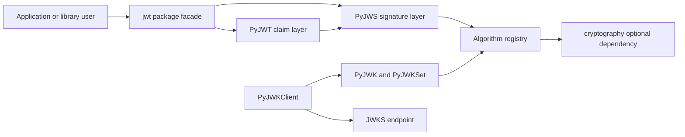
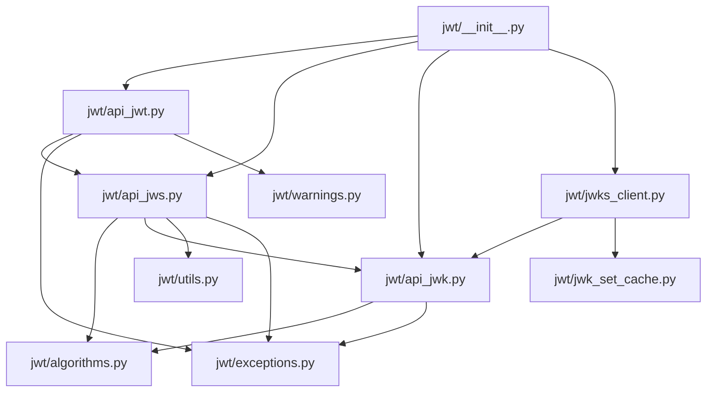

Last Reviewed Scope: full review
Doc Status: DRAFT
Last Architecture Update: 2026-07-06T14:44:06Z
Updated By: agent
Source Basis: pyproject scan; code scan; tests scan; workflow scan; docs scan

# Architecture

## Purpose

This document describes the static structure of PyJWT: its public entry points, internal module boundaries, external dependencies, and the data/control flow used to encode, decode, and validate JWTs.

## Scope

Covered:

- package layout under `jwt/`
- public API facade
- algorithm, JWK, and JWKS boundaries
- configuration-sensitive behavior
- packaging and docs-related architectural constraints

Not covered:

- exhaustive API reference details already documented in Sphinx
- runtime benchmarking or performance characterization
- maintainer decision history outside the repository evidence

## Architecture Summary

PyJWT is structured as a small, flat Python package with three main layers:

1. Public facade in `jwt/__init__.py` and module-level helper functions.
2. Core protocol logic in `jwt/api_jwt.py`, `jwt/api_jws.py`, and `jwt/algorithms.py`.
3. Key-material adapters in `jwt/api_jwk.py`, `jwt/jwks_client.py`, and `jwt/jwk_set_cache.py`.

The package keeps state to a minimum. The notable stateful elements are the module-level global helper objects (`_jwt_global_obj`, `_jws_global_obj`) and the optional in-memory caches used by `PyJWKClient`.

## System Context

Status: verified from `jwt/__init__.py`, `jwt/api_jwt.py`, `jwt/api_jws.py`, `jwt/api_jwk.py`, `jwt/jwks_client.py`, and `jwt/algorithms.py`.

## Runtime Model From An Architectural Perspective

- Most consumers call module-level functions such as `jwt.encode` and `jwt.decode`.
- `PyJWT` owns claim-oriented behavior: default verification options, timestamp normalization, and registered claim validation.
- `PyJWS` owns compact token mechanics: JOSE header handling, base64url segments, signature verification, and algorithm allow-list enforcement.
- `Algorithm` subclasses encapsulate key preparation and sign/verify behavior for each algorithm family.
- `PyJWK` and `PyJWKSet` adapt structured key material into usable algorithm-specific keys.
- `PyJWKClient` is the only component that performs network I/O.

## Main Entry Points

| Entry point | Responsibility |
|---|---|
| `jwt.encode` | Serialize payload claims and sign the resulting token |
| `jwt.decode` | Verify signature and validate claims, then return payload |
| `jwt.decode_complete` | Return header, payload, and signature triplet |
| `jwt.get_unverified_header` | Parse JOSE header without verifying signature |
| `jwt.PyJWK` / `jwt.PyJWKSet` | Parse local JWK/JWKS material |
| `jwt.PyJWKClient` | Fetch and cache signing keys from remote JWKS endpoints |
| `jwt.register_algorithm` / `jwt.unregister_algorithm` | Extend or modify the active JWS algorithm registry |

## Layering And Boundaries

| Layer | Modules | Boundary notes |
|---|---|---|
| Public facade | `jwt/__init__.py` | Re-exports stable API and hides internal module names |
| Claim layer | `jwt/api_jwt.py` | Must not perform low-level cryptographic work directly; delegates to JWS layer |
| Signature layer | `jwt/api_jws.py` | Parses compact serialization and selects algorithms |
| Algorithm layer | `jwt/algorithms.py` | Centralizes key-family rules and optional `cryptography` dependency |
| Key adapter layer | `jwt/api_jwk.py`, `jwt/jwks_client.py`, `jwt/jwk_set_cache.py` | Translates local/remote key metadata into usable verification keys |
| Support layer | `jwt/utils.py`, `jwt/types.py`, `jwt/exceptions.py`, `jwt/warnings.py` | Shared helpers, typing, and error surfaces |

## Main Components

| Component | Responsibilities | Important collaborators |
|---|---|---|
| `PyJWT` | Default options, payload JSON encoding/decoding, claims validation | `PyJWS`, exceptions, datetime helpers |
| `PyJWS` | JOSE header assembly, token parsing, signature verification, detached payload handling | algorithm registry, utils, `PyJWK` |
| `Algorithm` subclasses | Key normalization plus sign/verify primitives | stdlib `hmac`/`hashlib`; optional `cryptography` |
| `PyJWK` | Infer algorithm from JWK metadata and materialize key object | algorithm registry |
| `PyJWKSet` | Hold parsed collections of usable keys | `PyJWK` |
| `PyJWKClient` | Remote fetch, cache policy, and `kid` lookup | `urllib.request`, `JWKSetCache`, `PyJWKSet` |
| `JWKSetCache` | TTL-based in-memory caching for fetched JWKS sets | monotonic time |

## Static Module Map

## Data Model And Ownership

| Data | Owner | Lifetime |
|---|---|---|
| JWT payload dict | caller until encode; `PyJWT` during validation | per function call |
| JOSE header dict | `PyJWS` | per encode/decode operation |
| Compact token string / bytes | caller and `PyJWS` | per operation |
| Algorithm registry | `PyJWS` instance | process lifetime for each object/global singleton |
| Parsed JWK | `PyJWK` | per object instance |
| Parsed JWK set | `PyJWKSet` | per object instance or cache entry |
| JWKS cache entry | `JWKSetCache` and optional `lru_cache` wrapper | in-memory until expiry or eviction |

PyJWT has no database, file-backed state, or on-disk persistence as part of normal library execution.

## Data Flow Overview

### Encode path

1. Caller passes payload, key, and optional algorithm/header data to `jwt.encode`.
2. `PyJWT.encode` normalizes time claims and payload shape.
3. `PyJWS.encode` assembles JOSE headers and selects the effective algorithm.
4. The selected `Algorithm` prepares the key and signs the compact input.
5. The compact JWT string is returned.

### Decode path

1. Caller passes token, key, and allowed algorithms to `jwt.decode`.
2. `PyJWS.decode_complete` splits segments, parses the header, validates header extensions, and verifies the signature.
3. `PyJWT._decode_payload` parses the JSON payload.
4. `PyJWT._validate_claims` enforces time, issuer, audience, subject, JTI, and required-claim rules.
5. The payload dict is returned.

### JWKS-assisted verification path

1. `PyJWKClient.get_signing_key_from_jwt` decodes the token header without verifying the signature.
2. `PyJWKClient` fetches or reuses a cached JWKS document.
3. `PyJWKSet` and `PyJWK` convert matching key material into a concrete verification key.
4. The caller passes that key back into `jwt.decode` for final verification.

## External Dependencies

| Dependency | Role | Status |
|---|---|---|
| Python stdlib (`json`, `datetime`, `urllib`, `hmac`, `hashlib`) | Core parsing, claim time handling, network fetch, and symmetric signing | verified |
| `cryptography` | Optional support for RSA, EC, PSS, and EdDSA algorithms | verified |
| `typing_extensions` | Compatibility typing dependency for Python < 3.11 | verified |
| `pytest`, `coverage`, `tox`, `pre-commit`, `ruff`, `mypy` | Development and validation toolchain | verified |
| Sphinx and Read the Docs theme | Documentation generation | verified |

## Configuration-Affected Architecture

| Input | Architectural effect |
|---|---|
| `.[crypto]` extra or installed `cryptography` | Expands supported algorithms beyond `none` and HMAC |
| `PyJWT` options dict | Enables/disables signature and claim validation checks |
| `algorithms` argument on decode | Defines the allowed signature algorithms at verification time |
| `PyJWKClient` cache options | Changes whether JWKS sets and individual keys are cached |
| `SPHINX_BUILD` env var | Enables doc-build-specific type alias import paths during Sphinx generation |

## Security And Trust Boundaries

- Tokens, headers, payloads, JWKs, and remote JWKS responses are untrusted inputs.
- `PyJWS.decode_complete` requires explicit algorithm allow-lists unless a `PyJWK` already binds the algorithm, which reduces header-driven confusion risk.
- `HMACAlgorithm.prepare_key` explicitly rejects PEM/SSH keys and JWK-shaped JSON blobs as raw HMAC secrets.
- `PyJWKClient` rejects non-HTTP(S) URI schemes before any network call, preventing `file://` and similar misuse.
- Claim validation is opt-out or configurable through options, so application code still owns policy choices such as issuer, audience, and leeway.

## Architectural Decisions And Constraints

- Keep the public API centered on a single `jwt` package import path.
- Expose convenience wrappers backed by long-lived global helper objects.
- Treat `cryptography` as optional so the library still works for HMAC-only use cases.
- Make docs and examples executable validation surfaces through doctest and CI.
- Preserve Python 3.9+ support across both CPython and PyPy according to CI and metadata.

## Testing And Architecture Confidence

- Architecture confidence is high for public API shape, algorithm layering, and JWKS boundaries because code and tests cover those surfaces directly.
- Confidence is lower for exact release operations because they are distributed across GitHub workflow files and were not exercised locally in this review.
- This session did not run `tox`, `pytest`, or Sphinx builds, so live behavior remains unverified here.

## Known Structural Weaknesses

- `jwt/api_jwt.py` and `jwt/api_jws.py` are large, central files, so unrelated concerns accumulate in a small number of modules.
- Global singleton helpers simplify the facade but make implicit shared algorithm registry state part of process-level behavior.
- Optional crypto support doubles the meaningful runtime matrix: changes can behave differently with and without `cryptography` installed.

## High-Risk Change Areas

- Any edits around algorithm dispatch or key preparation in `jwt/api_jws.py` and `jwt/algorithms.py`.
- Claim validation rule changes in `jwt/api_jwt.py`.
- Remote key fetching, cache invalidation, and URI validation in `jwt/jwks_client.py`.
- Packaging metadata or workflow edits that affect release and docs publication.

## Verified / Inferred Claim Register

| Claim | Evidence | Status |
|---|---|---|
| The public API is exposed from a single `jwt` package facade | `jwt/__init__.py` | verified |
| JWT claim validation is layered above JWS signature validation | `jwt/api_jwt.py`, `jwt/api_jws.py` | verified |
| RSA, EC, PSS, and EdDSA support are optional and depend on `cryptography` | `jwt/algorithms.py`, `pyproject.toml` | verified |
| Remote key retrieval is isolated to `PyJWKClient` and uses `urllib.request` | `jwt/jwks_client.py` | verified |
| The repo favors behavior-driven tests over architectural docs for design intent | `tests/`, absence of ADR/design docs | inferred |

## Known Unknowns

- Could not verify performance characteristics or memory behavior under large JWKS sets because no benchmark suite was inspected.
- Could not identify an explicit human-authored architecture rationale for the global singleton facade; the decision is inferred from code structure.