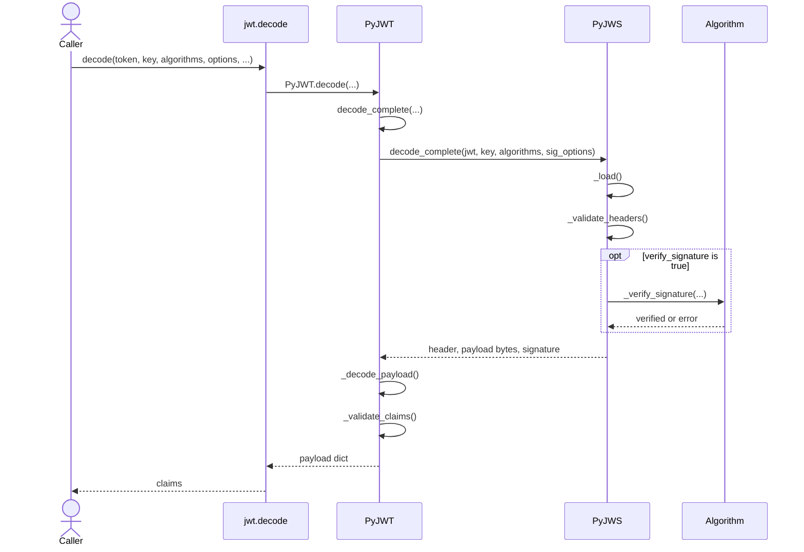

# Decode Flow

Purpose: Show how `jwt.decode()` moves from a compact token input to a validated payload dict in PyJWT.

Source basis:
- `jwt/api_jwt.py`
- `jwt/api_jws.py`
- `tests/test_api_jwt.py`

Diagram type: sequenceDiagram

## Explanation

`jwt.decode()` is a thin facade over the global `PyJWT` instance in `jwt/api_jwt.py`. The high-level flow is:

1. `PyJWT.decode()` forwards almost everything to `PyJWT.decode_complete()`.
2. `PyJWT.decode_complete()` merges decode options and derives the signature-related subset passed down to `PyJWS`.
3. `PyJWS.decode_complete()` performs the low-level token work: split the compact serialization, decode header and payload segments, validate JOSE headers, and verify the signature when `verify_signature` is enabled.
4. Control returns to `PyJWT`, which JSON-decodes the payload bytes into a Python dict.
5. `PyJWT._validate_claims()` applies claim-level checks such as expiration, audience, issuer, subject, and JTI handling.
6. `PyJWT.decode()` returns only the payload, while `decode_complete()` would return header, payload, and signature together.

Notes:
- Mainline flow is verified from `jwt/api_jwt.py` and `jwt/api_jws.py`.
- The detached-payload path (`b64=false` plus `crit`) is intentionally omitted from the diagram to keep it readable, but it is implemented in `jwt/api_jws.py`.
- If signature verification is enabled and the caller does not provide `algorithms` for a non-`PyJWK` key, `PyJWS.decode_complete()` raises a `DecodeError` before signature verification continues.
