# Validation Flow

Purpose: Explain how PyJWT validates decoded claims after signature handling and payload parsing.

Source basis:
- `jwt/api_jwt.py`
- `tests/test_api_jwt.py`

Diagram type: flowchart LR

```mermaid
flowchart LR
    Input[Payload + options] --> Args[Normalize leeway and caller args]
    Args --> Require[Check required claims]
    Require --> Time[Validate iat nbf exp if enabled]
    Time --> Iss[Validate iss if enabled]
    Iss --> Aud[Validate aud if enabled]
    Aud --> Sub[Validate sub if enabled]
    Sub --> Jti[Validate jti if enabled]
    Jti --> Result[Return validated payload]
```

## Explanation

Claim validation lives in `PyJWT._validate_claims()` and runs only after the payload has already been parsed from JSON.

The method applies checks in a fixed order:

1. Convert a `timedelta` leeway to seconds.
2. Reject an invalid `audience` argument type before claim checks begin.
3. Enforce any claims listed in `options["require"]`.
4. Compute the current UTC timestamp and run time-based checks for `iat`, `nbf`, and `exp` when their corresponding verification flags are enabled.
5. Run issuer, audience, subject, and JTI validation according to the merged options.

Each helper raises a specific exception instead of collecting multiple failures. For example:

- `MissingRequiredClaimError` for missing required claims.
- `ExpiredSignatureError` when `exp` is in the past.
- `ImmatureSignatureError` when `iat` or `nbf` is in the future.
- `InvalidAudienceError`, `InvalidIssuerError`, `InvalidSubjectError`, or `InvalidJTIError` for semantic mismatches.

Notes:
- This flow is verified from `jwt/api_jwt.py`.
- Audience handling has an important branch not shown in the diagram: strict audience mode requires a single string claim and exact match, while normal mode allows list-style audience matching.
- Validation is controlled by merged defaults plus caller-supplied options, so disabling `verify_signature` can also disable several dependent checks through `_merge_options()`.
