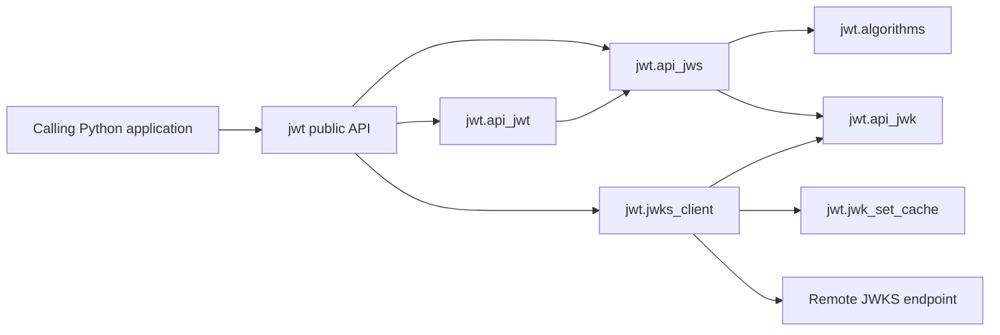
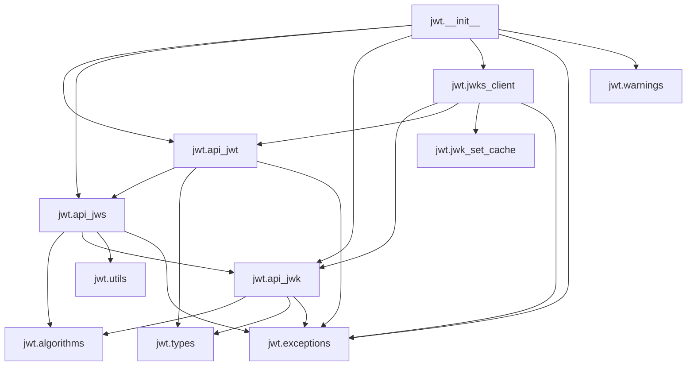

# PyJWT Architecture

> Generated with `ai-craftkit` skill: `archdoc`  
> Source: `https://github.com/jpadilla/pyjwt.git` at commit `7144e4534c34810f4525dc4578a32addd8212cff`  
> Prompt: `Follow instructions in #prompt:SKILL.md with these arguments: generate the architecture documentation for the pyjwt repo.`

Last Reviewed Scope: full review
Doc Status: DRAFT
Last Architecture Update: 2026-07-06T21:43:59Z
Updated By: agent
Source Basis: README scan | docs scan | code scan | test scan | workflow scan

## Purpose

This document describes the static structure of PyJWT: how modules are split, what they own, and where the main trust and dependency boundaries sit.

Detailed public contracts belong in `API_SURFACE.md`. Runtime and verification workflows belong in `OPERATIONS.md`.

## Architecture Summary

PyJWT is a layered library with a narrow core:

- `jwt.api_jws` owns compact token framing, signing, and signature verification.
- `jwt.api_jwt` wraps JWS behavior with JWT-specific payload decoding and registered-claim validation.
- `jwt.algorithms` provides pluggable algorithm implementations and key normalization.
- `jwt.api_jwk` and `jwt.jwks_client` handle JWK parsing and optional remote JWKS key discovery.
- `jwt.__init__` re-exports the supported top-level surface.

There is no persistence layer and no service runtime. State is limited to in-memory objects and optional JWKS caches.

## System Context

## Main Entry Points

| Entry point | Owner | Role |
|---|---|---|
| `jwt.encode` | `jwt.api_jwt` | Encode JWT payloads into compact tokens |
| `jwt.decode` | `jwt.api_jwt` | Decode tokens and validate claims |
| `jwt.decode_complete` | `jwt.api_jwt` | Return header, payload, and signature together |
| `jwt.get_unverified_header` | `jwt.api_jws` via `jwt.__init__` | Read JOSE header without signature verification |
| `jwt.PyJWK` / `jwt.PyJWKSet` | `jwt.api_jwk` | Parse JWK and JWKS structures |
| `jwt.PyJWKClient` | `jwt.jwks_client` | Fetch keys from remote JWKS endpoints |
| `jwt.register_algorithm` / `jwt.unregister_algorithm` | `jwt.api_jws` | Extend or alter the algorithm registry |

## Layering And Boundaries

| Layer | Modules | Responsibility | Boundary notes |
|---|---|---|---|
| Public facade | `jwt.__init__` | Stable import surface and exception re-exports | Compatibility-sensitive |
| JWT semantics | `jwt.api_jwt`, `jwt.types` | Claim validation, option merging, payload encode/decode | Should not duplicate low-level signing logic |
| JWS mechanics | `jwt.api_jws` | Token segmentation, header validation, signature checks | Security-critical parsing boundary |
| Crypto and key material | `jwt.algorithms`, `jwt.api_jwk`, `jwt.utils` | Algorithm implementations, key preparation, JWK conversion | Optional `cryptography` boundary |
| Remote key lookup | `jwt.jwks_client`, `jwt.jwk_set_cache` | HTTP fetch, cache, kid selection | Only network-aware part of the package |
| Diagnostics | `jwt.help`, `jwt.exceptions`, `jwt.warnings` | Support utility plus shared error/warning taxonomy | Cross-cutting support layer |

## Main Components

| Component | Responsibility | Key evidence |
|---|---|---|
| `PyJWT` | Default options, payload JSON conversion, registered-claim validation | `jwt/api_jwt.py`, `tests/test_api_jwt.py` |
| `PyJWS` | Token framing and signature verification | `jwt/api_jws.py`, `tests/test_api_jws.py` |
| `Algorithm` subclasses | Sign / verify implementations for HMAC, RSA, EC, EdDSA, and `none` | `jwt/algorithms.py`, `tests/test_algorithms.py` |
| `PyJWK` / `PyJWKSet` | JWK and JWKS parsing into usable key objects | `jwt/api_jwk.py`, `tests/test_api_jwk.py` |
| `PyJWKClient` | Outbound JWKS retrieval, cache, and kid-based lookup | `jwt/jwks_client.py`, `tests/test_jwks_client.py` |
| `JWKSetCache` | TTL-based in-memory cache for JWKS responses | `jwt/jwk_set_cache.py` |

## Static Module Dependency Map

## Data Model And Ownership

| Data shape | Owning module | Notes |
|---|---|---|
| Compact JWT/JWS string | `jwt.api_jws` | Split into header, payload, signature segments |
| JOSE header dict | `jwt.api_jws` | Parsed before signature verification; validation is security-sensitive |
| JWT payload dict | `jwt.api_jwt` | Must be a JSON object; registered claims validated after JWS decode |
| Decode options | `jwt.types`, merged by `jwt.api_jwt` / `jwt.api_jws` | Default values define security posture |
| JWK dict | `jwt.api_jwk` | Interpreted into algorithm-specific key objects |
| JWKS response | `jwt.api_jwk`, `jwt.jwks_client` | Must be a JSON object containing usable keys |
| JWKS cache state | `jwt.jwk_set_cache` | In-memory only; timestamped TTL semantics |

## Interface Types And Owners

PyJWT exposes three interface families:

- Python call-level API owned by `jwt.__init__`, `jwt.api_jwt`, and `jwt.api_jws`
- Key material interfaces owned by `jwt.api_jwk` and `jwt.algorithms`
- Network-backed key discovery owned by `jwt.jwks_client`

Detailed arguments, return values, warnings, and compatibility notes are documented in `API_SURFACE.md`.

## Data Flow Overview

### Encode path

1. Caller invokes `jwt.encode` or `PyJWT.encode`.
2. `jwt.api_jwt` validates payload shape and normalizes time claims.
3. `jwt.api_jws` chooses the algorithm and builds header plus signing input.
4. `jwt.algorithms` prepares the key and signs the input.
5. `jwt.api_jws` emits the compact token string.

### Decode path

1. Caller invokes `jwt.decode` or `PyJWT.decode_complete`.
2. `jwt.api_jws` parses token segments and validates header structure.
3. `jwt.algorithms` verifies the signature if enabled.
4. `jwt.api_jwt` decodes JSON payload and validates registered claims.
5. Caller receives payload or full decoded structure.

## External Dependencies

| Dependency | Role | Status |
|---|---|---|
| Python stdlib | Core runtime, JSON, time, urllib, warnings | verified |
| `cryptography` | Optional asymmetric algorithm and advanced key support | verified |
| `typing_extensions` | Compatibility dependency for older Python runtimes | verified |
| `pytest`, `coverage`, `tox`, `mypy`, `ruff`, `pre-commit` | Development and verification tooling | verified |
| Sphinx and `sphinx-rtd-theme` | Documentation build | verified |

## Configuration-Affected Architecture

| Configuration point | Architectural effect | Evidence |
|---|---|---|
| Install with or without `.[crypto]` | Changes available algorithms and key types | `pyproject.toml`, `jwt/algorithms.py` |
| `options` passed to `decode` / `decode_complete` | Alters verification behavior for signature and claims | `jwt/types.py`, `jwt/api_jwt.py` |
| `PyJWKClient` cache and timeout parameters | Changes remote-key lookup behavior and cache scope | `jwt/jwks_client.py` |
| `SPHINX_BUILD` env var | Broadens type-import paths for docs generation | `jwt/api_jwt.py`, `jwt/algorithms.py` |

## Security And Trust Boundaries

| Boundary | Why it matters | Evidence |
|---|---|---|
| Untrusted token input -> `jwt.api_jws._load` | Header and payload parsing must reject malformed or adversarial tokens early | `jwt/api_jws.py`, `tests/test_api_jws.py` |
| Header `alg` and caller-provided algorithms | Central defense against algorithm confusion | `jwt/api_jwt.py`, `jwt/api_jws.py`, `tests/test_algorithms.py` |
| Raw key material -> `jwt.algorithms.prepare_key` | Rejecting wrong key shapes is security-critical | `jwt/algorithms.py`, `tests/test_algorithms.py` |
| Remote URI -> `PyJWKClient` | Only `http` and `https` are allowed to avoid non-HTTP scheme abuse | `jwt/jwks_client.py`, `tests/test_jwks_client.py` |
| Cached JWKS responses | Staleness and refresh behavior affect downstream auth correctness | `jwt/jwks_client.py`, `jwt/jwk_set_cache.py` |

## Background Jobs And Async Architecture

No internal background jobs, queues, or async workers were found. All behavior is synchronous and request-scoped except for in-memory JWKS cache retention inside a `PyJWKClient` instance.

## Testing And Architecture Confidence

| Claim | Evidence | Status |
|---|---|---|
| Public behavior is heavily test-driven | Multiple targeted pytest modules across core components | verified |
| Asymmetric support is optional by design | optional dependency plus `has_crypto` fallback paths | verified |
| Docs and doctests are part of regular verification | `tox.ini`, `.readthedocs.yaml` | verified |
| Current code paths were not executed during this review | read-only inspection only | missing |

## Known Structural Weaknesses

- The top-level import surface re-exports many exceptions and helpers, which makes seemingly local renames compatibility-sensitive.
- Security behavior is distributed across `api_jwt`, `api_jws`, and `algorithms`, so changes often need coordinated tests in more than one module.
- Optional cryptography support creates two practical runtime modes that both need coverage.

## High-Risk Change Areas

| Change area | Impact |
|---|---|
| `jwt/algorithms.py` | Can break key parsing, signing, verification, or security invariants across many APIs |
| `jwt/api_jws.py` | Can break compact token parsing or signature semantics for every caller |
| `jwt/api_jwt.py` | Can silently change validation defaults or deprecation behavior |
| `jwt/__init__.py` | Can break imports used by downstream applications |
| `jwt/jwks_client.py` | Can break remote key resolution and auth flows in consumers |

## Verified / Inferred Claim Register

| Claim | Evidence | Status |
|---|---|---|
| PyJWT is a library, not a service | repo structure, absence of app/server/deploy manifests | verified |
| `api_jwt` builds on top of `api_jws` instead of duplicating JWS logic | imports and composition in `jwt/api_jwt.py` | verified |
| `cryptography` is optional but required for several algorithms | `pyproject.toml`, `jwt/algorithms.py`, docs | verified |
| Remote JWKS access is intentionally restricted to HTTP(S) URIs | `jwt/jwks_client.py` | verified |
| Most downstream integrations depend on top-level imports rather than submodules | `jwt/__init__.py`, docs examples | inferred |

## Known Unknowns

- Could not verify whether any downstream code relies on undocumented module internals beyond the exported surface.
- Could not confirm whether all Sphinx API docs are fully up to date; `docs/api.rst` still contains a note that PyJWS documentation is unfinished.