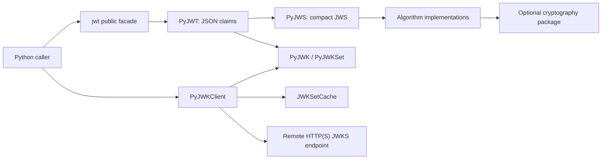

# PyJWT Architecture

> Review Scope: full static repository review
> Doc Status: MAINTAINED
> Last Updated: 2026-10-04T08:21:17Z
> Updated By: agent
> Source Revision: 7144e4534c34810f4525dc4578a32addd8212cff
> Source Basis: `pyproject.toml`, `jwt/`, `tests/`, `docs/`, and `.github/workflows/`

## Scope And Context

**verified:** PyJWT owns creation and validation of compact JSON Web Tokens, JWS processing, JWK/JWKS interpretation, and optional HTTP(S) retrieval of signing keys. The package exposes this behavior to Python callers through the `jwt` module ([jwt/__init__.py](../../jwt/__init__.py)). It does not own identity issuance, key lifecycle management, an authorization server, token storage, or a network service.

## Drivers And Constraints

- **verified:** the project describes itself as an RFC 7519 implementation and documents its `encode`/`decode` use ([README.rst](../../README.rst)).
- **verified:** it supports Python 3.9 through 3.14 in package metadata and CI; the CI matrix also includes PyPy 3.9 through 3.11 ([pyproject.toml](../../pyproject.toml), [.github/workflows/main.yml](../../.github/workflows/main.yml)).
- **verified:** asymmetric cryptography is optional through the `crypto` extra, while HMAC algorithms remain available without it ([pyproject.toml](../../pyproject.toml), [jwt/algorithms.py](../../jwt/algorithms.py)).
- **missing:** no ADR or explicit repository rationale was found for the present module decomposition or public compatibility strategy.

## Solution Strategy

The library layers JWT-specific behavior over a JWS engine. `PyJWT` converts JSON payloads and validates registered claims; `PyJWS` serializes or parses compact JWS segments and delegates signing/verification to algorithm implementations. JWK objects bind key data to an algorithm; `PyJWKClient` optionally retrieves matching signing keys from an HTTP(S) JWKS endpoint.

```mermaid
flowchart LR
    Caller["Python caller"] --> Facade["jwt public facade"]
    Facade --> JWT["PyJWT: JSON claims"]
    JWT --> JWS["PyJWS: compact JWS"]
    JWS --> Algorithms["Algorithm implementations"]
    JWT --> JWK["PyJWK / PyJWKSet"]
    Caller --> JWKS["PyJWKClient"]
    JWKS --> JWK
    JWKS --> Cache["JWKSetCache"]
    JWKS --> Endpoint["Remote HTTP(S) JWKS endpoint"]
    Algorithms --> Crypto["Optional cryptography package"]
```

## Building Blocks

| Component | Responsibility | Dependencies and state |
| --- | --- | --- |
| `jwt.__init__` | Stable top-level re-exports and package version. | Depends on API, JWK, JWKS, exception, and warning modules. |
| `PyJWT` | Encodes dictionary payloads; decodes JSON payloads; validates `exp`, `nbf`, `iat`, `aud`, `iss`, `sub`, `jti`, and required claims. | Owns default validation options and composes `PyJWS` ([jwt/api_jwt.py](../../jwt/api_jwt.py)). |
| `PyJWS` | Builds/parses compact serialization; maintains a per-instance algorithm registry and verifies signatures. | Uses `Algorithm` implementations and `PyJWK` ([jwt/api_jws.py](../../jwt/api_jws.py)). |
| Algorithms | Normalizes keys, signs, verifies, and translates JWK material. | HMAC uses the standard library; RSA, EC, PS, and EdDSA require `cryptography` ([jwt/algorithms.py](../../jwt/algorithms.py)). |
| JWK model | Converts JWK/JWK Set data into usable key objects and chooses or validates algorithms. | Rejects unusable key material; depends on algorithm registry ([jwt/api_jwk.py](../../jwt/api_jwk.py)). |
| JWKS client/cache | Fetches a remote JWKS, filters signing keys, matches `kid`, and caches sets/optionally individual keys. | Uses `urllib.request`, in-memory cache, supplied headers/timeout/SSL context ([jwt/jwks_client.py](../../jwt/jwks_client.py)). |

## Cross-Cutting Security And Failure Handling

- **verified:** signature verification defaults to enabled. When verification is enabled, callers must supply an algorithm allow-list unless a `PyJWK` supplies the bound algorithm ([jwt/api_jws.py](../../jwt/api_jws.py)).
- **verified:** high-level decode validates standard claims by default; options can disable individual checks, and failures use the public exception hierarchy ([jwt/api_jwt.py](../../jwt/api_jwt.py), [jwt/exceptions.py](../../jwt/exceptions.py)).
- **verified:** `PyJWK` binds key data to an algorithm, and JWS verification rejects a token whose advertised algorithm differs from that binding ([jwt/api_jwk.py](../../jwt/api_jwk.py), [jwt/api_jws.py](../../jwt/api_jws.py)).
- **verified:** the JWKS client allows only `http` and `https` URIs, supports caller-supplied request headers, timeout, and SSL context, and preserves a previously cached set when a refresh fails ([jwt/jwks_client.py](../../jwt/jwks_client.py), [tests/test_jwks_client.py](../../tests/test_jwks_client.py)).
- **verified:** insufficient key length emits `InsecureKeyLengthWarning` by default and can become `InvalidKeyError` when the corresponding option is enabled ([jwt/api_jws.py](../../jwt/api_jws.py)).

## Representative Flows

**Encoding:** `jwt.encode` delegates to `PyJWT.encode`, which checks the payload shape, converts registered datetime claims, JSON-encodes the payload, then asks `PyJWS` and the selected algorithm to produce a compact signed token.

**Decoding:** `jwt.decode` delegates to `PyJWT.decode_complete`; `PyJWS` parses and validates the protected header and signature before `PyJWT` JSON-decodes the payload and evaluates configured claims. The public facade test exercises this end-to-end path ([tests/test_jwt.py](../../tests/test_jwt.py)).

**Remote-key decoding:** an application can use `PyJWKClient.get_signing_key_from_jwt` to inspect an unverified header only to select a `kid`, retrieve the matching key from the configured JWKS endpoint, then pass that key and an application-controlled algorithm allow-list to `jwt.decode` ([jwt/jwks_client.py](../../jwt/jwks_client.py), [tests/test_jwks_client.py](../../tests/test_jwks_client.py)).

## Risks And Unknowns

- **verified:** callers control keys, allowed algorithms, validation options, endpoint URLs, and supplied headers; misuse of those inputs remains outside this library's control.
- **inferred:** `PyJWKClient` caches are process-local and not designed as a shared cache; only in-memory classes are present.
- **missing:** no static evidence of telemetry, metrics, structured logging, rate limiting, or a documented key-rotation operational policy was found.