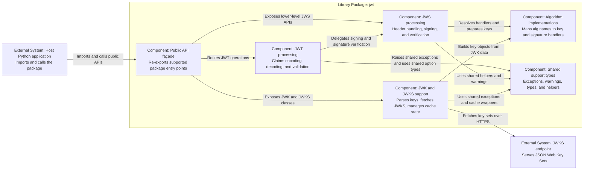

# C3: Component View — PyJWT Library Package

> Generated with `ai-craftkit` skill: `c4doc`  
> Source: `https://github.com/jpadilla/pyjwt.git` at commit `7144e4534c34810f4525dc4578a32addd8212cff`  
> Prompt: `Create the c4 documentation for the pyjwt repo here in this workspace.`

## Purpose

Describe the internal structure of the `jwt` package at the component level.

This view groups modules by responsibility so reviewers can reason about the public façade, token processing pipeline, algorithm subsystem, and optional remote key retrieval without mirroring every file one-to-one.

## Scope

| Field | Value |
|---|---|
| System | `PyJWT` |
| Container | `Library package: jwt` |
| Repository | `pyjwt` |
| View type | `C3 Component` |
| Last updated | `2026-07-07` |
| Confidence | `Confirmed` |

## Component Selection Criteria

Components are included when they represent stable responsibility boundaries that appear directly in the public API or coordinate important internal behavior.

## Diagram

## Components

| ID | Name | Responsibility | Main source paths | Interfaces | Evidence | Confidence |
|---|---|---|---|---|---|---|
| `component-public-api` | `Public API façade` | Keeps the public import surface stable by re-exporting classes, functions, warnings, and exceptions from package root | `jwt/__init__.py` | `import jwt`, package-level `encode`, `decode`, `PyJWKClient`, and related exports | `jwt/__init__.py` | Confirmed |
| `component-jwt` | `JWT processing` | Converts payload claims, manages decode options, and validates JWT claim semantics | `jwt/api_jwt.py` | `PyJWT`, `encode`, `decode`, `decode_complete` | `jwt/api_jwt.py`, `docs/api.rst` | Confirmed |
| `component-jws` | `JWS processing` | Serializes JOSE headers, enforces algorithm selection, and verifies detached or attached signatures | `jwt/api_jws.py` | `PyJWS`, `get_unverified_header`, algorithm registration helpers | `jwt/api_jws.py`, `docs/api.rst` | Confirmed |
| `component-algorithms` | `Algorithm implementations` | Defines algorithm classes and the default registry, with optional `cryptography`-backed asymmetric algorithms | `jwt/algorithms.py` | `get_default_algorithms`, algorithm classes | `jwt/algorithms.py`, `pyproject.toml` | Confirmed |
| `component-jwks` | `JWK and JWKS support` | Parses JWK structures, builds key objects, fetches remote JWKS documents, and caches key-set state | `jwt/api_jwk.py`, `jwt/jwks_client.py`, `jwt/jwk_set_cache.py` | `PyJWK`, `PyJWKSet`, `PyJWKClient` | `jwt/api_jwk.py`, `jwt/jwks_client.py`, `docs/api.rst` | Confirmed |
| `component-support` | `Shared support types` | Centralizes exceptions, warnings, types, and helper utilities reused by the processing components | `jwt/exceptions.py`, `jwt/warnings.py`, `jwt/types.py`, `jwt/utils.py` | Internal module imports | Cross-module imports throughout `jwt/` | Confirmed |

## Relationships

| From | To | Description | Technology / Mechanism | Evidence | Confidence |
|---|---|---|---|---|---|
| `component-public-api` | `component-jwt` | Exposes package-level JWT encode/decode entry points | Python import and function delegation | `jwt/__init__.py`, `jwt/api_jwt.py` | Confirmed |
| `component-public-api` | `component-jws` | Exposes lower-level JWS controls and algorithm registration | Python import and function delegation | `jwt/__init__.py`, `jwt/api_jws.py` | Confirmed |
| `component-public-api` | `component-jwks` | Exposes JWK parsing and remote key retrieval classes | Python import and class export | `jwt/__init__.py`, `jwt/api_jwk.py`, `jwt/jwks_client.py` | Confirmed |
| `component-jwt` | `component-jws` | Delegates token signing and signature verification after claim handling | Internal object composition and method calls | `jwt/api_jwt.py` | Confirmed |
| `component-jws` | `component-algorithms` | Resolves algorithm objects and prepares keys before sign or verify | In-process Python calls | `jwt/api_jws.py`, `jwt/algorithms.py` | Confirmed |
| `component-jwks` | `component-algorithms` | Uses algorithm implementations to materialize key objects from JWK data | In-process Python calls | `jwt/api_jwk.py`, `jwt/algorithms.py` | Confirmed |
| `component-jwks` | `external-jwks` | Retrieves remote key sets and signing keys when the client is configured with a URI | `HTTPS` via `urllib.request` | `jwt/jwks_client.py` | Confirmed |

## Source Mapping

| Component | Source paths | Notes |
|---|---|---|
| `Public API façade` | `jwt/__init__.py` | Single package root defines the supported import surface |
| `JWT processing` | `jwt/api_jwt.py` | Owns claim validation and wraps a `PyJWS` instance |
| `JWS processing` | `jwt/api_jws.py` | Owns serialization and signature-level concerns |
| `Algorithm implementations` | `jwt/algorithms.py` | Concentrates algorithm-specific key handling and signing logic |
| `JWK and JWKS support` | `jwt/api_jwk.py`, `jwt/jwks_client.py`, `jwt/jwk_set_cache.py` | Isolated subsystem for key material and remote retrieval |
| `Shared support types` | `jwt/exceptions.py`, `jwt/warnings.py`, `jwt/types.py`, `jwt/utils.py` | Grouped as one component to avoid over-fragmenting the model |

## External Interfaces

| Interface | Owned by component | Type | Description | Evidence |
|---|---|---|---|---|
| `jwt.encode()`, `jwt.decode()`, `jwt.decode_complete()` | `Public API façade`, `JWT processing` | Function | Main token encode and decode surface shown in README and API docs | `README.rst`, `docs/api.rst`, `jwt/__init__.py` |
| `jwt.PyJWT`, `jwt.PyJWS` | `JWT processing`, `JWS processing` | Class | Lower-level object-oriented access to token and signature workflows | `docs/api.rst`, `jwt/__init__.py` |
| `jwt.PyJWK`, `jwt.PyJWKSet`, `jwt.PyJWKClient` | `JWK and JWKS support` | Class | Key parsing and remote signing-key retrieval surface | `docs/api.rst`, `jwt/__init__.py` |

## Internal Interfaces

| Interface | From | To | Description | Evidence |
|---|---|---|---|---|
| `_jws` composition | `JWT processing` | `JWS processing` | `PyJWT` creates and delegates to a `PyJWS` instance for signature-level work | `jwt/api_jwt.py` |
| `get_default_algorithms()` and algorithm objects | `JWS processing` | `Algorithm implementations` | `PyJWS` builds and filters the algorithm registry | `jwt/api_jws.py`, `jwt/algorithms.py` |
| `PyJWK(...).Algorithm.from_jwk(...)` | `JWK and JWKS support` | `Algorithm implementations` | JWK parsing resolves the correct algorithm implementation before building key objects | `jwt/api_jwk.py`, `jwt/algorithms.py` |

## Important Dependencies

Only architecture-relevant dependencies are included here.

| Dependency | Used by | Why it matters | Evidence |
|---|---|---|---|
| `cryptography` | `Algorithm implementations`, `JWK and JWKS support` | Enables RSA, ECDSA, PSS, and EdDSA algorithm support beyond HMAC-only operation | `pyproject.toml`, `jwt/algorithms.py`, `jwt/api_jwk.py` |
| Python `urllib.request` | `JWK and JWKS support` | Provides the only network-facing integration path in the repository | `jwt/jwks_client.py` |

## Not Modeled

| Omitted item | Reason |
|---|---|
| Individual exception, warning, and utility modules as separate components | Too detailed for this repository-sized component view |
| `jwt/help.py` bug-report helper | Useful support script, but not a core responsibility boundary of the library architecture |
| Test modules | Behavioral validation, not primary runtime architecture |

## Assumptions

| Assumption | Reason | Review needed |
|---|---|---|
| The `jwt` package can be treated as the library boundary analogous to a C4 container for component-view purposes | This keeps the component diagram useful even though a true deployable C2 container is absent | yes |

## Open Questions

| Question | Why it matters |
|---|---|
| Should the JWK and JWKS subsystem be split into separate views if `PyJWKClient` grows more transport or cache behavior? | It is already the most externally connected part of the package |

## Review Notes

- Confirm that these are responsibility boundaries rather than just convenient module groupings.
- Keep `cryptography` documented as a technology dependency, not an external runtime system.
- Split this view only if future growth makes the JWKS subsystem or algorithm subsystem materially larger.