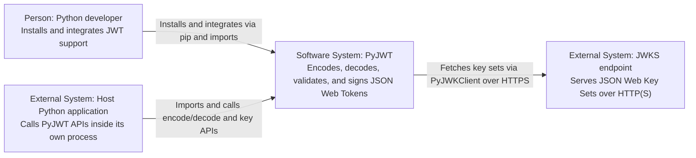

# C1: System Context

> Generated with `ai-craftkit` skill: `c4doc`  
> Source: `https://github.com/jpadilla/pyjwt.git` at commit `7144e4534c34810f4525dc4578a32addd8212cff`  
> Prompt: `Create the c4 documentation for the pyjwt repo here in this workspace.`

## Purpose

Describe how PyJWT fits into its environment as a library rather than a standalone service.

This view focuses on who integrates the library, which system executes it, and the one repository-backed external runtime dependency that matters architecturally.

## Scope

| Field | Value |
|---|---|
| System in scope | `PyJWT` |
| Repository | `pyjwt` |
| View type | `C1 System Context` |
| Last updated | `2026-07-07` |
| Confidence | `Confirmed` |

## Diagram

## People

| ID | Name | Description | Evidence | Confidence |
|---|---|---|---|---|
| `person-developer` | `Python developer` | Adds JWT creation, verification, or key-loading behavior to an application or reusable package | `README.rst`, `pyproject.toml` (`Intended Audience :: Developers`) | Confirmed |

## Software System in Scope

| ID | Name | Description | Evidence | Confidence |
|---|---|---|---|---|
| `system-pyjwt` | `PyJWT` | Python library implementing JSON Web Token encoding, decoding, validation, signing, and key handling | `README.rst`, `pyproject.toml`, `jwt/__init__.py` | Confirmed |

## External Systems

| ID | Name | Description | Relationship to system | Evidence | Confidence |
|---|---|---|---|---|---|
| `external-host-app` | `Host Python application` | The caller that imports the library and executes its APIs | Calls PyJWT's public functions and classes inside the caller's process | `README.rst`, `docs/api.rst` | Inferred |
| `external-jwks-endpoint` | `JWKS endpoint` | Remote endpoint serving JSON Web Key Set documents | Provides key material to `PyJWKClient` over HTTP(S) when configured | `jwt/jwks_client.py` | Confirmed |

## Relationships

| From | To | Description | Technology / Protocol | Evidence | Confidence |
|---|---|---|---|---|---|
| `person-developer` | `system-pyjwt` | Installs the package and integrates its APIs | `pip`, Python imports | `README.rst`, `docs/installation.rst`, `docs/api.rst` | Confirmed |
| `external-host-app` | `system-pyjwt` | Imports and invokes public JWT and JWK APIs | Python module, class, and function calls | `README.rst`, `docs/api.rst` | Inferred |
| `system-pyjwt` | `external-jwks-endpoint` | Retrieves remote JWK sets and signing keys when `PyJWKClient` is used | `HTTPS` via `urllib.request` | `jwt/jwks_client.py` | Confirmed |

## Evidence

| Evidence path | What it supports |
|---|---|
| `README.rst` | System purpose, installation, and developer-facing usage |
| `pyproject.toml` | Package identity, supported Python versions, and intended audience |
| `docs/api.rst` | Stable public API surface that callers integrate |
| `jwt/jwks_client.py` | Remote JWKS retrieval as an external-system relationship |

## Assumptions

| Assumption | Reason | Review needed |
|---|---|---|
| The host Python application is modeled as an external system even though it shares a process with PyJWT at runtime | This is the clearest way to express the library boundary in a C1 view | yes |
| JWKS endpoints are represented generically rather than as a named identity provider | The repository exposes a generic URI-based client and does not hard-code any provider | no |

## Open Questions

| Question | Why it matters |
|---|---|
| Should a future version of these docs show a second human actor such as a security engineer or maintainer? | The current repository evidence supports developers clearly, but other roles may be relevant outside the codebase |

## Review Notes

- Confirm that the host application should remain in the context view as an external system.
- Confirm that no other runtime external systems should be shown beyond a generic JWKS endpoint.
- Keep ordinary code dependencies such as `cryptography` out of the context diagram unless they become separate runtime services.