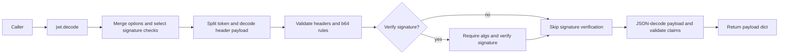

# JWT Decode Workflow

> Generated with `ai-craftkit` skill: `mermaiddoc`  
> Source: `https://github.com/jpadilla/pyjwt.git` at commit `7144e4534c34810f4525dc4578a32addd8212cff`  
> Prompt: `In the pyjwt repo describe the encode workflow with a new md file. Also describe the decode workflow with a separate md file.`

Purpose: Show how `jwt.decode()` verifies a compact JWT, parses the payload, and applies claim validation.

Source basis:
- `jwt/__init__.py`
- `jwt/api_jwt.py`
- `jwt/api_jws.py`
- `tests/test_api_jwt.py`

Diagram type: flowchart LR

Notes:
- verified: `jwt.decode` is exported from `jwt/__init__.py` and delegates into `PyJWT.decode()`, which calls `decode_complete()` before returning only the payload.
- verified: `PyJWS.decode_complete()` splits the compact token, decodes the JOSE header and payload, validates header rules, and verifies the signature when `verify_signature` is enabled.
- verified: When signature verification is enabled and the key is not a `PyJWK`, callers must pass `algorithms` or `PyJWS.decode_complete()` raises `DecodeError`.
- verified: After JWS handling, `PyJWT` JSON-decodes the payload and validates required claims plus enabled checks for `iat`, `nbf`, `exp`, `iss`, `aud`, `sub`, and `jti`.
- omitted: Detached-payload decoding and the detailed audience-validation branches are intentionally left out to keep the diagram focused.