# JWT Encode Workflow

> Generated with `ai-craftkit` skill: `mermaiddoc`  
> Source: `https://github.com/jpadilla/pyjwt.git` at commit `7144e4534c34810f4525dc4578a32addd8212cff`  
> Prompt: `In the pyjwt repo describe the encode workflow with a new md file. Also describe the decode workflow with a separate md file.`

Purpose: Show how `jwt.encode()` turns a claim dict into a signed compact JWT.

Source basis:
- `jwt/__init__.py`
- `jwt/api_jwt.py`
- `jwt/api_jws.py`
- `tests/test_api_jwt.py`

Diagram type: flowchart LR

```mermaid
flowchart LR
    Caller[Caller] --> Facade[jwt.encode]
    Facade --> Claims[Copy payload and normalize exp iat nbf]
    Claims --> Iss[Check iss type]
    Iss --> Payload[JSON-encode payload bytes]
    Payload --> Header[Build header and segments]
    Header --> Alg[Resolve alg and prepare key]
    Alg --> Sign[Sign input and append signature]
    Sign --> Token[Return compact JWT]
```

Notes:
- verified: `jwt.encode` is exported from `jwt/__init__.py` and delegates into `PyJWT.encode()`.
- verified: `PyJWT.encode()` copies the payload, converts `exp`, `iat`, and `nbf` datetimes to NumericDate integers, and rejects a non-string `iss` claim.
- verified: `PyJWS.encode()` lets a `headers["alg"]` value override the function argument and uses a `PyJWK` key's algorithm when no explicit algorithm is supplied.
- inferred: Key preparation, optional key-length enforcement, and signature generation are grouped into one node to keep the overview readable.
- omitted: Detached-payload handling (`b64=false`) exists in `PyJWS.encode()` but is not part of the default `jwt.encode()` path.