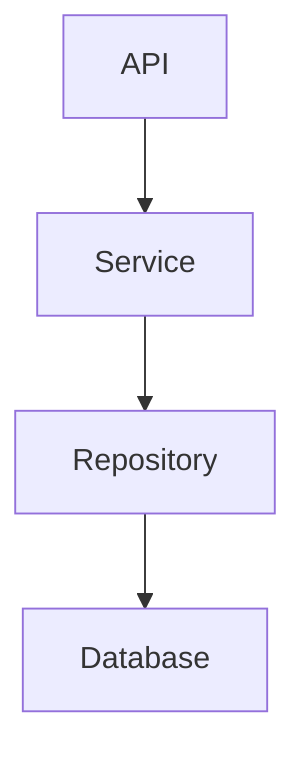

# Adrgen Skill

Command: `/adrgen`

Generate evidence-based Architecture Decision Records and ADR-related decision documents for the currently opened repository.

The skill supports four modes:

```text
/adrgen discover
/adrgen generate
/adrgen capture
/adrgen prepare
```

The skill inspects repository evidence when needed, uses the ADR template, removes unused or irrelevant template sections, and writes the final decision documentation to the repository’s `docs/adr/` folder.

## Purpose

`/adrgen` helps humans and agents document architectural decisions in a practical, traceable, and evidence-based way.

The goal is to create decision documentation that helps future humans and agents:

- understand why an architectural choice exists
- distinguish decisions from implementation details
- see which alternatives were considered
- understand consequences and trade-offs
- find evidence in code, docs, issues, discussions, pull requests, or human input
- avoid repeating old debates without new evidence
- avoid changing important architecture accidentally
- mark uncertainty instead of inventing rationale
- turn reviewed ADR candidates into useful ADR drafts

The goal is not to create generic ADR boilerplate.

## Modes

`adrgen` has four first-class modes.

```text
discover
generate
capture
prepare
```

Each mode has a different purpose, source basis, and output behavior.

Recommended lifecycle:

```text
discover  = find undocumented decisions in the repository
generate  = turn reviewed candidates into ADR drafts
capture   = record the result of a discussion
prepare   = prepare alternatives before a discussion
```

### Mode 1: Discover

Command:

```text
/adrgen discover
```

Purpose:

Find architectural decisions that appear to exist in the repository but are not documented yet.

Use this mode when:

- the repository has architecture patterns but few or no ADRs
- the user wants to identify missing decision records
- the codebase contains important structural choices that future agents should understand
- `archdoc` has already documented the repository and now decisions should be extracted from it
- the user wants a reviewable list of ADR candidates before generating ADR files

Discovery mode should inspect the repository thoroughly.

It should look for decision candidates such as:

- framework or runtime choices
- data storage choices
- module boundaries
- layering patterns
- dependency direction
- API style
- authentication and authorization design
- state ownership
- persistence and migration strategy
- background job or queue architecture
- configuration strategy
- deployment model
- integration strategy
- error handling and retry strategy
- observability approach
- security and trust boundaries
- testing strategy
- monorepo or package structure
- build and release strategy
- vendor or platform commitments

Discovery mode should usually create or update:

```text
docs/adr/ADR_CANDIDATES.md
docs/adr/README.md
```

Discovery mode should not automatically create final accepted ADRs.

If the user explicitly asks discovery mode to also create draft ADR files, create them with status `PROPOSED` or `NEEDS REVIEW`, not `ACCEPTED`, unless repository evidence or human input clearly confirms the decision.

Recommended workflow:

```text
/adrgen discover
human reviews and edits docs/adr/ADR_CANDIDATES.md
/adrgen generate
```

### Mode 2: Generate

Command:

```text
/adrgen generate
```

Purpose:

Generate ADR drafts from reviewed candidates in `docs/adr/ADR_CANDIDATES.md`.

Use this mode when:

- discovery mode has created `ADR_CANDIDATES.md`
- a human has reviewed, edited, approved, rejected, prioritized, or refined candidates
- the user wants to turn selected candidates into ADR files
- the repository should get missing ADRs without rerunning full discovery
- the user wants ADR generation to happen only after candidate review
- the candidate list has been adjusted to the team’s needs

Generate mode should read:

```text
docs/adr/ADR_CANDIDATES.md
docs/adr/README.md
docs/adr/*.md
```

Generate mode may inspect the repository again when needed to verify:

- evidence
- affected files
- affected modules
- current implementation
- runtime impact
- testing impact
- security impact
- open questions
- potential duplication with existing ADRs

Default behavior:

- generate ADRs only for candidates marked as approved, selected, ready, or explicitly requested
- skip candidates marked rejected, deferred, duplicate, not ADR-worthy, generated, or needs discussion
- create ADRs with `Decision Status: PROPOSED` unless the candidate or human input clearly confirms `ACCEPTED`
- use `Doc Status: NEEDS REVIEW` when rationale or original intent is inferred
- preserve candidate evidence and open questions
- update `docs/adr/README.md`
- update `docs/adr/ADR_CANDIDATES.md` with the generated ADR filename when safe

Generate mode should not create ADRs from every candidate by default.

It should require one of these signals:

```text
Candidate Status: approved
Candidate Status: selected
Candidate Status: ready
Generate ADR: yes
Suggested next step: generate ADR
```

If no candidates are clearly approved, report the candidates that look ready and ask the user to mark them, or generate only a candidate the user explicitly names in natural language.

Candidate marker examples:

```md
## CAND-001: Use PostgreSQL for primary persistence

Candidate Status: approved
Generate ADR: yes
Suggested ADR: docs/adr/0001-use-postgresql-for-primary-persistence.md
Generated ADR: none
Decision Status: PROPOSED
```

```md
## CAND-002: Separate API and worker runtime units

Candidate Status: ready
Generate ADR: yes
Generated ADR: none
Decision Status: PROPOSED
```

Skipped candidate examples:

```md
Candidate Status: rejected
Generate ADR: no
```

```md
Candidate Status: deferred
Generate ADR: no
```

```md
Candidate Status: duplicate
Generate ADR: no
Duplicate of: ADR-0003
```

```md
Candidate Status: needs discussion
Generate ADR: no
```

```md
Candidate Status: generated
Generate ADR: no
Generated ADR: docs/adr/0004-use-postgresql-for-primary-persistence.md
```

If a candidate says `Generate ADR: yes` but has `Candidate Status: needs discussion`, treat this as contradictory.

In that case:

- do not generate automatically
- report the contradiction
- ask the user to set either `Candidate Status: ready` or `Generate ADR: no`

### Mode 3: Capture

Command:

```text
/adrgen capture
```

Purpose:

Turn an ongoing or completed discussion into an ADR draft.

Use this mode when the user provides:

- meeting notes
- Slack or Teams discussion
- GitHub issue comments
- pull request discussion
- architecture review notes
- pasted conversation
- a short summary of a decision
- explicit human input about a decision

Capture mode should identify:

- the decision that was made
- the context that led to it
- alternatives discussed
- reasons for accepting or rejecting options
- trade-offs
- consequences
- objections or reservations
- follow-up work
- evidence and open questions

Capture mode should create or update one ADR file:

```text
docs/adr/NNNN-decision-title.md
```

Capture mode should also create or update:

```text
docs/adr/README.md
```

Capture mode may inspect the repository when needed.

Inspect the repository when:

- the discussion references modules, files, services, frameworks, data stores, or commands
- the impact of the decision is unclear
- the decision affects runtime behavior, data ownership, deployment, security, or testing
- the user asks to ground the ADR in codebase evidence
- existing `REPO_MAP.md`, `ARCHITECTURE.md`, or `OPERATIONS.md` can provide useful context

If the user provides discussion content directly, use it as the primary source. Do not invent missing participants, reasons, or agreement.

### Mode 4: Prepare

Command:

```text
/adrgen prepare
```

Purpose:

Prepare alternatives, trade-offs, and decision criteria for an upcoming architecture discussion.

Use this mode when:

- no decision has been made yet
- the user wants to structure an architecture discussion
- the team needs alternatives before choosing
- the topic is broad, risky, or has several viable options
- the user wants a discussion document before creating an ADR

Prepare mode should create a decision preparation document, not a final ADR by default.

Typical output:

```text
docs/adr/ADR_PREP-decision-topic.md
```

Prepare mode may also update:

```text
docs/adr/README.md
```

Prepare mode should include:

- problem statement
- scope
- decision criteria
- constraints
- affected architecture areas
- options
- trade-offs
- risks
- evidence from the repository
- missing information
- questions for the discussion
- recommended next step, if evidence is strong enough

Prepare mode may inspect the repository thoroughly when the topic touches existing code or architecture.

Natural examples:

```text
/adrgen prepare "Choose an authorization model for the API"
/adrgen prepare "Move background jobs from cron to queue workers"
```

Prepare mode must not claim that a decision has been made unless the user explicitly says so.

After the discussion, use capture mode to convert the outcome into a real ADR.

## Slash Command

Use this skill when the user calls:

```text
/adrgen
```

Supported commands:

```text
/adrgen discover
/adrgen generate
/adrgen capture
/adrgen prepare "<topic>"
```

If no mode is provided:

1. If `docs/adr/ADR_CANDIDATES.md` exists and contains candidates marked approved, selected, ready, or `Generate ADR: yes`, use `generate`.
2. If the user provided discussion notes or a decision summary, use `capture`.
3. If the user provided an upcoming topic or question, use `prepare`.
4. If the user only called `/adrgen` inside a repository, use `discover`.
5. If the intent cannot be determined, explain the four modes and ask the user to choose one.

## Required Output Files

Use this output directory:

```text
docs/adr/
```

Create the directory if it does not exist.

### Always create or update when useful

```text
docs/adr/README.md
```

The ADR index should list:

- accepted ADRs
- proposed ADRs
- rejected ADRs
- deprecated ADRs
- superseded ADRs
- preparation documents
- candidate documents

### Discover mode output

Default:

```text
docs/adr/ADR_CANDIDATES.md
docs/adr/README.md
```

Only create draft ADR files if the user asks for them:

```text
docs/adr/NNNN-decision-title.md
```

### Generate mode output

Create or update:

```text
docs/adr/NNNN-decision-title.md
docs/adr/README.md
docs/adr/ADR_CANDIDATES.md
```

Generate one ADR file per selected candidate.

Do not generate ADRs for candidates marked rejected, deferred, duplicate, not ADR-worthy, generated, or needs discussion unless the user explicitly names them.

### Capture mode output

Create or update:

```text
docs/adr/NNNN-decision-title.md
docs/adr/README.md
```

### Prepare mode output

Default:

```text
docs/adr/ADR_PREP-decision-topic.md
docs/adr/README.md
```

If the user explicitly asks for a proposed ADR instead of a preparation document, create:

```text
docs/adr/NNNN-decision-title.md
```

with status:

```text
PROPOSED
```

Do not place generated ADR files outside `docs/adr/`.

Do not modify application source code.

Do not modify unrelated documentation unless the user explicitly asks.

## Lightweight Provenance Block

Every generated Markdown document must include a small provenance block near the top, directly after the title and before status fields or document metadata.

This applies to generated ADR files, ADR candidate files, ADR preparation documents, and ADR indexes created or updated by this skill.

The block must include only information that is directly available. Do not guess, infer, reconstruct, or invent missing metadata.

Use this format:

```markdown
> Generated with `ai-craftkit` skill: `adrgen`  
> Source: `<repository-url>` at commit `<commit-hash>`  
> Prompt: `<exact-user-prompt>`
```

## Template Handling Rules

Use the ADR template as the conceptual source:

```text
skills/adrgen/templates/adr-0000.template.md
```

If the repository uses another path for skills, find the local `adrgen/templates/adr-0000.template.md` file and use it.

The final generated ADR must not look like an unfilled template.

Before writing the final ADR:

1. Fill sections with concrete repository-specific, discussion-specific, candidate-specific, or user-provided information.
2. Delete placeholder-only sections.
3. Delete irrelevant sections.
4. Delete empty tables.
5. Delete unused example rows.
6. Delete unresolved bracket placeholders such as `[path]`, `[command]`, `[status]`.
7. Keep useful unknown sections only when the missing information matters.
8. Prefer concise concrete documentation over long generic boilerplate.
9. Preserve evidence labels where claims are important.
10. Preserve trade-offs even when the final decision is clear.
11. Preserve candidate IDs and candidate references when an ADR is generated from `ADR_CANDIDATES.md`.

Never leave content like this in final ADRs:

```text
[Describe ...]
[Insert ...]
[file or module]
[command]
[verified/inferred]
```

If a section is important but information is missing, keep it only when it helps future agents. In that case, write it as a real gap:

```md
## Open Questions and Gaps

- Could not determine why PostgreSQL was originally selected. Checked `README.md`, `docs/`, `docker-compose.yml`, and migration files.
- Could not verify whether the retry policy was intentionally designed or grew from implementation history.
```

## Evidence Policy

Architecture decision documentation generated by agents must be evidence-based.

Use these labels when needed:

```text
verified
inferred
uncertain
missing
```

Definitions:

- `verified`: directly confirmed from code, config, tests, logs, local execution, existing docs, issue comments, pull request comments, discussion notes, candidate review notes, or explicit human input.
- `inferred`: likely true based on naming, imports, structure, package dependencies, recurring patterns, or partial evidence.
- `uncertain`: plausible but not sufficiently supported.
- `missing`: expected information was searched for but not found.

Important claims should include evidence such as:

```text
README.md
docs/REPO_MAP.md
docs/ARCHITECTURE.md
docs/API_SURFACE.md
docs/OPERATIONS.md
docs/adr/ADR_CANDIDATES.md
docs/adr/README.md
docs/adr/*.md
package.json
pyproject.toml
go.mod
Cargo.toml
Dockerfile
docker-compose.yml
.github/workflows/ci.yml
src/server.ts
src/main.py
tests/
issues
pull requests
discussion notes
meeting notes
human input
```

Prefer this style:

```md
| Claim | Evidence | Status |
|---|---|---|
| The service uses PostgreSQL as the primary persistence store | `docker-compose.yml`, `src/db/connection.ts`, migration files | verified |
| Redis appears to support background job processing | `redis` dependency and `src/jobs/queue.ts` | inferred |
| Original reason for choosing PostgreSQL is not documented | checked `README.md`, `docs/`, ADRs, and git log | missing |
```

Do not overclaim.

If the repository, discussion, or reviewed candidate does not prove something, mark it as inferred, uncertain, or missing.

## Repository Inspection Process

When repository inspection is needed, inspect the complete repository from the current working directory.

Discovery mode should inspect the repository thoroughly by default.

Generate mode should inspect existing ADRs and `ADR_CANDIDATES.md` by default. It should inspect the codebase again when candidate evidence is stale, incomplete, uncertain, or architecture-sensitive.

Capture and prepare modes should inspect the repository when repository evidence is needed to understand or verify the decision.

Start with safe read-only commands.

Recommended first pass:

```bash
pwd
git rev-parse --show-toplevel
git status --short
find . -maxdepth 2 -type f | sort
find . -maxdepth 2 -type d | sort
```

Prefer using `git ls-files` when available:

```bash
git ls-files
```

If available, inspect a compact tree:

```bash
tree -a -L 3
```

If `tree` is not available, use `find`.

Do not scan huge ignored directories manually.

Skip or summarize these paths unless they are directly relevant:

```text
.git/
node_modules/
vendor/
dist/
build/
.next/
.nuxt/
target/
coverage/
.cache/
.venv/
venv/
__pycache__/
.pytest_cache/
.idea/
.vscode/
.DS_Store
```

Do not read secrets.

Never print secret values into generated ADRs or ADR candidate files.

Sensitive files to avoid reading in full:

```text
.env
.env.*
*.pem
*.key
*.crt
id_rsa
id_ed25519
secrets.*
credentials.*
```

It is acceptable to record that a secret or env file exists, but do not copy its values.

Example:

```md
- `.env.example`: documents required local variables.
- `.env`: present locally but values were not read.
```

## Files to Inspect

Inspect repository files in this rough order.

### 1. Existing Decision and Architecture Docs

Look for:

```text
docs/adr/
docs/ADRs/
adr/
ADRs/
README.md
docs/REPO_MAP.md
docs/ARCHITECTURE.md
docs/API_SURFACE.md
docs/OPERATIONS.md
docs/
CONTRIBUTING.md
DEVELOPMENT.md
DEPLOYMENT.md
CHANGELOG.md
SECURITY.md
```

Extract:

- existing ADR numbering
- existing ADR status values
- documented decisions
- undocumented decisions mentioned in architecture docs
- decision conflicts
- superseded decisions
- stale or contradictory decisions
- architecture constraints
- module boundaries
- runtime flows
- deployment assumptions
- operational risks
- candidate IDs and generation markers in `ADR_CANDIDATES.md`

If `archdoc` outputs exist, use them as orientation input, but verify important claims against repository evidence when writing ADRs.

If `ADR_CANDIDATES.md` exists, use it as the source of reviewed candidate intent for generate mode.

### 2. Manifests and Package Files

Look for:

```text
package.json
pnpm-lock.yaml
yarn.lock
package-lock.json
pyproject.toml
requirements.txt
Pipfile
poetry.lock
Cargo.toml
go.mod
pom.xml
build.gradle
composer.json
Gemfile
Makefile
justfile
Taskfile.yml
```

Extract:

- language and runtime choices
- framework choices
- package manager choices
- major dependencies
- scripts and commands
- test framework
- build tool
- lint and format tools
- likely entry points
- vendor or platform commitments

Decision candidates often appear here.

Examples:

- choice of framework
- choice of package manager
- choice of build system
- choice of test runner
- choice of ORM or database library
- choice of queue or messaging library

### 3. Source Tree

Look for common entry points:

```text
main.*
index.*
server.*
app.*
cli.*
manage.py
wsgi.py
asgi.py
cmd/
src/
app/
routes/
api/
controllers/
services/
models/
domain/
db/
jobs/
workers/
lib/
utils/
```

Extract:

- main modules
- module responsibilities
- boundaries
- dependency direction
- cross-cutting abstractions
- data providers
- integration adapters
- routes and commands
- background jobs
- persistence layer
- validation points
- logging patterns
- error handling patterns
- authorization checks
- trust boundaries
- recurring architectural patterns

Decision candidates often appear as repeated structure.

Examples:

- controllers call services, services call repositories
- all external calls are hidden behind adapters
- domain logic is isolated from framework code
- database writes are centralized
- workers share business services with API handlers
- tenant context is passed explicitly
- feature flags control risky behavior

### 4. Tests

Look for:

```text
test/
tests/
spec/
__tests__/
e2e/
features/
*.test.*
*.spec.*
pytest.ini
vitest.config.*
jest.config.*
playwright.config.*
cypress.config.*
```

Extract:

- test types
- test commands
- architecture assumptions encoded in tests
- integration boundaries
- fixtures and fake providers
- missing coverage
- smoke checks
- acceptance tests
- external dependencies required for tests

Decision candidates can appear in tests.

Examples:

- API contract tests imply a public boundary
- repository tests imply persistence abstraction
- integration tests imply service boundaries
- fixtures imply domain concepts
- E2E tests imply critical user flows

### 5. Runtime and Deployment

Look for:

```text
Dockerfile
docker-compose.yml
compose.yml
.dockerignore
Procfile
systemd/
deploy/
infra/
k8s/
helm/
terraform/
.github/workflows/
.gitlab-ci.yml
fly.toml
render.yaml
vercel.json
netlify.toml
```

Extract:

- deployment target
- runtime units
- containers
- ports
- volumes
- environment variables
- health checks
- CI/CD
- restart policy
- persistent state
- resource limits
- production start command
- infrastructure assumptions
- rollout or migration approach

Decision candidates often appear here.

Examples:

- container-first deployment
- serverless deployment
- static frontend hosting
- database migration in CI
- environment variables as configuration
- one process per container
- background workers as separate runtime units

### 6. Config and Environment

Look for:

```text
.env.example
.env.template
config/
settings.*
*.config.*
```

Extract:

- configuration files
- feature flags
- required environment variables
- runtime modes
- secret names only, never values
- config precedence when clear
- environment-specific behavior

Decision candidates often appear here.

Examples:

- config by environment variables
- feature flags for rollout
- compile-time config
- runtime config files
- secrets outside repository
- local development defaults

### 7. Git History, PRs, Issues

Use only if locally available and useful.

Safe commands:

```bash
git log --oneline -n 30
git branch --show-current
git tag --sort=-creatordate | head
```

Extract:

- recent architectural direction
- major migrations
- active decision areas
- deleted or replaced technologies
- old decision candidates
- likely supersession events

Do not rely on git history as the only evidence for current architecture.

Git history can support decision discovery, but current repository state is more important.

## Optional Command Execution

The skill may run safe commands to verify the repo, but should be conservative.

Safe commands usually include:

```bash
git status --short
git ls-files
cat README.md
rg "ADR|Architecture Decision|decision|rationale|trade-off|tradeoff"
rg "CAND-|Candidate Status|Generate ADR|Suggested ADR|Generated ADR" docs/adr
rg "TODO|FIXME|HACK|DEPRECATED|LEGACY"
rg "main\(|server|listen|route|router|controller|service|worker|queue|cron"
rg "auth|permission|role|policy|token|session"
rg "migration|schema|repository|database|postgres|mysql|sqlite|redis|queue"
```

Commands that install dependencies, start services, run tests, build images, or modify files may be expensive or have side effects.

Before running heavier commands, inspect scripts first.

Examples of heavier commands:

```bash
npm install
pnpm install
poetry install
docker compose up
npm run dev
npm test
pytest
make test
docker build
```

If the user did not explicitly allow command execution and the command might be slow, networked, destructive, or state-changing, do not run it automatically.

Instead, document the command and mark verification as unknown.

Start with safe read-only inspection. Do not install dependencies, start servers, run Docker, execute deployments, or run heavy verification commands unless the user explicitly asks or the command is clearly safe and necessary.

## Decision Candidate Detection

Discovery mode should identify decision candidates, not every implementation detail.

A good ADR candidate usually has several of these properties:

- it affects multiple modules or teams
- it creates or enforces a boundary
- it selects one option from plausible alternatives
- it would be costly to reverse
- it affects runtime behavior, deployment, persistence, security, or operations
- it explains why the system is structured a certain way
- it is likely to be rediscovered by future maintainers
- changing it would require coordinated changes
- tests, config, deployment, or docs depend on it
- the rationale is missing or unclear

Do not create ADR candidates for trivial implementation details.

Usually not ADR-worthy:

- local variable naming
- one helper function
- small refactoring with no architectural impact
- formatting choice
- isolated bug fix
- implementation detail with no broader consequence
- dependency added only for a narrow internal helper

Likely ADR-worthy:

- selected database technology
- selected framework
- selected deployment model
- module boundary
- authentication model
- authorization model
- eventing or queue model
- API contract style
- data ownership rule
- migration strategy
- multi-tenancy strategy
- external provider abstraction
- error handling and retry policy
- observability strategy
- test strategy for critical flows
- build and release model

## ADR Candidate Review Model

`ADR_CANDIDATES.md` is a reviewable funnel.

Discovery mode creates or updates candidates.

Humans may then edit candidates before ADR files are generated.

Generate mode reads those reviewed candidates and creates ADR drafts only for selected candidates.

Recommended review fields:

```text
Candidate Status
Generate ADR
Decision Status
Suggested ADR
Generated ADR
Open Questions
Suggested Next Step
```

Candidate status values:

```text
new
ready
approved
selected
needs discussion
deferred
rejected
duplicate
generated
```

Generation flag values:

```text
yes
no
undecided
```

Decision status values for generated ADRs:

```text
PROPOSED
ACCEPTED
unknown
```

Default candidate behavior:

- `Candidate Status: new`
- `Generate ADR: undecided`
- `Generated ADR: none`
- `Decision Status: unknown`

Generation behavior:

- generate when `Candidate Status` is `approved`, `selected`, or `ready` and `Generate ADR` is `yes`
- skip when `Candidate Status` is `rejected`, `deferred`, `duplicate`, `generated`, or `needs discussion`
- skip when `Generate ADR` is `no`
- report candidates with `Generate ADR: undecided`
- generate explicitly named candidates even if the default generation markers are missing, but mark weak evidence clearly

## Discovery Mode Writing Process

When `/adrgen discover` is called, follow this process:

1. Determine repo root.
2. Create `docs/adr/` if missing.
3. Inspect existing ADRs and decision docs.
4. Inspect `REPO_MAP.md`, `ARCHITECTURE.md`, and `OPERATIONS.md` if present.
5. Inspect README and other existing docs.
6. Inspect manifests and package files.
7. Inspect project structure.
8. Inspect source modules.
9. Inspect tests.
10. Inspect config and deployment files.
11. Inspect CI/CD files.
12. Optionally inspect git history.
13. Identify architectural decision candidates.
14. Group similar candidates.
15. Remove duplicates.
16. Rate each candidate by confidence and impact.
17. Record evidence and gaps.
18. Assign stable candidate IDs such as `CAND-001`.
19. Set `Candidate Status: new` by default.
20. Set `Generate ADR: undecided` by default.
21. Set `Generated ADR: none` by default.
22. Write or update `docs/adr/ADR_CANDIDATES.md`.
23. Update `docs/adr/README.md`.
24. If the user explicitly asks discovery mode to also create draft ADRs, create proposed ADR drafts for high-confidence candidates.
25. Report what was created and the most important candidates.

Candidate confidence:

```text
high: strong code, config, docs, or discussion evidence
medium: recurring pattern with some supporting evidence
low: plausible candidate with limited evidence
```

Candidate impact:

```text
high: affects system shape, data, runtime, security, deployment, or many modules
medium: affects one subsystem or several related modules
low: localized design choice with limited blast radius
```

`ADR_CANDIDATES.md` should include:

```text
# ADR Candidates

Last Reviewed Scope: [full review | delta update | targeted area]
Doc Status: [MAINTAINED | DRAFT | NEEDS REVIEW]
Last ADR Candidate Update: [YYYY-MM-DDTHH:MM:SSZ]
Updated By: [human | agent | human+agent]
Source Basis: [README scan | code scan | tests run | app run locally | git history | other]

## Purpose

## Evidence Legend

## Candidate Summary

## Candidates

## Rejected Candidate Ideas

## Existing ADR Coverage

## Open Questions and Gaps

## Suggested Next ADRs

## Agent Work Guide
```

Each candidate should include:

```text
Candidate ID
Title
Suggested ADR filename
Generated ADR filename
Candidate status
Generate ADR flag
Decision status
Confidence
Impact
Affected area
Why this looks like an architectural decision
Evidence
Likely alternatives
Known consequences
Open questions
Suggested next step
```

Recommended candidate format:

```md
## CAND-001: [Candidate Title]

Candidate Status: [new | ready | approved | selected | needs discussion | deferred | rejected | duplicate | generated]
Generate ADR: [yes | no | undecided]
Suggested ADR: docs/adr/NNNN-short-kebab-case-title.md
Generated ADR: [docs/adr/NNNN-short-kebab-case-title.md or none]
Decision Status: [PROPOSED | ACCEPTED | unknown]
Confidence: [high | medium | low]
Impact: [high | medium | low]
Affected area: [module, subsystem, integration, platform, data model, runtime path]
Source Mode: discover

### Why this looks like an architectural decision

[Explain why this is more than an implementation detail.]

### Evidence

| Evidence | Type | Supports | Status |
|---|---|---|---|
| [`path` or source] | [code/config/test/doc/discussion] | [claim] | [verified/inferred/uncertain] |

### Likely Alternatives

- [alternative]
- [alternative]

### Known Consequences

- [consequence]
- [consequence]

### Open Questions

- [question]
- [question]

### Suggested Next Step

[review candidate | generate ADR | discuss with team | reject | merge with another candidate]
```

Discovery mode should optimize for later human review.

Good candidate output should allow the user to edit only a few fields before running `/adrgen generate`.

## Generate Mode Writing Process

When `/adrgen generate` is called, follow this process:

1. Determine the repository root.
2. Read `docs/adr/ADR_CANDIDATES.md`.
3. Read `docs/adr/README.md` if present.
4. Read existing ADR files to avoid duplicates and numbering conflicts.
5. Identify candidates marked for generation.
6. Skip rejected, deferred, duplicate, generated, not ADR-worthy, or needs discussion candidates unless explicitly requested.
7. For each selected candidate, inspect repository evidence again when needed.
8. Verify that the candidate still matches the current repository state.
9. Determine the next ADR number.
10. Create one ADR draft per selected candidate using the ADR template.
11. Set `Source Mode: generate`.
12. Set `Source Basis: ADR_CANDIDATES.md plus repository evidence`.
13. Reference the source candidate ID in the generated ADR.
14. Use `Decision Status: PROPOSED` by default.
15. Use `Decision Status: ACCEPTED` only when human input, reviewed candidate notes, existing docs, or implementation clearly confirms the decision.
16. Use `Doc Status: NEEDS REVIEW` when rationale or intent is inferred.
17. Preserve candidate evidence, consequences, alternatives, and open questions.
18. Remove unused template sections and placeholders.
19. Update `docs/adr/README.md`.
20. Update `docs/adr/ADR_CANDIDATES.md` with generated ADR filenames when safe.
21. Change generated candidates to `Candidate Status: generated` only after the ADR file has been written successfully.
22. Report generated ADRs and skipped candidates.

Do not regenerate an ADR that already exists unless the user explicitly asks to update it.

If a candidate appears to duplicate an existing ADR:

- skip it by default
- record the duplicate relationship in `ADR_CANDIDATES.md`
- mention it in the completion report

If a candidate has weak evidence:

- generate it only when explicitly selected
- use `Decision Status: PROPOSED`
- use `Doc Status: NEEDS REVIEW`
- preserve open questions clearly

If `ADR_CANDIDATES.md` does not exist:

- do not run discovery automatically unless the user explicitly asks
- explain that generate mode needs `docs/adr/ADR_CANDIDATES.md`
- suggest running `/adrgen discover`

If no candidates are marked for generation:

- do not create ADR files
- list candidates that look closest to ready
- explain which fields the user can edit
- suggest marking candidates with `Candidate Status: ready` and `Generate ADR: yes`

If a candidate says `Generate ADR: yes` but has `Candidate Status: needs discussion`, treat this as contradictory.

In that case:

- do not generate automatically
- report the contradiction
- ask the user to set either `Candidate Status: ready` or `Generate ADR: no`

If a candidate already has `Generated ADR` set to an existing ADR file:

- do not create a new ADR
- verify that the file exists if possible
- update the ADR only if the user explicitly requests update behavior
- mention the existing generated ADR in the report

## Capture Mode Writing Process

When `/adrgen capture` is called, follow this process:

1. Determine the source input.
2. Identify whether the source is discussion notes, issue comments, meeting transcript, pull request discussion, human summary, or mixed input.
3. Extract the decision topic.
4. Extract the final decision, if one exists.
5. Extract alternatives considered.
6. Extract arguments for and against each option.
7. Extract decision drivers.
8. Extract consequences and follow-up work.
9. Inspect the repository when needed to verify affected files, modules, commands, tests, config, deployment, or runtime impact.
10. Check existing ADRs for duplicates or supersession.
11. Determine the next ADR number.
12. Create or update the ADR file using the ADR template.
13. Remove unused template sections.
14. Remove placeholders.
15. Mark uncertain rationale clearly.
16. Update `docs/adr/README.md`.
17. Report what was created and the most important gaps.

Capture mode should preserve dissent and trade-offs when they are present.

Good ADRs do not only record the winning option. They record why other options were rejected.

If the discussion does not clearly show a final decision, use status `PROPOSED` or `NEEDS REVIEW`.

Do not mark an ADR as `ACCEPTED` unless:

- the user explicitly says the decision was accepted
- the source discussion clearly states agreement
- an existing issue, PR, or doc confirms the decision
- repository implementation clearly follows the decision and there is no contradictory evidence

## Prepare Mode Writing Process

When `/adrgen prepare` is called, follow this process:

1. Determine the decision topic.
2. Determine the scope.
3. Inspect repository evidence if the topic affects existing code or architecture.
4. Identify relevant constraints.
5. Identify decision drivers.
6. Identify viable options.
7. Compare options.
8. Identify risks and unknowns.
9. Identify questions for the upcoming discussion.
10. Identify evidence needed before deciding.
11. Write a preparation document.
12. Update `docs/adr/README.md` if useful.
13. Report what was created and the most important open questions.

Prepare mode should not pretend that a decision exists.

Use wording such as:

```text
This document prepares an upcoming decision.
No final decision is recorded here.
```

A preparation document should include:

```text
# ADR Prep: [Decision Topic]

Decision Status: PREPARATION
Discussion Date: [YYYY-MM-DD or unknown]
Last Reviewed Scope: [initial draft | repo discovery | targeted area]
Doc Status: [DRAFT | NEEDS REVIEW]
Last Prep Update: [YYYY-MM-DDTHH:MM:SSZ]
Updated By: [human | agent | human+agent]
Source Basis: [human input | code scan | architecture docs | discussion notes | other]

## Purpose

## Scope

## Evidence Legend

## Problem Statement

## Current Situation

## Decision Drivers

## Constraints

## Options

## Trade-off Summary

## Risks

## Repository Evidence

## Open Questions for the Discussion

## Information Needed Before Deciding

## Suggested Discussion Flow

## Follow-up After Discussion
```

If the user asks for a proposed ADR instead, use the ADR template and set:

```text
Decision Status: PROPOSED
Source Mode: prepare
```

## ADR Numbering and File Naming

ADR files should use stable numbering.

Format:

```text
docs/adr/NNNN-short-kebab-case-title.md
```

Examples:

```text
docs/adr/0001-use-postgresql-for-primary-persistence.md
docs/adr/0002-separate-api-and-worker-runtime-units.md
docs/adr/0003-use-environment-variables-for-runtime-config.md
```

Rules:

1. Inspect existing ADR files before assigning a number.
2. Use the next available number.
3. Do not renumber existing ADRs.
4. Do not reuse numbers.
5. Preserve existing naming conventions if the repository already has one.
6. Use lower-case kebab-case slugs.
7. Keep titles short and concrete.
8. If the ADR already exists, update it instead of creating a duplicate.
9. If a decision supersedes another ADR, keep both files and mark the relationship.

Preparation files should not consume ADR numbers unless the user asks for a proposed ADR.

Default preparation filename:

```text
docs/adr/ADR_PREP-short-kebab-case-topic.md
```

Discovery candidate file:

```text
docs/adr/ADR_CANDIDATES.md
```

Generate mode uses the next available ADR number unless the reviewed candidate contains a valid unused `Suggested ADR` filename.

If the suggested ADR number conflicts with an existing ADR, use the next available number and update the candidate with the actual generated filename.

## ADR Index

Create or update:

```text
docs/adr/README.md
```

The ADR index should be concise and useful.

Suggested structure:

```md
# Architecture Decision Records

Last ADR Index Update: [YYYY-MM-DDTHH:MM:SSZ]
Updated By: [human | agent | human+agent]

## Purpose

This directory records architectural decisions, decision candidates, and preparation documents.

## Status Legend

- PROPOSED
- ACCEPTED
- REJECTED
- SUPERSEDED
- DEPRECATED
- PREPARATION
- NEEDS REVIEW

## ADRs

| ID | Title | Status | Date | Notes |
|---|---|---|---|---|
| ADR-0001 | [title] | [status] | [date] | [notes] |

## Preparation Documents

| Topic | File | Status | Notes |
|---|---|---|---|
| [topic] | [`file`] | PREPARATION | [notes] |

## Candidate Documents

| File | Notes |
|---|---|
| [`ADR_CANDIDATES.md`] | [notes] |

## Agent Guidance

Before changing architecture-sensitive code, check this index and read any ADRs related to the affected module, data flow, runtime unit, dependency, or integration.
```

Remove unused sections when empty.

When generate mode creates ADR files, update the ADR index with:

- the generated ADR ID
- the generated ADR title
- the decision status
- the date
- a note referencing the source candidate ID when useful

## Existing ADR Handling

If ADR files already exist:

1. Read them first.
2. Preserve useful manually written information when still accurate.
3. Preserve decision history.
4. Preserve supersession links.
5. Do not silently overwrite human rationale.
6. Do not change accepted decisions unless the user asks.
7. Do not convert inferred rationale into verified history.
8. If implementation differs from an ADR, document the gap.
9. If an ADR appears stale, mark it as needing review or note the contradiction.
10. If a new ADR supersedes an old one, update both files when appropriate.

If an existing ADR contains a clear manual warning, preserve it.

Example:

```md
> Manual note: this decision was made for a customer-specific deployment and should not be generalized without review.
```

Generate mode must check existing ADRs before creating new ADRs from candidates.

If a reviewed candidate duplicates an existing ADR:

- do not create a duplicate ADR
- mark or report the candidate as duplicate
- reference the existing ADR
- update `ADR_CANDIDATES.md` only when safe

## Status Fields

Use these fields at the top of generated ADR files, matching the ADR template:

```md
Decision Status: [PROPOSED | ACCEPTED | REJECTED | SUPERSEDED | DEPRECATED]
Decision Date: [YYYY-MM-DD]
Last Reviewed Scope: [initial draft | discussion capture | repo discovery | decision review | supersession review]
Doc Status: [MAINTAINED | DRAFT | NEEDS REVIEW]
Last ADR Update: [YYYY-MM-DDTHH:MM:SSZ]
Updated By: [human | agent | human+agent]
Source Mode: [discover | generate | capture | prepare | manual]
Source Basis: [ADR_CANDIDATES.md | discussion notes | issue comments | code scan | architecture docs | meeting transcript | pull request | human input | other]
```

Rules:

- Use `DRAFT` when the ADR was created but not all claims could be verified.
- Use `NEEDS REVIEW` when important rationale is missing or risky claims are inferred.
- Use `MAINTAINED` only when the ADR is based on strong evidence and appears complete.
- Use UTC timestamps.
- Use `discover` when the ADR was derived directly from repository inspection.
- Use `generate` when the ADR was generated from a reviewed candidate in `ADR_CANDIDATES.md`.
- Use `capture` when the ADR was derived from discussion or human decision input.
- Use `prepare` when the ADR is a proposed decision or preparation artifact.
- Use `manual` only when preserving or updating a human-authored ADR without changing its source basis.

Decision status rules:

- `PROPOSED`: decision is suggested or drafted but not accepted.
- `ACCEPTED`: decision is confirmed by human input, discussion, implementation, or existing docs.
- `REJECTED`: option was considered and explicitly rejected.
- `SUPERSEDED`: decision has been replaced by a newer ADR.
- `DEPRECATED`: decision is no longer recommended but may still exist in the system.

Generate mode status rules:

- Use `PROPOSED` by default.
- Use `ACCEPTED` only when the candidate or human input clearly says the decision is accepted, or implementation and existing docs strongly confirm the decision with no contradictory evidence.
- Use `Doc Status: NEEDS REVIEW` when the candidate is based on inference, weak evidence, or missing rationale.
- Include the source candidate ID in the ADR body when useful.

## Final Document Quality Rules

Final ADRs and ADR-related documents must be:

- specific to the repository or discussion
- concise but useful
- evidence-based
- readable by humans
- useful to coding agents
- clear about uncertainty
- clear about trade-offs
- free of template placeholders
- free of copied secret values
- organized for future review

Prefer tables for inventories, comparisons, candidate lists, and evidence registers.

Prefer short prose for context, rationale, and consequences.

Do not create speculative history.

Do not present inferred rationale as if it came from the original decision makers.

Do not hide missing information.

Do not document every implementation detail.

Do not generate ADRs from unreviewed candidates unless the user explicitly asks.

Focus on decisions that help future agents answer:

```text
Why is the system shaped this way?
What should not be changed casually?
Which alternatives were considered?
What evidence supports this?
What is still uncertain?
```

## Diagrams

Use Mermaid diagrams only when useful and supported by evidence.

Acceptable diagrams:



Useful diagram types:

- decision impact area
- affected module boundary
- data ownership before and after
- runtime unit split
- integration flow
- migration path

Only include diagrams that reflect repository evidence, discussion input, or reviewed candidate evidence.

If the structure is uncertain, either omit the diagram or label it as inferred.

Do not create large speculative diagrams.

## High-Risk Decision Areas

Identify high-risk decision areas when present.

Common examples:

```text
authentication
authorization
payments
billing
database migrations
multi-tenancy
background jobs
queues
retry logic
idempotency
production deployment
secrets
external APIs
file deletion
data import/export
LLM/tool execution
sandboxing
permissions
customer data
schema changes
public API contracts
```

For each high-risk decision, document:

- what can break
- why it is risky
- likely symptoms
- what to inspect first
- tests or checks to run
- rollback or mitigation notes
- uncertainty level

Generate mode should preserve high-risk notes from candidates and verify them against repository evidence when possible.

## Open Questions and Gaps

Do not hide missing information.

Every generated ADR or ADR-related document may include a final section for gaps if useful.

Good examples:

```md
## Open Questions and Gaps

- Could not determine why Redis was selected for job state. Checked `README.md`, `docs/`, `docker-compose.yml`, and `src/jobs/`.
- Could not verify whether this decision is still accepted because implementation and documentation disagree.
- Could not find deployment evidence for how migrations are run in production.
```

Bad examples:

```md
## Open Questions and Gaps

- TBD
- Unknown
- Fill this in later
```

Generate mode should copy meaningful open questions from the source candidate into the ADR.

If an open question was resolved during generation, remove it from the ADR and update the evidence.

If an open question remains unresolved, keep it and mark the ADR as `Doc Status: NEEDS REVIEW` when the gap is important.

## Agent Guidance

Each generated ADR should include an agent work guide unless irrelevant.

Recommended default:

```md
## Agent Work Guide

Before changing code affected by this ADR:

1. Read this ADR fully.
2. Check `ARCHITECTURE.md` for the current structure and boundaries.
3. Check `OPERATIONS.md` for runtime and deployment impact.
4. Inspect the evidence listed in this ADR.
5. Search for newer ADRs that supersede or modify this decision.
6. Preserve the documented decision unless the user explicitly asks to revisit it.
7. If implementation differs from this ADR, mark the gap and update the relevant docs.
8. If evidence is missing, add an open question instead of inventing intent.

Rules:

- Do not treat inferred rationale as verified history.
- Do not remove trade-offs when updating the decision.
- Do not hide uncertainty.
- Prefer small, reviewable changes aligned with the documented decision.
- Update this ADR when the decision, consequences, affected files, or confidence level changes.
```

## Completion Report

After writing files, respond with a concise report.

For discover mode:

```text
Created/updated:
- docs/adr/ADR_CANDIDATES.md
- docs/adr/README.md

Most important ADR candidates:
- [candidate]
- [candidate]
- [candidate]

Important gaps:
- [gap]
- [gap]

Suggested next step:
- Review ADR_CANDIDATES.md, mark candidates with Candidate Status: ready and Generate ADR: yes, then run /adrgen generate.
```

For generate mode:

```text
Created/updated:
- docs/adr/0001-use-postgresql-for-primary-persistence.md
- docs/adr/0002-separate-api-and-worker-runtime-units.md
- docs/adr/README.md
- docs/adr/ADR_CANDIDATES.md

Generated ADRs:
- ADR-0001: Use PostgreSQL for primary persistence
- ADR-0002: Separate API and worker runtime units

Skipped candidates:
- CAND-003: Authorization model, marked needs discussion
- CAND-004: Queue abstraction, duplicate of ADR-0002

Important gaps:
- Original rationale for PostgreSQL is still inferred, not verified.
- Deployment rollback behavior could not be confirmed.

Suggested next step:
- Review generated ADRs and change status from PROPOSED to ACCEPTED only after human confirmation.
```

For capture mode:

```text
Created/updated:
- docs/adr/NNNN-decision-title.md
- docs/adr/README.md

Captured decision:
- [decision]

Important trade-offs:
- [trade-off]
- [trade-off]

Important gaps:
- [gap]

Suggested next step:
- [one concrete next step]
```

For prepare mode:

```text
Created/updated:
- docs/adr/ADR_PREP-decision-topic.md
- docs/adr/README.md

Prepared discussion:
- [topic]

Main options:
- [option]
- [option]
- [option]

Important open questions:
- [question]
- [question]

Suggested next step:
- [one concrete next step]
```

## Failure Handling

If the repository root cannot be determined:

```text
I could not determine the repository root. Open the repository folder first or run `/adrgen` from inside the repo.
```

If the repo is too large to inspect fully:

1. Inspect top-level files first.
2. Inspect existing docs and ADRs.
3. Inspect `ADR_CANDIDATES.md` if present.
4. Inspect manifests and package files.
5. Inspect likely source roots.
6. Inspect tests, config, and deployment files.
7. Sample large modules strategically.
8. Document the scope limitation clearly.

If the ADR template is missing:

- Continue using the expected ADR structure described in this skill.
- Do not fail solely because the template file is not present.
- Mention that the template was not found.

If `ADR_CANDIDATES.md` is missing during generate mode:

- do not create ADRs
- explain that generate mode needs `docs/adr/ADR_CANDIDATES.md`
- suggest running `/adrgen discover`

If no candidate is marked for generation:

- do not create ADRs
- report that no candidates are marked with `Candidate Status: ready`, `approved`, or `selected` and `Generate ADR: yes`
- suggest the exact candidate fields the user can edit

If candidate markers are inconsistent:

- do not guess
- report the inconsistent candidate IDs
- explain the conflict
- suggest the minimal change needed

Examples:

```text
CAND-002 has Candidate Status: needs discussion and Generate ADR: yes.
Set Candidate Status: ready to generate it, or set Generate ADR: no to skip it.
```

If files cannot be written:

- Report the error.
- Provide the generated content or a summary of what would have been written.

If the source discussion is ambiguous:

- Create a draft with `Doc Status: NEEDS REVIEW`.
- Mark unclear claims as `uncertain`.
- Add concrete open questions.
- Do not invent a final decision.

If an existing ADR conflicts with repository implementation:

- Preserve the ADR.
- Document the conflict.
- Mark it as needing review unless the user explicitly asks to update or supersede it.

If a generated ADR would duplicate an existing ADR:

- do not create a duplicate by default
- report the existing ADR
- update the candidate as duplicate when safe
- ask for explicit instruction if the user wants a replacement or supersession ADR

## Non-Goals

This skill does not:

- redesign the architecture
- refactor the repository
- fix tests
- deploy the application
- install dependencies by default
- expose secrets
- generate exhaustive API reference docs
- document every source file
- replace human architecture review
- decide on behalf of the team when evidence is insufficient
- turn every implementation detail into an ADR
- rewrite accepted decisions without explicit instruction
- generate ADRs from rejected, deferred, duplicate, generated, or needs-discussion candidates by default

## Core Principle

Create decision documentation that lets the next human or agent quickly answer:

```text
What decision exists here?
Why was it made?
What alternatives were considered?
What are the consequences?
Which files, modules, docs, candidates, or discussions support it?
What is known, inferred, uncertain, or missing?
What should I check before changing this area?
```