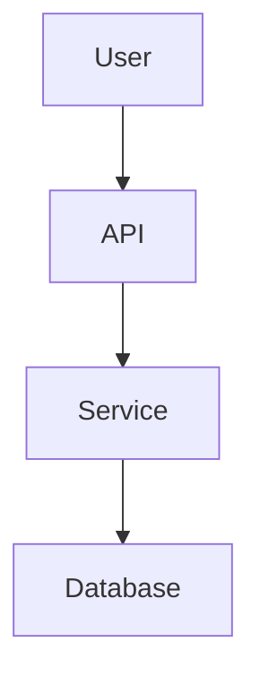

# Archdoc Skill

Command: `/archdoc`

Generate agent-friendly architecture documentation for the currently opened repository.

The skill inspects the repository, fills the architecture documentation templates, removes unused or irrelevant template sections, and writes the final documentation files to the repository’s `docs/` folder.

## Purpose

`/archdoc` creates four primary repository documentation files:

```text
docs/REPO_MAP.md
docs/ARCHITECTURE.md
docs/API_SURFACE.md
docs/OPERATIONS.md
```

These documents help humans and agents understand a codebase quickly and safely.

Responsibility split:

- `REPO_MAP.md`: repository orientation, important files, commands, conventions, glossary, and agent navigation.
- `ARCHITECTURE.md`: static architecture, modules, boundaries, dependencies, data ownership, and high-level interface ownership only.
- `API_SURFACE.md`: detailed public and integration-relevant interfaces such as HTTP endpoints, CLI commands, events, queues, webhooks, exports, schemas, auth rules, and compatibility notes.
- `OPERATIONS.md`: runtime behavior, local execution, deployment, configuration, debugging, failure modes, health checks, recovery, and operational verification.

The goal is not to produce generic documentation. The goal is to create a practical repository map that helps future agents:

- understand what is in the repo
- find the main entry points
- understand the static architecture
- understand how the system runs
- trace important runtime flows
- identify tests, config, deployment, and failure modes
- avoid inventing patterns that already exist
- make small, safe changes

## Slash Command

Use this skill when the user calls:

```text
/archdoc
```

The skill should generate or update the documentation set directly.

If the user names a specific area, document that area with enough repository context to keep the output accurate. Otherwise, inspect the repository broadly enough to produce a reliable full documentation pass.

## Required Output Files

Treat these as the four primary outputs:

```text
docs/REPO_MAP.md
docs/ARCHITECTURE.md
docs/API_SURFACE.md
docs/OPERATIONS.md
```

Always create or update `docs/REPO_MAP.md`, `docs/ARCHITECTURE.md`, and `docs/OPERATIONS.md`.

Generate `docs/API_SURFACE.md` whenever public or integration-relevant interfaces exist or are likely. If inspection shows that the repository has no meaningful public or integration-relevant interface surface, either:

- omit `docs/API_SURFACE.md`, or
- create a short file that clearly states that no interface surface was found,

depending on which choice better matches the repository’s documentation style.

Report that choice explicitly in the completion report.

Create the `docs/` directory if it does not exist.

Do not place the generated files outside `docs/`.

Do not modify application source code.

Do not modify unrelated documentation unless the user explicitly asks.

## Lightweight Provenance Block

Every generated Markdown document must include a small provenance block near the top, directly after the title and before the document status fields.

The block must include only information that is directly available. Do not guess, infer, reconstruct, or invent missing metadata.

Use this format:

```markdown
> Generated with `ai-craftkit` skill: `archdoc`  
> Source: `<repository-url>` at commit `<commit-hash>`  
> Prompt: `<exact-user-prompt>`
```

## Document Responsibilities

Keep the document responsibilities separate.

- Do not let `ARCHITECTURE.md` duplicate detailed interface documentation.
- Do not let `OPERATIONS.md` duplicate endpoint, schema, event payload, CLI option, or compatibility inventories.
- `ARCHITECTURE.md` may summarize interface ownership and link to `API_SURFACE.md`.
- `OPERATIONS.md` may reference `API_SURFACE.md` when runtime behavior depends on an interface, but it should stay focused on how the system runs, fails, and is verified.

### `docs/REPO_MAP.md`

Answers:

```text
What is here?
Where should an agent start?
Which files and folders matter?
What commands, conventions, vocabulary, and risks should an agent know?
```

Include only sections that are supported by repository evidence.

This document owns the static structure of the system. It may summarize major interface types and interface-owning modules, but it should not become the detailed endpoint, command, event, schema, or export reference.

Typical content:

- overview
- README quick start and gaps
- root-level structure
- top-level directory map
- important file index
- main entry files
- commands and runner scripts
- test suite map
- module overview
- data provider and persistence modules
- integration surface
- config and source files
- runtime and deployment files
- generated, ignored, and artifact paths
- domain language / glossary
- project conventions
- search hints for agents
- recommended reading order
- agent work guide
- high-risk areas
- current repository health
- open questions and gaps

### `docs/ARCHITECTURE.md`

Answers:

```text
How is the system structured?
What are the static modules, boundaries, dependencies, and data ownership rules?
```

Include only sections that are supported by repository evidence.

Typical content:

- purpose
- scope
- architecture summary
- system context
- runtime model from an architectural perspective
- main entry points
- layering and boundaries
- main components
- static module map
- internal dependency map
- data model and ownership
- main interface types
- owning modules
- architectural boundaries
- links to `API_SURFACE.md`
- background jobs and async architecture
- data flow overview
- external dependencies
- configuration-affected architecture
- security and trust boundaries
- architecture diagrams
- architectural decisions and constraints
- testing and architecture confidence
- known structural weaknesses
- high-risk change areas
- change impact notes
- verified / inferred claim register
- known unknowns

### `docs/API_SURFACE.md`

Answers:

```text
Which public or integration-relevant interfaces exist?
Where are they implemented?
What inputs, outputs, auth rules, schemas, errors, and compatibility constraints matter?
What should future agents verify before changing an interface?
```

Include only sections that are supported by repository evidence.

This document owns detailed interface and contract documentation.

Typical content:

- purpose
- scope
- evidence legend
- API surface summary
- interface inventory
- HTTP API
- GraphQL API
- RPC / gRPC / protobuf contracts
- CLI surface
- events, queues, and messages
- webhooks and inbound integrations
- public library / module exports
- file import / export formats
- input and output schemas
- authentication and authorization
- error and response conventions
- versioning, compatibility, and deprecation
- examples and smoke checks
- tests and contract confidence
- API surface diagrams
- high-risk interface changes
- change impact notes
- verified / inferred claim register
- known unknowns
- agent work guide

### `docs/OPERATIONS.md`

Answers:

```text
How does the system run?
How is it configured, deployed, tested, debugged, and recovered?
What happens dynamically at runtime?
```

Include only sections that are supported by repository evidence.

This document owns runtime and operational behavior. It may reference interface entry points, health checks, ports, or runtime dependencies, but detailed interface contracts belong in `API_SURFACE.md`.

Typical content:

- purpose
- runtime overview
- local development quick start
- command map
- execution model
- runtime modes
- environment and secrets
- configuration points
- Docker and container notes
- deployment
- deployment boundaries
- cron, scheduling, and triggers
- external runtime dependencies
- one real user action trace
- main runtime flows
- data flow and persistence
- background jobs and queues
- logging and observability
- debugging guide
- failure modes
- manual recovery notes
- backups and persistent state
- security operations
- current operational health
- safe change workflow
- extending operations
- operational gaps and known unknowns

## Template Handling Rules

Use the existing templates as the conceptual source:

```text
ARCHITECTURE.template.md
API_SURFACE.template.md
OPERATIONS.template.md
REPO_MAP.template.md
```

The final generated documents must not look like unfilled templates.

Before writing the final files:

1. Fill sections with concrete repository-specific information.
2. Delete placeholder-only sections.
3. Delete irrelevant sections.
4. Delete empty tables.
5. Delete unused example rows.
6. Delete unresolved bracket placeholders such as `[path]`, `[command]`, `[status]`.
7. Keep useful “unknown” sections only when the missing information matters.
8. Prefer concise concrete documentation over long generic boilerplate.
9. Keep detailed interface inventories in `API_SURFACE.md`, not in `ARCHITECTURE.md` or `OPERATIONS.md`.

Never leave content like this in final documents:

```text
[Describe ...]
[Insert ...]
[file or module]
[command]
[verified/inferred]
```

If a section is important but information is missing, keep it only when it helps future agents. In that case, write it as a real gap:

```md
## Known Unknowns

- Could not determine production deployment target. Checked `README.md`, `Dockerfile`, `.github/workflows`, and deployment-related files.
- Could not verify whether tests pass because dependencies were not installed.
```

## Evidence Policy

Architecture documentation generated by agents must be evidence-based.

Use these labels when needed:

```text
verified
inferred
uncertain
missing
```

Definitions:

- `verified`: directly confirmed from code, config, tests, logs, local execution, or explicit documentation.
- `inferred`: likely true based on naming, imports, structure, package dependencies, or partial evidence.
- `uncertain`: plausible but not sufficiently supported.
- `missing`: expected information was searched for but not found.

Important claims should include evidence such as:

```text
README.md
package.json
pyproject.toml
Dockerfile
docker-compose.yml
src/server.ts
src/main.py
.github/workflows/ci.yml
tests/
```

Prefer this style:

```md
| Claim | Evidence | Status |
|---|---|---|
| The app exposes an HTTP API | `src/server.ts`, `package.json` start script | verified |
| Redis appears to be used for background jobs | `redis` dependency and `src/jobs/queue.ts` | inferred |
| Production deployment target is not documented | checked README, Docker, CI files | missing |
```

Do not overclaim. If the repository does not prove something, mark it as inferred, uncertain, or missing.

## Repository Inspection Process

When `/archdoc` is called, inspect the complete repository from the current working directory.

Start with safe read-only commands.

Recommended first pass:

```bash
pwd
git rev-parse --show-toplevel
git status --short
find . -maxdepth 2 -type f | sort
find . -maxdepth 2 -type d | sort
```

Prefer using `git ls-files` when available:

```bash
git ls-files
```

If available, inspect a compact tree:

```bash
tree -a -L 3
```

If `tree` is not available, use `find`.

Do not scan huge ignored directories manually.

Skip or summarize these paths unless they are directly relevant:

```text
.git/
node_modules/
vendor/
dist/
build/
.next/
.nuxt/
target/
coverage/
.cache/
.venv/
venv/
__pycache__/
.pytest_cache/
.idea/
.vscode/
.DS_Store
```

Do not read secrets.

Never print secret values into generated docs.

Sensitive files to avoid reading in full:

```text
.env
.env.*
*.pem
*.key
*.crt
id_rsa
id_ed25519
secrets.*
credentials.*
```

It is acceptable to record that a secret or env file exists, but do not copy its values.

Example:

```md
- `.env.example`: documents required local variables.
- `.env`: present locally but values were not read.
```

## Files to Inspect

Inspect repository files in this rough order.

### 1. Existing Docs

Look for:

```text
README.md
docs/
docs/API_SURFACE.md
CONTRIBUTING.md
DEVELOPMENT.md
DEPLOYMENT.md
CHANGELOG.md
SECURITY.md
```

Extract:

- purpose
- install instructions
- run instructions
- test instructions
- deploy instructions
- known caveats
- architecture notes
- interface notes
- project conventions

Also compare README claims against repository reality.

### 2. Manifests and Package Files

Look for:

```text
package.json
pnpm-lock.yaml
yarn.lock
package-lock.json
pyproject.toml
requirements.txt
Pipfile
poetry.lock
Cargo.toml
go.mod
pom.xml
build.gradle
composer.json
Gemfile
Makefile
justfile
Taskfile.yml
```

Extract:

- language/runtime
- framework
- dependencies
- scripts
- commands
- test framework
- lint/format tools
- build outputs
- likely entry points

### 3. Source Tree

Look for common entry points:

```text
main.*
index.*
server.*
app.*
cli.*
manage.py
wsgi.py
asgi.py
cmd/
src/
app/
routes/
api/
controllers/
services/
models/
domain/
db/
jobs/
workers/
lib/
utils/
```

Extract:

- main modules
- module responsibilities
- public exports and interface-owning modules
- data providers
- integration adapters
- routes and commands
- schemas and contract definitions
- background jobs
- persistence layer
- validation points
- logging patterns
- error handling patterns

### 4. Tests

Look for:

```text
test/
tests/
spec/
__tests__/
e2e/
features/
*.test.*
*.spec.*
pytest.ini
vitest.config.*
jest.config.*
playwright.config.*
cypress.config.*
```

Extract:

- test types
- test commands
- coverage areas
- gaps
- smoke checks
- acceptance tests
- external dependencies required for tests

### 5. Runtime and Deployment

Look for:

```text
Dockerfile
docker-compose.yml
compose.yml
.dockerignore
Procfile
systemd/
deploy/
infra/
k8s/
helm/
terraform/
.github/workflows/
.gitlab-ci.yml
fly.toml
render.yaml
vercel.json
netlify.toml
```

Extract:

- deployment target
- runtime units
- containers
- ports
- volumes
- env vars
- health checks
- CI/CD
- restart policy
- persistent state
- resource limits
- production start command

### 6. Config and Environment

Look for:

```text
.env.example
.env.template
config/
settings.*
*.config.*
```

Extract:

- configuration files
- feature flags
- required environment variables
- runtime modes
- secret names only, never values
- config precedence when clear

### 7. Git History, PRs, Issues

Use only if locally available and useful.

Safe commands:

```bash
git log --oneline -n 20
git branch --show-current
```

Extract:

- recent direction
- active areas
- important architectural changes

Do not rely on git history as the only evidence for current architecture.

## Optional Command Execution

The skill may run safe commands to verify the repo, but should be conservative.

Safe commands usually include:

```bash
git status --short
git ls-files
cat README.md
rg "TODO|FIXME|HACK"
rg "main\(|server|listen|route|router|controller|service|worker|queue|cron"
```

Commands that install dependencies, start services, run tests, build images, or modify files may be expensive or have side effects.

Before running heavier commands, inspect scripts first.

Examples of heavier commands:

```bash
npm install
pnpm install
poetry install
docker compose up
npm run dev
npm test
pytest
make test
docker build
```

If the user did not explicitly allow command execution and the command might be slow, networked, destructive, or state-changing, do not run it automatically. Instead, document the command and mark verification as unknown.

Start with safe read-only inspection. Do not install dependencies, start servers, run Docker, execute deployments, or run heavy verification commands unless the user explicitly asks or the command is clearly safe and necessary.

## Writing Process

When generating the docs, follow this process:

1. Determine repo root.
2. Create `docs/` if missing.
3. Inspect existing documentation.
4. Inspect project structure.
5. Inspect commands and entry points.
6. Inspect tests.
7. Inspect config and deployment files.
8. Inspect source modules.
9. Identify public and integration-relevant interfaces.
10. Identify at least one real runtime flow if possible.
11. Identify external dependencies.
12. Identify high-risk areas.
13. Identify conventions and search hints.
14. Generate `REPO_MAP.md`.
15. Generate `ARCHITECTURE.md`.
16. Generate `API_SURFACE.md` when interfaces exist or are likely; otherwise omit it or create a clear no-surface summary.
17. Generate `OPERATIONS.md`.
18. Remove unused template sections.
19. Remove placeholders.
20. Add known unknowns where useful.
21. Write files to `docs/`.
22. Report what was created and the most important gaps.

## Final Document Quality Rules

Final docs must be:

- specific to the repository
- concise but useful
- evidence-based
- readable by humans
- useful to coding agents
- free of template placeholders
- free of copied secret values
- clear about uncertainty
- organized for quick onboarding
- clear about document ownership so architecture, interface, and operations content do not drift into each other

Prefer tables for maps and inventories.

Prefer short prose for interpretation.

Prefer Mermaid diagrams only when they add clarity and can be supported by evidence.

Do not create large speculative diagrams.

Do not include every file in the repository. Focus on files and folders that help understand or operate the system.

Do not document generated or vendored files in detail.

Do not duplicate detailed endpoint, CLI, event, export, schema, auth, or compatibility tables across multiple documents. Put those details in `API_SURFACE.md` and keep the other docs at the correct level.

## Diagrams

Use Mermaid diagrams when useful.

Acceptable diagrams:



Useful diagram types:

- system context
- module dependency map
- data flow
- request flow
- background job flow
- deployment/runtime shape

Only include diagrams that reflect repository evidence.

If the structure is uncertain, either omit the diagram or label it as inferred.

## One Real User Action Trace

`OPERATIONS.md` should include one real user action trace whenever possible.

Examples:

```text
login
signup
create project
upload file
send message
process payment
run background job
call CLI command
submit form
handle webhook
```

Trace it like this:

```text
user action
-> route / command / event
-> handler
-> service
-> model / repository
-> database or external dependency
-> response / side effect
```

If no user-facing action exists, trace the most important system action instead.

Examples:

```text
CLI command execution
scheduled job execution
library function call
batch processing path
test smoke path
```

If no runtime flow can be verified, omit the detailed trace and add a known unknown.

## README Reality Check

`REPO_MAP.md` should compare README claims against the repository where possible.

Check:

- install command
- run command
- test command
- build command
- deploy instructions
- documented env vars
- actual scripts and config files

Use this style:

```md
| Topic | README says | Repository shows | Status | Gap / note |
|---|---|---|---|---|
| Run | `npm run dev` | `package.json` contains `dev` script | verified | - |
| Test | not documented | `package.json` contains `test` script | missing | README should mention tests |
```

## Agent Guidance

Each generated `REPO_MAP.md` should include an agent work guide unless irrelevant.

Recommended default:

```md
## Agent Work Guide

Before changing code:

1. Identify the relevant module from the module overview.
2. Search for similar existing code.
3. Read the closest tests.
4. Trace the relevant runtime flow in `OPERATIONS.md`.
5. Make the smallest safe change.
6. Run the narrowest relevant test first.
7. Run broader tests or build.
8. Update docs if structure or behavior changed.

Rules:
- Do not invent a new pattern until existing patterns have been searched.
- Prefer small, reviewable diffs.
- Preserve project conventions.
- Mark uncertain findings instead of pretending they are verified.
- Add open questions when evidence is missing.
```

## High-Risk Areas

Identify high-risk areas when present.

Common examples:

```text
authentication
authorization
payments
billing
database migrations
background jobs
queues
retry logic
idempotency
production deployment
secrets
external APIs
file deletion
data import/export
LLM/tool execution
sandboxing
permissions
```

For each risk, document:

- what can break
- why it is risky
- likely symptoms
- what to inspect first
- tests or checks to run

## Open Questions and Gaps

Do not hide missing information.

Every generated doc may include a final section for gaps if useful.

Good examples:

```md
## Known Unknowns

- Could not determine production deployment target.
- Could not verify whether tests pass because dependencies were not installed.
- Could not find a documented backup strategy.
- Could not determine whether background jobs are idempotent.
```

Bad examples:

```md
## Known Unknowns

- TBD
- Unknown
- Fill this in later
```

## Existing Docs Handling

If the target files already exist:

1. Read them first.
2. Preserve useful manually written information when still accurate.
3. Update stale sections based on repository evidence.
4. Remove obsolete sections.
5. Do not blindly append duplicate sections.
6. Do not overwrite useful human notes unless contradicted by evidence.
7. If unsure, keep the note and mark it as uncertain or needs review.

If the existing docs contain a clear manual warning, preserve it.

Examples:

```md
> Manual note: production deploys are currently handled outside this repo.
```

## Status Fields

Use these fields at the top of each generated file:

```md
Last Reviewed Scope: [full review | delta update | targeted area]
Doc Status: [MAINTAINED | DRAFT | NEEDS REVIEW]
Last [Repo Map/Architecture/API Surface/Operations] Update: [YYYY-MM-DDTHH:MM:SSZ]
Updated By: [human | agent | human+agent]
Source Basis: [README scan | code scan | tests run | app run locally | deployment files | other]
```

Rules:

- Use `DRAFT` when the repo was inspected but not all claims could be verified.
- Use `NEEDS REVIEW` when important information is missing or risky claims are inferred.
- Use `MAINTAINED` only when the doc is based on strong evidence and appears complete.
- Use UTC timestamps.
- Set scope to `full review` for default `/archdoc`.

## Completion Report

After writing the files, respond with a concise report:

```text
Created/updated:
- docs/REPO_MAP.md
- docs/ARCHITECTURE.md
- docs/API_SURFACE.md  [when generated]
- docs/OPERATIONS.md

Most important findings:
- [finding]
- [finding]
- [finding]

Important gaps:
- [gap]
- [gap]

Suggested next step:
- [one concrete next step]
```

## Failure Handling

If the repository root cannot be determined:

```text
I could not determine the repository root. Open the repository folder first or run `/archdoc` from inside the repo.
```

If the repo is too large to inspect fully:

1. Inspect top-level files first.
2. Inspect manifests and docs.
3. Inspect likely source roots.
4. Sample large modules strategically.
5. Document the scope limitation clearly.

If templates are missing:

- Continue using the expected document structure described in this skill.
- Do not fail solely because template files are not present.
- Mention that the templates were not found.

If no public or integration-relevant interface surface is found:

- Do not invent one.
- Either omit `docs/API_SURFACE.md` or create a short file that explicitly says no interface surface was found.
- Mention the choice in the completion report.

If files cannot be written:

- Report the error.
- Provide the generated content or a summary of what would have been written.

## Non-Goals

This skill does not:

- redesign the architecture
- refactor the repository
- fix tests
- deploy the application
- install dependencies by default
- expose secrets
- generate exhaustive API reference docs
- document every source file
- replace human architecture review

## Core Principle

Create documentation that lets the next agent quickly answer:

```text
Where am I?
What is important?
How does this system run?
Where does this change belong?
What should I check before editing?
What is known, inferred, uncertain, or missing?
```