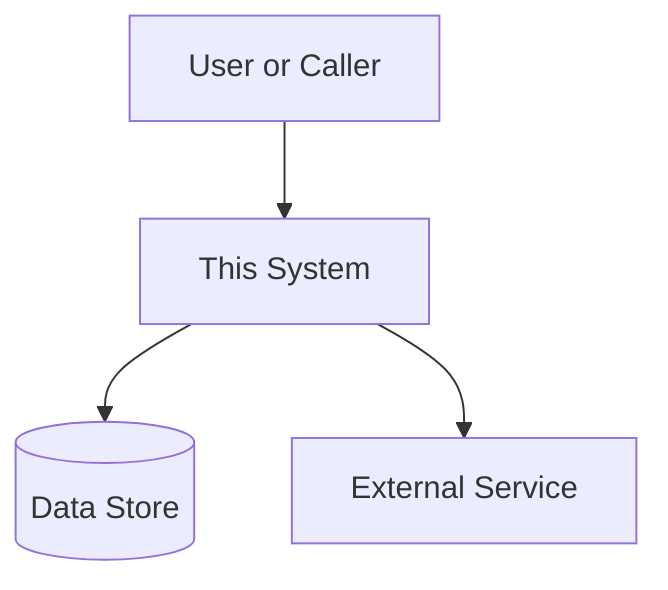
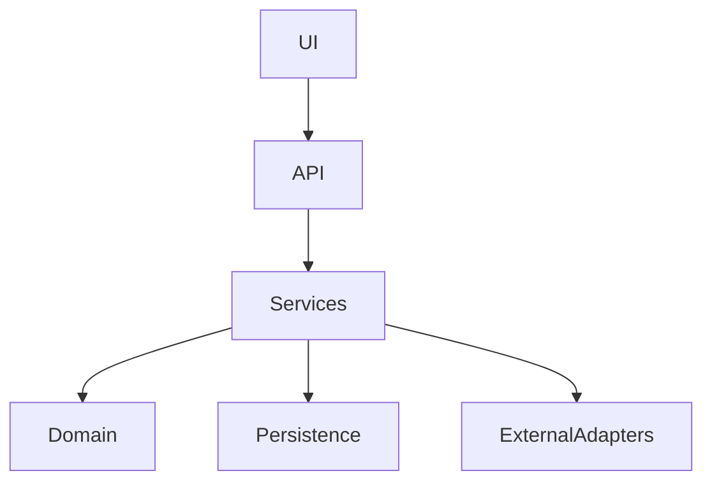

# Architecture

Last Reviewed Scope: [full review | delta update | targeted area]  
Doc Status: [MAINTAINED | DRAFT | NEEDS REVIEW]  
Last Architecture Update: [YYYY-MM-DDTHH:MM:SSZ]  
Updated By: [human | agent | human+agent]  
Source Basis: [README scan | code scan | tests run | app run locally | deployment files | other]  

Related docs:
- `REPO_MAP.md` — repository orientation, important files, commands, conventions, glossary.
- `OPERATIONS.md` — runtime behavior, local execution, deployment, debugging, failure modes.

## Purpose

[State what the system does, for whom, and why it exists. Keep this short and concrete.]

## Scope

This document describes the static architecture of the repository: modules, boundaries, dependencies, data ownership, and structural risks.

In scope:
- [Primary capability or product area]
- [Major subsystem or workflow]
- [Important internal module]
- [Important external integration]

Out of scope:
- Local setup and deployment details. See `OPERATIONS.md`.
- Detailed file-by-file repository orientation. See `REPO_MAP.md`.
- Product requirements, unless they directly explain architecture.

## Evidence Legend

Use these labels when documenting architecture claims:

- **verified**: directly confirmed from code, config, tests, or commands.
- **inferred**: likely true based on naming, imports, structure, or partial evidence.
- **uncertain**: plausible but not sufficiently supported.
- **missing**: expected information was not found.

## Architecture Summary

- **Architecture style**: [monolith | modular monolith | client/server | service-oriented | event-driven | plugin-based | CLI-first | other]
- **Primary runtime shape**: [web app | API server | worker | CLI | bot | scheduled jobs | library | mixed]
- **Main language/runtime**: [language, framework, runtime version if known]
- **Main layers**: [UI/API/application/domain/persistence/infrastructure/etc.]
- **Main persistence model**: [database/files/object storage/cache/none/unknown]
- **Main external boundaries**: [external APIs, queues, auth providers, payment providers, LLM providers, etc.]
- **Most important architectural constraint**: [short statement]

## System Context

[Describe the system in relation to users, external systems, storage, and infrastructure.]



## Runtime Model

[Briefly describe how the system runs from an architectural point of view: long-running services, request/response apps, scheduled jobs, background workers, CLIs, queues, or batch processes. Keep operational commands and deployment details in `OPERATIONS.md`.]

| Runtime part | Type | Responsibility | Evidence | Status |
|---|---|---|---|---|
| [service/process/job] | [API/worker/CLI/etc.] | [what it does] | [`path/to/file`] | [verified/inferred/uncertain] |
| [service/process/job] | [API/worker/CLI/etc.] | [what it does] | [`path/to/file`] | [verified/inferred/uncertain] |

## Main Entry Points

| Entry point | Type | Starts / controls | Important downstream modules | Evidence | Status |
|---|---|---|---|---|---|
| `[file, command, function, service, or route root]` | [server/CLI/worker/test/etc.] | [what starts here] | [modules called next] | [`path`] | [verified/inferred] |
| `[file, command, function, service, or route root]` | [server/CLI/worker/test/etc.] | [what starts here] | [modules called next] | [`path`] | [verified/inferred] |

## Layering and Boundaries

| Layer | Contains | May depend on | Must not depend on | Evidence | Status |
|---|---|---|---|---|---|
| [UI / presentation] | [files/modules] | [allowed deps] | [forbidden deps] | [`path`] | [verified/inferred] |
| [API / routes] | [files/modules] | [allowed deps] | [forbidden deps] | [`path`] | [verified/inferred] |
| [Application services] | [files/modules] | [allowed deps] | [forbidden deps] | [`path`] | [verified/inferred] |
| [Domain logic] | [files/modules] | [allowed deps] | [forbidden deps] | [`path`] | [verified/inferred] |
| [Persistence / adapters] | [files/modules] | [allowed deps] | [forbidden deps] | [`path`] | [verified/inferred] |

Boundary notes:
- [Important architectural boundary or rule]
- [Important dependency direction rule]
- [Important exception or legacy shortcut]

## Main Components

### [Component Name]

- **Responsibility**: [primary responsibility]
- **Owns**: [data, behavior, routes, jobs, UI, integration, etc.]
- **Inputs**: [important inputs]
- **Outputs**: [important outputs]
- **Depends on**: [important internal/external dependencies]
- **Used by**: [callers or runtime paths]
- **Important files**:
  - `[path]`: [why it matters]
  - `[path]`: [why it matters]
- **Boundary notes**: [what this component should or should not do]
- **Status**: [verified/inferred/uncertain]

### [Component Name]

- **Responsibility**: [primary responsibility]
- **Owns**: [data, behavior, routes, jobs, UI, integration, etc.]
- **Inputs**: [important inputs]
- **Outputs**: [important outputs]
- **Depends on**: [important internal/external dependencies]
- **Used by**: [callers or runtime paths]
- **Important files**:
  - `[path]`: [why it matters]
  - `[path]`: [why it matters]
- **Boundary notes**: [what this component should or should not do]
- **Status**: [verified/inferred/uncertain]

## Static Module Map

| Module / package | Responsibility | Owns | Depends on | Used by | Evidence | Status |
|---|---|---|---|---|---|---|
| `[module]` | [what it does] | [data/capability] | [deps] | [callers] | [`path`] | [verified/inferred] |
| `[module]` | [what it does] | [data/capability] | [deps] | [callers] | [`path`] | [verified/inferred] |

## Internal Dependency Map

[Describe important internal dependencies. Keep this updated when module boundaries change.]



Dependency notes:
- [Important dependency rule]
- [Important cycle, shortcut, or coupling]
- [Important place where architecture differs from the ideal]

## Data Model and Ownership

| Entity / table / collection / file | Purpose | Owned by module | Read by | Written by | Storage location | Evidence | Status |
|---|---|---|---|---|---|---|---|
| `[entity]` | [what it represents] | [module] | [modules] | [modules] | [DB/table/file/etc.] | [`path`] | [verified/inferred] |
| `[entity]` | [what it represents] | [module] | [modules] | [modules] | [DB/table/file/etc.] | [`path`] | [verified/inferred] |

Data ownership rules:
- [Which module is allowed to create/update key data]
- [Which module is read-only]
- [Any lifecycle, retention, migration, or consistency rule]

## API / Interface Map

| Interface | Route / command / event / function | Handler / entry file | Main service | Data touched | Auth / permission | Evidence | Status |
|---|---|---|---|---|---|---|---|
| [HTTP/API/CLI/UI/webhook/etc.] | `[route or command]` | [`path`] | [`service`] | [entities] | [rule] | [`path`] | [verified/inferred] |
| [HTTP/API/CLI/UI/webhook/etc.] | `[route or command]` | [`path`] | [`service`] | [entities] | [rule] | [`path`] | [verified/inferred] |

## Background Jobs and Async Architecture

| Job / worker / async path | Trigger | Responsibility | Queue / scheduler | Data touched | Idempotency / retry concern | Evidence | Status |
|---|---|---|---|---|---|---|---|
| `[job]` | [trigger] | [what it does] | [queue/scheduler] | [entities] | [notes] | [`path`] | [verified/inferred] |
| `[job]` | [trigger] | [what it does] | [queue/scheduler] | [entities] | [notes] | [`path`] | [verified/inferred] |

## Data Flow Overview

Common flow pattern:

```text
input -> validate -> transform -> store or call dependency -> return or emit result
```

Important flows:

### [Flow Name]

1. [Trigger or input]
2. [Validation or routing]
3. [Core processing]
4. [Persistence or external call]
5. [Response, event, or side effect]

Evidence:
- `[path]`
- `[path]`

Status: [verified/inferred/uncertain]

### [Flow Name]

1. [Trigger or input]
2. [Validation or routing]
3. [Core processing]
4. [Persistence or external call]
5. [Response, event, or side effect]

Evidence:
- `[path]`
- `[path]`

Status: [verified/inferred/uncertain]

## External Dependencies

| Dependency | Type | Used by | Purpose | Data sent / received | Failure impact | Evidence | Status |
|---|---|---|---|---|---|---|---|
| `[service/API/library]` | [API/SaaS/library/runtime] | [module] | [why it exists] | [data] | [what breaks] | [`path`] | [verified/inferred] |
| `[service/API/library]` | [API/SaaS/library/runtime] | [module] | [why it exists] | [data] | [what breaks] | [`path`] | [verified/inferred] |

External boundary notes:
- [Authentication mechanism]
- [Rate limit, timeout, retry, or billing concern]
- [Fallback behavior if unavailable]

## Configuration-Affected Architecture

These settings materially change structure, behavior, dependencies, or enabled modules.

| Config / flag | Defined in | Used by | Architectural effect | Default / example | Evidence | Status |
|---|---|---|---|---|---|---|
| `[SETTING_NAME]` | [`path`] | [module] | [what changes] | [value] | [`path`] | [verified/inferred] |
| `[SETTING_NAME]` | [`path`] | [module] | [what changes] | [value] | [`path`] | [verified/inferred] |

See `OPERATIONS.md` for full environment and secret handling.

## Security and Trust Boundaries

| Boundary / asset | Protection mechanism | Enforced where | Risk if broken | Evidence | Status |
|---|---|---|---|---|---|
| [auth/session/API key/user data/etc.] | [authz/validation/secret storage/etc.] | [`path`] | [risk] | [`path`] | [verified/inferred] |
| [auth/session/API key/user data/etc.] | [authz/validation/secret storage/etc.] | [`path`] | [risk] | [`path`] | [verified/inferred] |

Security notes:
- [Where authentication happens]
- [Where authorization happens]
- [Where untrusted input enters]
- [Where sensitive data is stored or transmitted]
- [Known missing or uncertain security controls]

## Architecture Diagrams to Keep Current

Required or recommended diagrams:
- **System context diagram**: [present/missing]
- **Container/runtime diagram**: [present/missing]
- **Module dependency diagram**: [present/missing]
- **Data flow diagram**: [present/missing]
- **Database/entity relationship sketch**: [present/missing]
- **Background job / queue diagram**: [present/missing]

## Architectural Decisions and Constraints

| Decision / constraint | Current choice | Reason | Tradeoff | Evidence / ADR | Status |
|---|---|---|---|---|---|
| [decision] | [choice] | [why] | [cost] | [`docs/adr/...` or path] | [verified/inferred] |
| [decision] | [choice] | [why] | [cost] | [`docs/adr/...` or path] | [verified/inferred] |

## Testing and Architecture Confidence

[Summarize how tests support architectural confidence. Do not duplicate all test commands from `OPERATIONS.md`; link to them.]

| Area | Test coverage found | Confidence | Evidence | Gaps |
|---|---|---|---|---|
| [module/flow] | [unit/integration/e2e/manual/none] | [high/medium/low] | [`path` or command] | [missing tests] |
| [module/flow] | [unit/integration/e2e/manual/none] | [high/medium/low] | [`path` or command] | [missing tests] |

## Known Structural Weaknesses

| Weakness | Why it matters | Affected areas | Symptom | Suggested improvement | Status |
|---|---|---|---|---|---|
| [weakness] | [risk/cost] | [modules] | [how it shows up] | [next step] | [verified/inferred] |
| [weakness] | [risk/cost] | [modules] | [how it shows up] | [next step] | [verified/inferred] |

## High-Risk Change Areas

| Area | Why risky | What to inspect first | Tests / checks to run | Notes |
|---|---|---|---|---|
| [auth/payments/migrations/jobs/etc.] | [risk] | [`path`] | [command] | [notes] |
| [auth/payments/migrations/jobs/etc.] | [risk] | [`path`] | [command] | [notes] |

## Change Impact Notes

| Change type | Likely affected files/modules | Required checks | Docs to update | Notes |
|---|---|---|---|---|
| [change type] | [areas] | [tests/build/manual] | [docs] | [notes] |
| [change type] | [areas] | [tests/build/manual] | [docs] | [notes] |

## Verified / Inferred Claim Register

| Claim | Evidence | Status | Notes |
|---|---|---|---|
| [architecture claim] | [`path`, command, or observation] | [verified/inferred/uncertain] | [notes] |
| [architecture claim] | [`path`, command, or observation] | [verified/inferred/uncertain] | [notes] |

## Known Unknowns

- [Unknown or missing architectural information]
- [Unknown or missing architectural information]
- [Unknown or missing architectural information]

## Additional Notes

[Capture assumptions, conventions, near-term evolution, or important reader guidance that does not fit cleanly above.]