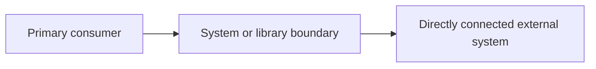
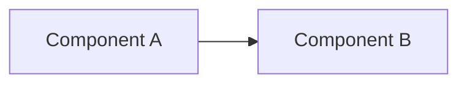

# Architecture

Review Scope: [full | targeted area | delta]
Doc Status: [MAINTAINED | DRAFT | NEEDS REVIEW]
Last Updated: [YYYY-MM-DDTHH:MM:SSZ]
Updated By: [human | agent | human+agent]
Source Repository: [canonical repository URL | unavailable]
Source Revision: [git SHA | unavailable]
Source Basis: [source scan, manifests, tests, requirements/docs, ADRs, other]

Related docs:
- `REPO_MAP.md` — repository orientation and important paths.
- `API_SURFACE.md` — detailed contracts, when present.
- `OPERATIONS.md` — runtime, deployment, observability, and operational behavior, when present.
- `../adr/` — architectural decisions and rationale, when present.

This template is a coverage model, not a demand to publish every heading. Before omitting a section, account for the concern as **documented**, **cross-referenced**, **not applicable**, or **missing**. Relevant-but-unknown information should normally be recorded as missing rather than silently removed.

## Purpose and Scope

Describe what the repository is responsible for and define the architectural boundary.

- **Primary responsibility**: [what this repository/system owns]
- **Primary consumers / actors**: [users, callers, operators, other systems]
- **Inside the boundary**: [major responsibilities]
- **Outside the boundary**: [important responsibilities owned elsewhere]

Do not repeat the repository tree here; `REPO_MAP.md` owns navigation detail.

## Architecture Drivers and Quality Goals

Record the small set of explicit requirements or quality goals that materially shape the architecture. Examples include security/trust, reliability/availability, compatibility, performance/latency, portability, maintainability, or extensibility.

Prefer requirements, ADRs, tests that encode a documented contract, security guidance, compatibility commitments, or other human-owned sources. If no explicit quality goals are documented, say so instead of inferring human intent from implementation shape.

| Driver / quality goal | Evidence | Architectural consequence | Status |
|---|---|---|---|
| [security/reliability/compatibility/etc.] | [`path`, ADR, explicit doc] | [how the current architecture addresses it] | [verified/inferred/missing] |

Keep this to the most important items.

## Hard Constraints

Record imposed limits on the solution space separately from quality goals. Typical examples are supported runtimes/platforms, required protocols or standards, mandatory frameworks, dependency restrictions, deployment environment, or regulatory constraints.

| Constraint | Evidence | Architectural consequence | Status |
|---|---|---|---|
| [platform/protocol/dependency/etc.] | [`path`, explicit doc] | [effect on design] | [verified/inferred/missing] |

A hard constraint can shape the architecture without explaining why humans chose the resulting design.

## Context and External Relationships

Show the repository/system in context: who or what uses it, what directly connected external systems it depends on, and which boundary or protocol connects them.

| Actor / external system | Relationship | Boundary / protocol | Evidence | Status |
|---|---|---|---|---|
| [consumer/system] | [uses/calls/provides/persists/etc.] | [library API/HTTP/DB/queue/file/etc.] | [`path`] | [verified/inferred] |

Keep internal modules out of a context view. For a library, the host application is outside the library boundary even when it runs in the same process. Ordinary code dependencies are usually better described under building blocks, constraints, or cross-cutting concepts.

Add one small context diagram only when it is clearer than the table. Keep deployment topology in `OPERATIONS.md`.

```mermaid
flowchart LR
    Consumer["Primary consumer"] --> System["System or library boundary"]
    System --> External["Directly connected external system"]
```

Remove the diagram when it does not fit the repository.

## Solution Strategy

Summarize the fundamental approach visible in the architecture: top-level decomposition, important technology choices, and the small number of mechanisms that shape the rest of the design.

| Strategy / approach | Evidence | Addresses | Rationale source | Status |
|---|---|---|---|---|
| [layering/event-driven/plugin model/etc.] | [`path`] | [driver/constraint] | [ADR/doc/missing] | [verified/inferred] |

Implementation can establish that an approach exists. Only explicit decision sources establish **why** it was chosen.

## Major Building Blocks

| Component / module | Responsibility | Main paths | Depends on | Owned state/data | Status |
|---|---|---|---|---|---|
| [name] | [responsibility] | [`path`] | [dependencies] | [state/data] | [verified/inferred] |

Describe the level-1 decomposition needed to understand the system. Add deeper component detail only for areas that are architecture-significant or unusually complex.

## Dependency Direction and Boundaries

Describe important dependency direction, layering, or boundary rules evidenced by imports, package/module structure, configuration, tests, or explicit documentation. Do not infer intended layering from names alone.

```mermaid
flowchart LR
    A["Component A"] --> B["Component B"]
```

Remove the diagram if prose/table form is clearer or the relationships are not sufficiently evidenced.

## Data and State Ownership

| Data / state | Owner / authority | Readers | Writers | Storage / transport | Evidence | Status |
|---|---|---|---|---|---|---|
| [entity/state] | [caller/module/external system] | [modules] | [modules] | [DB/file/cache/API/queue/memory] | [`path`] | [verified/inferred] |

For stateless libraries or services, say that explicitly. Still distinguish caller-owned or externally authoritative data from process-local caches/configuration and other transient state. Do not hide state merely because it is in memory.

## Cross-Cutting Architectural Concepts

Document only concepts that affect multiple building blocks or are necessary to change the system safely. Typical candidates include security/trust boundaries, authentication/authorization, validation, error propagation, serialization, transactions/consistency, concurrency/asynchrony, caching, configuration boundaries, optional dependencies, and extension/plugin mechanisms.

| Concept | How the architecture handles it | Affected areas | Evidence | Status |
|---|---|---|---|---|
| [concept] | [short description] | [components] | [`path`, ADR, doc] | [verified/inferred] |

Do not manufacture this section from generic best practices. Observed implementation patterns are descriptive unless a human-owned source makes them normative.

## Important Interaction Paths

Document only representative flows needed to understand how the building blocks collaborate.

### [Flow name]

1. [entry event/request]
2. [component interaction]
3. [state/external interaction]
4. [result]

Evidence:
- [`path` / symbol] — [what it confirms] [verified/inferred]

Use a sequence or flow diagram only when it materially improves understanding. Detailed diagnostics, startup procedures, retries, and recovery belong in `OPERATIONS.md` unless they are architecture-significant.

## Interface Ownership

| Interface area | Owning component | Contract source | Architectural significance | Status |
|---|---|---|---|---|
| [HTTP/CLI/event/library/etc.] | [component] | [`path` / `API_SURFACE.md`] | [why this boundary matters] | [verified/inferred] |

Keep detailed payloads, commands, and endpoint inventories in `API_SURFACE.md`.

## Architecture-Relevant Constraints and Invariants

Record enforced contracts, security properties, or boundary rules that a maintainer must preserve for the current architecture to remain valid. Require concrete evidence from code, tests, schemas, contracts, ADRs, or explicit documentation.

| Constraint / invariant | Evidence | Architectural effect | Status |
|---|---|---|---|
| [invariant] | [`path`, test, ADR, explicit doc] | [what would break if violated] | [verified/inferred] |

Do not turn recurring coding style or an incidental implementation pattern into a normative rule. An enforced contract can be architecture-relevant even when its historical rationale is missing.

## Related Decisions

| ADR / source | Decision | Affected area | Status |
|---|---|---|---|
| [`../adr/NNNN-...md`] | [decision] | [area] | [current/superseded/etc.] |

If architecture-significant rationale is not documented, state that it is missing. Do not substitute reconstructed rationale from code for an accepted human decision.

## Risks, Technical Debt, and Unknowns

| Item | Evidence | Why it matters | Status / next step |
|---|---|---|---|
| [risk/debt/unknown] | [`path` / explicit source] | [reason] | [uncertain/missing/action] |

Do not label code as technical debt merely because it looks unusual. Use explicit evidence or describe the item as an uncertainty/risk instead.
