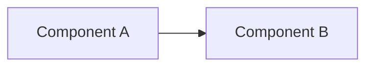

# Architecture

Review Scope: [full | targeted area | delta]
Doc Status: [MAINTAINED | DRAFT | NEEDS REVIEW]
Last Updated: [YYYY-MM-DDTHH:MM:SSZ]
Updated By: [human | agent | human+agent]
Source Revision: [git SHA | unavailable]
Source Basis: [source scan, manifests, tests, requirements/docs, ADRs, other]

Related docs:
- `REPO_MAP.md` — repository orientation and important paths.
- `API_SURFACE.md` — detailed contracts, when present.
- `OPERATIONS.md` — runtime, deployment, observability, and operational behavior, when present.
- `../adr/` — architectural decisions and rationale, when present.

## Purpose and Scope

Describe what the repository is responsible for and the architectural scope of this document.

- **Primary responsibility**: [what this repository/system owns]
- **Primary consumers / actors**: [users, callers, operators, other systems]
- **Inside the boundary**: [major responsibilities]
- **Outside the boundary**: [important responsibilities owned elsewhere]

Do not repeat the repository tree here; `REPO_MAP.md` owns navigation detail.

## Architecture Drivers

Record the small set of requirements, quality goals, and hard constraints that materially shape the architecture. Prefer explicit requirements, ADRs, tests, security guidance, compatibility commitments, or other human-owned sources.

If no explicit quality goals or drivers are documented, say so. Do **not** reverse-engineer human intent from implementation shape.

| Driver / quality goal / constraint | Evidence | Architectural consequence | Status |
|---|---|---|---|
| [security/reliability/compatibility/performance/etc.] | [`path`, ADR, explicit doc] | [how it shapes the architecture] | [verified/inferred/missing] |

Keep this to the most important 3–5 items when possible.

## Context and External Relationships

Show the system/repository in context: who or what uses it, what it depends on, and which boundary or protocol connects them.

| Actor / external system | Relationship | Boundary / protocol | Evidence | Status |
|---|---|---|---|---|
| [consumer/system/dependency] | [uses/calls/provides/persists/etc.] | [library API/HTTP/DB/queue/file/etc.] | [`path`] | [verified/inferred] |

Add one small context diagram only when it is clearer than the table. Keep deployment topology in `OPERATIONS.md`.

## Solution Strategy

Summarize the fundamental approach visible in the architecture: top-level decomposition, important technology choices, and the small number of mechanisms that shape the rest of the design.

| Strategy / approach | Evidence | Addresses | Rationale source | Status |
|---|---|---|---|---|
| [layering/event-driven/plugin model/etc.] | [`path`] | [driver/constraint] | [ADR/doc/missing] | [verified/inferred] |

Implementation can establish that an approach exists. Only explicit decision sources establish **why** it was chosen.

## Major Building Blocks

| Component / module | Responsibility | Main paths | Depends on | Owned state/data | Status |
|---|---|---|---|---|---|
| [name] | [responsibility] | [`path`] | [dependencies] | [state/data] | [verified/inferred] |

Describe the level-1 decomposition needed to understand the system. Add deeper component detail only for areas that are architecture-significant or unusually complex.

## Dependency Direction and Boundaries

Describe important dependency direction, layering, or boundary rules that are evidenced by imports, package/module structure, configuration, tests, or explicit documentation. Do not infer intended layering from names alone.

```mermaid
flowchart LR
    A["Component A"] --> B["Component B"]
```

Remove the diagram if prose/table form is clearer or the relationships are not sufficiently evidenced.

## Data and State Ownership

| Data / state | Owner | Readers | Writers | Storage / transport | Evidence | Status |
|---|---|---|---|---|---|---|
| [entity/state] | [module] | [modules] | [modules] | [DB/file/cache/API/queue/memory] | [`path`] | [verified/inferred] |

For stateless libraries or services, say explicitly which state belongs to callers or external systems and which transient state is kept in-process.

## Cross-Cutting Architectural Concepts

Document only concepts that affect multiple building blocks or are necessary to change the system safely. Typical candidates include security/trust boundaries, authentication/authorization, validation, error propagation, serialization, transactions/consistency, concurrency/asynchrony, caching, configuration boundaries, and extension/plugin mechanisms.

| Concept | How the architecture handles it | Affected areas | Evidence | Status |
|---|---|---|---|---|
| [concept] | [short description] | [components] | [`path`, ADR, doc] | [verified/inferred] |

Do not manufacture this section from generic best practices. Omit concepts that are not evidenced or architecture-significant. Observed implementation patterns are descriptive unless a human-owned source makes them normative.

## Important Interaction Paths

Document only representative flows needed to understand how the building blocks collaborate.

### [Flow name]

1. [entry event/request]
2. [component interaction]
3. [state/external interaction]
4. [result]

Evidence:
- [`path` / symbol] — [what it confirms] [verified/inferred]

Use a sequence or flow diagram only when it materially improves understanding. Detailed diagnostics, startup procedures, retries, and recovery belong in `OPERATIONS.md` unless they are architecture-significant.

## Interface Ownership

| Interface area | Owning component | Contract source | Architectural significance | Status |
|---|---|---|---|---|
| [HTTP/CLI/event/library/etc.] | [component] | [`path` / `API_SURFACE.md`] | [why this boundary matters] | [verified/inferred] |

Keep detailed payloads, commands, and endpoint inventories in `API_SURFACE.md`.

## Architecture-Relevant Constraints and Invariants

Record constraints or invariants that a maintainer must preserve to avoid violating the architecture. These require explicit evidence from code/tests, schemas, ADRs, or human-owned documentation.

| Constraint / invariant | Source | Architectural effect | Status |
|---|---|---|---|
| [constraint] | [`path`, test, ADR, explicit doc] | [effect] | [verified/inferred] |

Do not turn a recurring implementation pattern into a normative rule without explicit evidence.

## Related Decisions

| ADR / source | Decision | Affected area | Status |
|---|---|---|---|
| [`../adr/NNNN-...md`] | [decision] | [area] | [current/superseded/etc.] |

Omit when no decision records exist, but state when architecture-significant rationale is missing and therefore should not be inferred.

## Risks, Technical Debt, and Unknowns

| Item | Evidence | Why it matters | Status / next step |
|---|---|---|---|
| [risk/debt/unknown] | [`path` / explicit source] | [reason] | [uncertain/missing/action] |

Do not label code as technical debt merely because it looks unusual. Use explicit evidence or describe the item as an uncertainty/risk instead.
