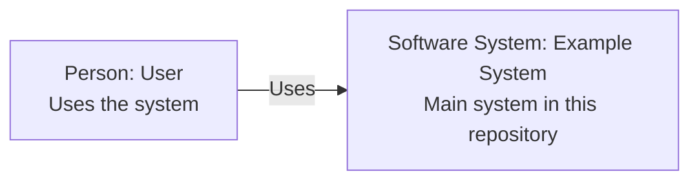

# C4 Architecture Documentation Skill

Command: `/c4doc`

This skill helps GitHub Copilot generate practical C4-style architecture documentation for a repository.

It creates Markdown documentation and Mermaid diagrams that can be viewed directly in GitHub. It intentionally avoids Mermaid C4 syntax and uses ordinary Mermaid `flowchart` diagrams instead.

This skill can be exposed in Copilot Chat via `/c4doc`.

## What this skill does

The skill analyzes a repository and creates repository-specific C4 architecture documentation under:

```text
docs/c4-documentation/
```

It can generate:

```text
index.md
architecture-model.md
generation-report.md
system-context.md
container.md
components/<container-name>.md
code/<component-name>.md
deployment/<environment-or-platform>.md
dynamic/<use-case>.md
```

It uses templates from:

```text
templates/
```

## Design philosophy

The skill is intentionally conservative.

It should not generate every possible C4 diagram for every repository. Many repositories do not need all C4 levels. For example:

- A small C++ library may only need a context view and a component/API structure view.
- A Python CLI tool may need a context view and maybe a container view.
- A Java server running in Kubernetes may benefit from context, container, component, deployment, and dynamic-flow views.
- A tiny script may only need an architecture note and generation report.

The skill should generate the minimum useful documentation set and explain what it skipped.

## Why use standard Mermaid flowcharts?

GitHub renders Mermaid diagrams in Markdown. This skill uses plain Mermaid diagrams such as:



It does **not** use Mermaid C4 syntax.

This keeps the generated documentation simple, readable, and compatible with normal GitHub Markdown rendering.

## What C4 levels are supported?

### C1: System Context

Shows the system in scope, human actors, and external systems.

Generated as:

```text
docs/c4-documentation/system-context.md
```

Template:

```text
templates/c1-system-context.template.md
```

### C2: Container

Shows the major runnable/deployable applications and data stores.

Generated as:

```text
docs/c4-documentation/container.md
```

Template:

```text
templates/c2-container.template.md
```

In C4, a container means a runnable or deployable unit such as an API, web app, CLI, database, worker, queue, or object store. It does not necessarily mean a Docker container.

### C3: Component

Shows meaningful responsibility boundaries inside one container.

Generated as:

```text
docs/c4-documentation/components/<container-name>.md
```

Template:

```text
templates/c3-component.template.md
```

Component diagrams should not mirror every package, class, file, or dependency.

### C4: Code

Shows selected implementation-level structure.

Generated as:

```text
docs/c4-documentation/code/<component-name>.md
```

Template:

```text
templates/c4-code.template.md
```

This level should be rare. In most repositories, generated API documentation, IDE navigation, Javadoc, Doxygen, Sphinx, TypeDoc, Rustdoc, or similar tools are better for code-level detail.

## Supporting views

The skill also includes practical supporting templates.

### Architecture index

Generated as:

```text
docs/c4-documentation/index.md
```

Template:

```text
templates/c0-index.template.md
```

This is the starting page for readers.

### Architecture model

Generated as:

```text
docs/c4-documentation/architecture-model.md
```

Template:

```text
templates/c0-architecture-model.template.md
```

This file records the model behind the diagrams: people, systems, containers, components, relationships, evidence, and confidence.

### Generation report

Generated as:

```text
docs/c4-documentation/generation-report.md
```

Template:

```text
templates/c0-generation-report.template.md
```

This file explains what was generated, what was skipped, what was inferred, and what needs human review.

### Deployment view

Generated as:

```text
docs/c4-documentation/deployment/<environment-or-platform>.md
```

Template:

```text
templates/deployment.template.md
```

This is useful for repositories with Docker, Kubernetes, Helm, Terraform, cloud deployment files, or other runtime infrastructure evidence.

### Dynamic flow view

Generated as:

```text
docs/c4-documentation/dynamic/<use-case>.md
```

Template:

```text
templates/dynamic-flow.template.md
```

This is useful for important runtime flows such as login, request processing, order creation, scheduled jobs, imports, event handling, or asynchronous processing.

## Recommended skill folder structure

```text
c4doc/
  SKILL.md
  README.md
  templates/
    c0-index.template.md
    c0-architecture-model.template.md
    c0-generation-report.template.md
    c1-system-context.template.md
    c2-container.template.md
    c3-component.template.md
    c4-code.template.md
    deployment.template.md
    dynamic-flow.template.md
```

## Suggested usage prompts

You can call the skill directly in Copilot Chat with:

```text
/c4doc
```

You can also add focus text after the command, for example:

```text
/c4doc create only the system context and container views for this repository
```

Use prompts like:

```text
Generate C4 architecture documentation for this repository.
```

```text
Refresh the existing C4 documentation based on the current repository state.
```

```text
Generate only the useful C4 views. Do not create artificial diagrams.
```

```text
Create a deployment view from the Kubernetes and Helm files.
```

```text
Create a component view for the main Java API container.
```

```text
Review the existing C4 documentation and report outdated or unsupported claims.
```

## Output rules

Generated documentation should:

1. Use Markdown files.
2. Use ordinary Mermaid `flowchart` diagrams for C1, C2, C3, and deployment views.
3. Use Mermaid `sequenceDiagram` only for dynamic runtime flows.
4. Avoid Mermaid C4 syntax.
5. Include cross-links between generated files.
6. Include evidence paths where possible.
7. Mark confidence as `Confirmed`, `Inferred`, `Unknown`, `Needs review`, or `Omitted`.
8. Explain skipped views.
9. Keep diagrams small and readable.
10. Avoid listing every dependency as a diagram element.

## Confidence model

Use this confidence model throughout the generated docs.

| Confidence | Meaning |
|---|---|
| Confirmed | Direct evidence exists in source code, configuration, manifests, documentation, tests, or build files |
| Inferred | Reasonably inferred from conventions, naming, imports, dependencies, or folder structure |
| Unknown | Not enough information exists in the repository |
| Needs review | Plausible but should be checked by maintainers |
| Omitted | Intentionally not modeled |

## Good generated documentation should say what it does not know

Architecture documentation generated from a repository cannot always identify:

- real production topology
- external systems hidden behind configuration
- actual users and business roles
- runtime permissions
- operational ownership
- data classification
- security boundaries
- deployment environments
- non-code architecture decisions

The skill should make those gaps visible instead of hiding them.

## Human review checklist

After generation, maintainers should review:

- Are the system boundaries correct?
- Are the named users and external systems correct?
- Are the container responsibilities accurate?
- Are the deployment assumptions correct?
- Are any important data stores or message queues missing?
- Are component boundaries meaningful?
- Are skipped diagrams correctly skipped?
- Are any generated claims unsupported?
- Are Mermaid diagrams readable in GitHub?

## Maintenance guidance

Keep these docs close to the code and update them when:

- a new service/container is added
- a deployment model changes
- a new database, queue, cache, or external system is introduced
- a major component boundary changes
- a critical runtime flow changes
- a repository is split or merged
- architecture decisions change

For major decisions, use ADRs alongside C4 docs.
