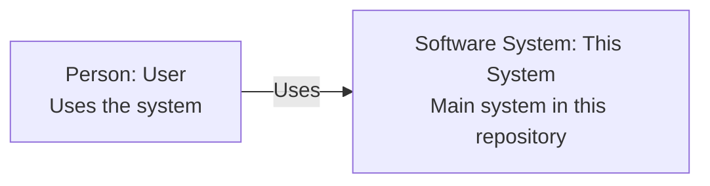

# C4 Architecture Documentation Skill

Command: `/c4doc`

Use this skill when the user calls `/c4doc` or asks to generate or refresh C4 architecture documentation for the current repository.

## Purpose

Use this skill to generate or refresh practical C4-style architecture documentation for a software repository.

The generated documentation must be stored in Markdown files and must use standard Mermaid diagrams that render in GitHub Markdown. Do **not** use Mermaid C4 syntax. Use ordinary `flowchart` diagrams for static architecture views and `sequenceDiagram` only for dynamic runtime flows.

The goal is not to force every repository into every C4 level. The goal is to create the minimum useful architecture documentation set for the repository, with clear diagrams, evidence, assumptions, and review notes.

## Slash Command

Use this skill when the user calls:

```text
/c4doc
```

The skill should inspect the current repository, create or refresh repository-specific C4 architecture documentation, and treat any additional user text as scoping guidance for which systems, views, or areas need attention.

## Primary Output Location

Create or update files under the repository being documented:

```text
docs/c4-documentation/
```

Recommended structure:

```text
docs/c4-documentation/
  index.md
  architecture-model.md
  generation-report.md
  system-context.md
  container.md
  components/
    <container-name>.md
  code/
    <component-name>.md
  deployment/
    <environment-or-platform>.md
  dynamic/
    <use-case>.md
```

Use stable, lowercase, hyphenated filenames.

## Lightweight Provenance Block

Every generated Markdown document must include a small provenance block near the top, directly after the title and before status fields, summary tables, or document metadata.

This applies to generated C4 indexes, architecture models, generation reports, system context views, container views, component views, code views, deployment views, and dynamic views created or updated by this skill.

The block must include only information that is directly available. Do not guess, infer, reconstruct, or invent missing metadata.

Use this format:

```markdown
> Generated with `ai-craftkit` skill: `c4doc`  
> Source: `<repository-url>` at commit `<commit-hash>`  
> Prompt: `<exact-user-prompt>`
```

## Template Location

Use the templates stored in this skill directory:

```text
templates/
  c0-index.template.md
  c0-architecture-model.template.md
  c0-generation-report.template.md
  c1-system-context.template.md
  c2-container.template.md
  c3-component.template.md
  c4-code.template.md
  deployment.template.md
  dynamic-flow.template.md
```

When generating documentation, copy the relevant template content and fill it with repository-specific findings.

## Core Behavior

Always do the following:

1. Inspect the repository before generating diagrams.
2. Decide which C4 views are useful.
3. Generate only the useful views.
4. Explicitly skip views that would be artificial.
5. Include evidence and confidence levels.
6. Prefer small focused diagrams over large complete diagrams.
7. Keep all diagrams readable in GitHub Markdown.
8. Do not model every source file, package, class, function, or third-party dependency.
9. Do not invent users, external systems, databases, queues, or deployment infrastructure without marking them as inferred or unknown.
10. Keep architecture documentation reviewable in pull requests.
11. Add the lightweight provenance block to every generated or refreshed Markdown file.

## Repository Inspection Checklist

Inspect the following files and folders where present:

```text
README.md
docs/
ADR files
package manager files
build files
source folders
test folders
Dockerfile
docker-compose.yml
Kubernetes manifests
Helm charts
Terraform/OpenTofu/Pulumi files
GitHub Actions workflows
OpenAPI/Swagger files
GraphQL schemas
database migration folders
configuration files
Makefile
scripts/
```

Language and platform hints:

```text
C/C++:
  CMakeLists.txt
  Makefile
  configure.ac
  meson.build
  include/
  src/
  examples/
  bindings/

Python:
  pyproject.toml
  setup.py
  requirements.txt
  poetry.lock
  Pipfile
  src/
  app/
  cli entry points

Java/Kotlin:
  pom.xml
  build.gradle
  settings.gradle
  src/main/java
  src/main/kotlin
  application.yml
  application.properties

JavaScript/TypeScript:
  package.json
  tsconfig.json
  vite.config.*
  next.config.*
  src/
  pages/
  app/

Go:
  go.mod
  cmd/
  internal/
  pkg/

Rust:
  Cargo.toml
  src/
  crates/
```

## Diagram Selection Rules

Use this decision matrix.

| Repository type | Recommended output |
|---|---|
| Tiny script or small utility | `index.md`, `generation-report.md`, maybe a short `system-context.md`; skip container/component/code diagrams unless useful |
| Library or SDK | `index.md`, `architecture-model.md`, `system-context.md`, maybe `c3-component` for public API/internal structure; usually skip `container` and `code` |
| CLI/tool | `index.md`, `architecture-model.md`, `system-context.md`, maybe `container.md`, maybe one component view if the tool has meaningful internal modules |
| Web application | `index.md`, `architecture-model.md`, `system-context.md`, `container.md`, selected component views |
| API/server/service | `index.md`, `architecture-model.md`, `system-context.md`, `container.md`, selected component views |
| Multi-service repository | `index.md`, `architecture-model.md`, `system-context.md`, `container.md`, component views for important containers |
| Kubernetes/cloud-deployed service | All useful standard docs plus `deployment/<environment-or-platform>.md` |
| Event-driven or workflow-heavy system | Add selected `dynamic/<use-case>.md` files |
| Highly complex component | Add `code/<component-name>.md` only when it adds clarity beyond generated code/API docs |

## Required Files

Always generate:

```text
docs/c4-documentation/index.md
docs/c4-documentation/generation-report.md
```

Generate `architecture-model.md` unless the repository is too small for a meaningful model.

## Confidence Levels

Every significant inferred architecture element should include one of these confidence levels:

| Confidence | Meaning |
|---|---|
| Confirmed | Directly supported by source code, configuration, documentation, manifests, or tests |
| Inferred | Reasonably inferred from file structure, dependencies, naming, or conventions |
| Unknown | Cannot be determined from the repository alone |
| Needs review | Plausible but should be confirmed by maintainers |
| Omitted | Intentionally excluded from the model |

Use confidence levels in tables and in the generation report.

## Evidence Rules

Whenever practical, include evidence paths.

Good:

```markdown
| Java API | Container | Confirmed | `pom.xml`, `src/main/java`, `Dockerfile` |
```

Avoid unsupported claims:

```markdown
| PostgreSQL | Database | Confirmed | No evidence |
```

If a database appears in code dependencies but no connection configuration is found, mark it as `Inferred` or `Needs review`.

## C4 Interpretation Rules

### Software System

A software system is the main thing being documented. In a monorepo, there may be more than one software system.

Use the repository name as a temporary system name only if no better name exists. Mark it as `Inferred`.

### Person

A person is a human actor, role, or group that uses or operates the system.

Do not invent overly specific people. Prefer generic roles such as:

```text
End User
Developer
Administrator
Operator
Data Analyst
External Client Application
```

Only include roles supported by README files, docs, route names, UI text, CLI help, test data, or domain vocabulary.

### External System

An external system is outside the system boundary and is called by, calls into, provides data to, or receives data from the system.

Examples:

```text
Identity provider
Payment provider
Message broker
Object storage
Email service
Third-party API
Company-internal platform
```

### Container

In C4, a container is a deployable or runnable application or data store, not necessarily a Docker container.

Examples:

```text
Web application
Mobile application
CLI application
REST API
Background worker
Database
Cache
Queue/topic
Object store
File system location
Serverless function
```

Do not show ordinary libraries as containers unless they are separately runnable or deployable.

### Component

A component is a meaningful responsibility boundary inside a container.

Good component candidates:

```text
Controller/API layer
Command handler
Domain service
Repository/data access
Adapter/client for external system
Authentication/authorization component
Scheduling component
Importer/exporter
Parser
Renderer
Plugin manager
```

Avoid mirroring every package, class, folder, dependency, or framework module.

### Code

Generate C4 code views only when there is a small, stable, important implementation structure that benefits from a permanent diagram.

Prefer generated docs for implementation detail:

```text
Javadoc
Doxygen
Sphinx
TypeDoc
Rustdoc
Godoc
IDE diagrams
```

## Dependency Modeling Rules

Do not include all dependencies from package manager files.

Include third-party libraries only when they are architecturally significant, such as:

```text
Web framework
Persistence framework
Messaging client
Authentication/security framework
Cloud SDK
Database driver
Plugin framework
Serialization/protocol technology
```

Represent dependencies as technologies or notes, not as boxes, unless the dependency is an external runtime system.

Good:

```markdown
- Technology: Java, Spring Boot, Hibernate
- Relationship: Java API reads/writes PostgreSQL using JDBC/JPA
```

Avoid:

```markdown
Java API --> Spring Boot
Java API --> Jackson
Java API --> Lombok
Java API --> JUnit
```

## Mermaid Rules

Use GitHub-renderable Mermaid diagrams.

Allowed diagram types:

```text
flowchart
sequenceDiagram
classDiagram
```

Default to `flowchart`.

Do not use Mermaid C4 syntax.

### Flowchart Conventions

Use these conventions consistently:



Recommended prefixes:

```text
person_
system_
container_
component_
external_
database_
queue_
store_
deployment_
node_
```

Recommended shapes:

```text
["Person: ..."]          for people
["Software System: ..."] for systems
["Container: ..."]       for containers
["Component: ..."]       for components
[("Database: ...")]      for databases
[["Queue/Topic: ..."]]   for queues/topics when readable
```

Use `<br/>` for line breaks inside nodes.

Every relationship arrow should have a label:

```mermaid
api -->|"Reads/writes via JDBC"| database
```

Avoid unlabeled arrows.

### Diagram Size Limits

Prefer diagrams with:

```text
5-12 nodes
5-15 relationships
```

If the diagram grows beyond that, split it into separate focused diagrams.

## Documentation Style

Use clear, neutral language.

Use these sections where applicable:

```markdown
## Purpose
## Scope
## Diagram
## Elements
## Relationships
## Evidence
## Assumptions
## Open Questions
## Review Notes
```

Avoid overclaiming. Prefer:

```markdown
This appears to be...
The repository indicates...
This is inferred from...
No evidence was found for...
```

## Update Behavior

When documentation already exists:

1. Preserve useful human-written notes.
2. Update diagrams only when evidence has changed.
3. Add review notes for uncertain changes.
4. Do not delete sections unless they are clearly obsolete.
5. Keep file names and anchors stable where possible.
6. Prefer appending an update note in `generation-report.md`.

## Required Generation Report Content

The generation report must state:

```text
- Repository summary
- Files inspected
- Detected technologies
- Recommended C4 documentation depth
- Generated files
- Skipped files and why
- Confirmed architecture facts
- Inferred architecture facts
- Open questions
- Suggested human review steps
```

## Completion Criteria

The task is complete when:

1. The useful architecture Markdown files exist under `docs/c4-documentation/` in the repository being documented.
2. Every generated diagram uses standard Mermaid, not Mermaid C4 syntax.
3. The generated docs cross-link to each other.
4. The model clearly distinguishes confirmed and inferred facts.
5. Artificial C4 levels are explicitly skipped.
6. The generation report explains what was generated and why.
