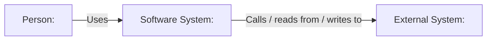

# C1: System Context

> Generated with `ai-craftkit` skill: `c4doc`  
> Source: `<repository-url>` at commit `<commit-hash>`  
> Prompt: `<exact-user-prompt>`

## Purpose

Describe how `<system-name>` fits into its environment.

This view should answer:

- What is the system?
- Who uses it?
- What external systems does it depend on?
- What external systems depend on it?
- What is inside versus outside the system boundary?

## Scope

| Field | Value |
|---|---|
| System in scope | `<system-name>` |
| Repository | `<repository-name>` |
| View type | `C1 System Context` |
| Last updated | `<yyyy-mm-dd>` |
| Confidence | `<Confirmed / Inferred / Needs review>` |

## Diagram

## People

| ID | Name | Description | Evidence | Confidence |
|---|---|---|---|---|
| `person-user` | `<User role>` | `<How this person uses the system>` | `<path or unknown>` | `<Confirmed / Inferred / Unknown / Needs review>` |

## Software System in Scope

| ID | Name | Description | Evidence | Confidence |
|---|---|---|---|---|
| `system-this` | `<System name>` | `<What this system does>` | `<README/source/config path>` | `<Confirmed / Inferred / Needs review>` |

## External Systems

| ID | Name | Description | Relationship to system | Evidence | Confidence |
|---|---|---|---|---|---|
| `external-system-example` | `<External system>` | `<What it does>` | `<Called by / calls / provides data to / receives data from>` | `<path or unknown>` | `<Confirmed / Inferred / Unknown / Needs review>` |

## Relationships

| From | To | Description | Technology / Protocol | Evidence | Confidence |
|---|---|---|---|---|---|
| `person-user` | `system-this` | `<Uses the system>` | `<HTTPS / CLI / API / file / unknown>` | `<path>` | `<Confirmed / Inferred / Needs review>` |
| `system-this` | `external-system-example` | `<Calls external system>` | `<HTTP / SQL / SDK / file / message / unknown>` | `<path>` | `<Confirmed / Inferred / Needs review>` |

## Evidence

| Evidence path | What it supports |
|---|---|
| `<README.md>` | `<supports system purpose/users>` |
| `<source/config path>` | `<supports external system relationship>` |

## Assumptions

| Assumption | Reason | Review needed |
|---|---|---|
| `<assumption>` | `<evidence or inference>` | `<yes/no>` |

## Open Questions

| Question | Why it matters |
|---|---|
| `<question>` | `<impact>` |

## Review Notes

- Confirm the system boundary.
- Confirm that all listed external systems are outside the system boundary.
- Remove external systems that are only ordinary code dependencies.
- Add missing human roles if they are known outside the repository.
