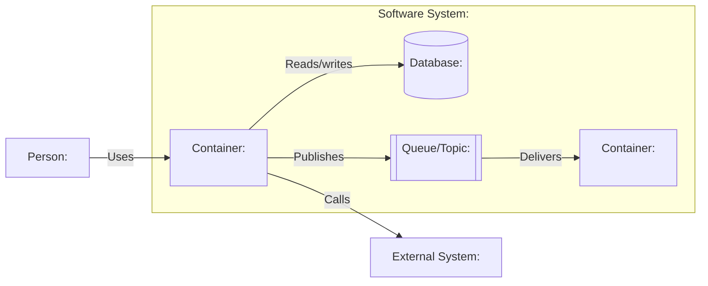

# C2: Container View

> Generated with `ai-craftkit` skill: `c4doc`  
> Source: `<repository-url>` at commit `<commit-hash>`  
> Prompt: `<exact-user-prompt>`

## Purpose

Describe the high-level technical architecture of `<system-name>`.

This view should answer:

- What are the major runnable or deployable units?
- What data stores exist?
- How do containers communicate?
- What technologies are used?
- What responsibilities belong to each container?

In C4, a container means a runnable/deployable application or data store. It does **not** necessarily mean a Docker container.

## Scope

| Field | Value |
|---|---|
| System | `<system-name>` |
| Repository | `<repository-name>` |
| View type | `C2 Container` |
| Last updated | `<yyyy-mm-dd>` |
| Confidence | `<Confirmed / Inferred / Needs review>` |

## Diagram

## Containers

| ID | Name | Type | Technology | Responsibility | Runs where | Evidence | Confidence |
|---|---|---|---|---|---|---|---|
| `container-app` | `<Application/API/CLI>` | `<web app / API / CLI / worker / database / queue / object store>` | `<technology>` | `<main responsibility>` | `<local / Docker / Kubernetes / serverless / unknown>` | `<path>` | `<Confirmed / Inferred / Needs review>` |
| `database-main` | `<Database name>` | `Database` | `<PostgreSQL/MySQL/SQLite/etc.>` | `<stored data>` | `<managed / local / container / unknown>` | `<path>` | `<Confirmed / Inferred / Unknown / Needs review>` |

## Relationships

| From | To | Description | Technology / Protocol | Evidence | Confidence |
|---|---|---|---|---|---|
| `person-user` | `container-app` | `<Uses application>` | `<HTTPS / CLI / file / API / unknown>` | `<path>` | `<Confirmed / Inferred / Needs review>` |
| `container-app` | `database-main` | `<Reads/writes application data>` | `<SQL/JDBC/ORM/etc.>` | `<path>` | `<Confirmed / Inferred / Needs review>` |
| `container-app` | `external-system` | `<Calls external system>` | `<HTTP/SDK/message/etc.>` | `<path>` | `<Confirmed / Inferred / Needs review>` |

## Technology Notes

| Container | Important technologies | Notes |
|---|---|---|
| `<container>` | `<frameworks/languages/runtime>` | `<why architecturally relevant>` |

## Data Notes

| Data store | Data type | Owner | Notes |
|---|---|---|---|
| `<database/cache/object store>` | `<data>` | `<container/team/unknown>` | `<notes>` |

## Not Modeled

Do not list every third-party dependency. Only include architecturally significant dependencies and external runtime systems.

| Omitted item | Reason |
|---|---|
| `<dependency/package/module>` | `<ordinary implementation dependency / not a runtime container / no architectural relevance>` |

## Evidence

| Evidence path | What it supports |
|---|---|
| `<Dockerfile>` | `<supports runtime/container>` |
| `<compose/k8s/helm file>` | `<supports deployment or data store>` |
| `<build file>` | `<supports language/framework>` |
| `<source path>` | `<supports container responsibility>` |

## Assumptions

| Assumption | Reason | Review needed |
|---|---|---|
| `<assumption>` | `<evidence or inference>` | `<yes/no>` |

## Open Questions

| Question | Why it matters |
|---|---|
| `<question>` | `<impact>` |

## Review Notes

- Confirm that every container is a runnable/deployable unit or data store.
- Remove ordinary libraries that were mistakenly modeled as containers.
- Confirm technology choices and protocols.
- Confirm whether inferred databases, queues, caches, or external systems really exist at runtime.
