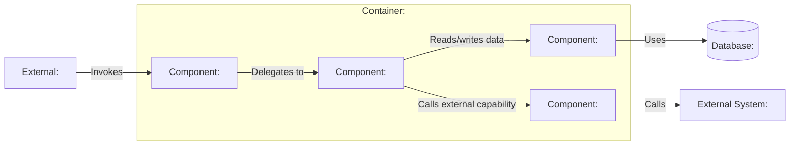

# C3: Component View — <Container Name>

> Generated with `ai-craftkit` skill: `c4doc`  
> Source: `<repository-url>` at commit `<commit-hash>`  
> Prompt: `<exact-user-prompt>`

## Purpose

Describe the internal structure of `<container-name>` at the component level.

This view should answer:

- What are the main responsibilities inside this container?
- Which components expose interfaces?
- Which components coordinate business or technical workflows?
- Which components access data or external systems?
- Which source paths map to each component?

Do not mirror every package, folder, class, or third-party dependency.

## Scope

| Field | Value |
|---|---|
| System | `<system-name>` |
| Container | `<container-name>` |
| Repository | `<repository-name>` |
| View type | `C3 Component` |
| Last updated | `<yyyy-mm-dd>` |
| Confidence | `<Confirmed / Inferred / Needs review>` |

## Component Selection Criteria

Components are included when they represent meaningful responsibility boundaries.

| Included because | Examples |
|---|---|
| Exposes an interface | REST controllers, CLI command handlers, event consumers |
| Coordinates business logic | services, use-case handlers, workflow coordinators |
| Owns data access | repositories, DAOs, database gateways |
| Integrates externally | API clients, message publishers, storage adapters |
| Encapsulates cross-cutting behavior | authentication, authorization, configuration, scheduling |

## Diagram

## Components

| ID | Name | Responsibility | Main source paths | Interfaces | Evidence | Confidence |
|---|---|---|---|---|---|---|
| `component-entry` | `<Entry/API/CLI layer>` | `<responsibility>` | `<paths>` | `<HTTP routes / CLI commands / events / function calls>` | `<path>` | `<Confirmed / Inferred / Needs review>` |
| `component-service` | `<Domain/Application service>` | `<responsibility>` | `<paths>` | `<interfaces>` | `<path>` | `<Confirmed / Inferred / Needs review>` |
| `component-repository` | `<Repository/Data access>` | `<responsibility>` | `<paths>` | `<interfaces>` | `<path>` | `<Confirmed / Inferred / Needs review>` |

## Relationships

| From | To | Description | Technology / Mechanism | Evidence | Confidence |
|---|---|---|---|---|---|
| `component-entry` | `component-service` | `<Delegates business operation>` | `<function call / dependency injection / interface>` | `<path>` | `<Confirmed / Inferred / Needs review>` |
| `component-service` | `component-repository` | `<Reads/writes data>` | `<repository call / ORM / SQL>` | `<path>` | `<Confirmed / Inferred / Needs review>` |
| `component-service` | `component-adapter` | `<Calls external capability>` | `<HTTP client / SDK / message publisher>` | `<path>` | `<Confirmed / Inferred / Needs review>` |

## Source Mapping

| Component | Source paths | Notes |
|---|---|---|
| `<component>` | `<path/glob>` | `<notes>` |

## External Interfaces

| Interface | Owned by component | Type | Description | Evidence |
|---|---|---|---|---|
| `<interface>` | `<component>` | `<REST / CLI / event / function / file>` | `<description>` | `<path>` |

## Internal Interfaces

| Interface | From | To | Description | Evidence |
|---|---|---|---|---|
| `<interface>` | `<component>` | `<component>` | `<description>` | `<path>` |

## Important Dependencies

Only include dependencies that explain architecture-relevant behavior.

| Dependency | Used by | Why it matters | Evidence |
|---|---|---|---|
| `<framework/library>` | `<component>` | `<architectural role>` | `<path>` |

## Not Modeled

| Omitted item | Reason |
|---|---|
| `<package/class/dependency>` | `<too detailed / implementation detail / generated / test-only>` |

## Assumptions

| Assumption | Reason | Review needed |
|---|---|---|
| `<assumption>` | `<evidence or inference>` | `<yes/no>` |

## Open Questions

| Question | Why it matters |
|---|---|
| `<question>` | `<impact>` |

## Review Notes

- Confirm that components are responsibility boundaries, not just folders.
- Confirm that source mapping is accurate.
- Confirm whether any components are missing because their names are domain-specific.
- Split this view if the diagram becomes too large.
