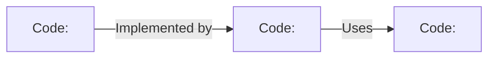
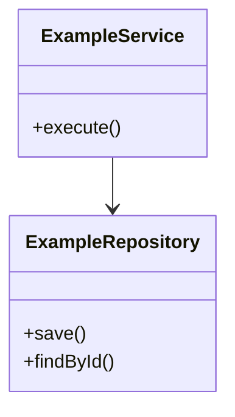

# C4: Code View — <Component Name>

> Generated with `ai-craftkit` skill: `c4doc`  
> Source: `<repository-url>` at commit `<commit-hash>`  
> Prompt: `<exact-user-prompt>`

## Purpose

Describe implementation-level structure inside `<component-name>` only when a permanent diagram adds value.

This view should answer:

- Which code elements are central to understanding this component?
- How do the main classes/modules/functions relate?
- Which interfaces or abstractions are important?
- Which implementation details should a maintainer know before changing this code?

Generate this view only when it adds clarity beyond source navigation and generated API documentation.

## Scope

| Field | Value |
|---|---|
| System | `<system-name>` |
| Container | `<container-name>` |
| Component | `<component-name>` |
| Repository | `<repository-name>` |
| View type | `C4 Code` |
| Last updated | `<yyyy-mm-dd>` |
| Confidence | `<Confirmed / Inferred / Needs review>` |

## Recommendation

| Question | Answer |
|---|---|
| Is a permanent C4 code view justified? | `<Yes / No / Needs review>` |
| Why? | `<reason>` |
| Alternative documentation | `<Javadoc / Doxygen / Sphinx / TypeDoc / Rustdoc / IDE navigation / README>` |

## Diagram

Use `flowchart` for a conceptual implementation view.

If a class diagram is clearer and GitHub Mermaid rendering supports the needed syntax, a small `classDiagram` may be used:

## Code Elements

| ID | Name | Type | Responsibility | Source path | Evidence | Confidence |
|---|---|---|---|---|---|---|
| `code-example` | `<Class/module/function/interface>` | `<class / interface / module / function>` | `<responsibility>` | `<path>` | `<path>` | `<Confirmed / Inferred / Needs review>` |

## Relationships

| From | To | Description | Mechanism | Evidence | Confidence |
|---|---|---|---|---|---|
| `<code element>` | `<code element>` | `<uses / implements / extends / creates / calls>` | `<language mechanism>` | `<path>` | `<Confirmed / Inferred / Needs review>` |

## Source Mapping

| Code element | Source path | Notes |
|---|---|---|
| `<element>` | `<path>` | `<notes>` |

## Important Invariants

| Invariant | Why it matters | Evidence |
|---|---|---|
| `<invariant>` | `<impact>` | `<path or unknown>` |

## Testing Notes

| Test path | What it validates |
|---|---|
| `<test path>` | `<behavior>` |

## Not Modeled

| Omitted item | Reason |
|---|---|
| `<class/function/module>` | `<implementation detail / generated / too many similar elements / better documented elsewhere>` |

## Open Questions

| Question | Why it matters |
|---|---|
| `<question>` | `<impact>` |

## Review Notes

- Keep this view small.
- Do not duplicate generated API documentation.
- Remove this file if it becomes stale or too detailed.
- Prefer linking to source files and generated docs for implementation details.
