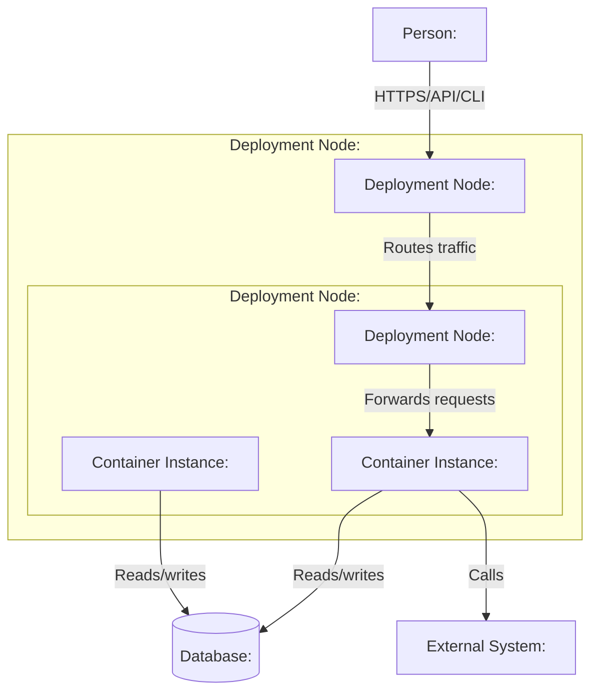

# Deployment View — <Environment or Platform>

> Generated with `ai-craftkit` skill: `c4doc`  
> Source: `<repository-url>` at commit `<commit-hash>`  
> Prompt: `<exact-user-prompt>`

## Purpose

Describe how `<system-name>` is deployed in `<environment-or-platform>`.

This view should answer:

- Where do containers run?
- What infrastructure nodes exist?
- Which runtime instances exist?
- How does traffic enter the system?
- Which managed services or data stores are used?
- Which deployment facts are confirmed versus inferred?

## Scope

| Field | Value |
|---|---|
| System | `<system-name>` |
| Environment/platform | `<local / development / staging / production / Kubernetes / Docker Compose / cloud / unknown>` |
| Repository | `<repository-name>` |
| View type | `Deployment` |
| Last updated | `<yyyy-mm-dd>` |
| Confidence | `<Confirmed / Inferred / Needs review>` |

## Diagram

## Deployment Nodes

| ID | Name | Type | Technology | Contains / Hosts | Evidence | Confidence |
|---|---|---|---|---|---|---|
| `deployment-platform` | `<Platform>` | `<Kubernetes cluster / Docker host / VM / cloud platform / local machine>` | `<technology>` | `<contained nodes>` | `<path>` | `<Confirmed / Inferred / Unknown / Needs review>` |
| `runtime-group` | `<Namespace/network/runtime group>` | `<namespace / network / node group>` | `<technology>` | `<instances>` | `<path>` | `<Confirmed / Inferred / Unknown / Needs review>` |

## Container Instances

| ID | Based on container | Runtime name | Image / artifact | Replicas | Configuration source | Evidence | Confidence |
|---|---|---|---|---|---|---|---|
| `instance-app` | `<container-id>` | `<deployment/service/process name>` | `<image/jar/binary/script>` | `<number or unknown>` | `<env/config/secret>` | `<path>` | `<Confirmed / Inferred / Unknown / Needs review>` |

## External Runtime Dependencies

| Dependency | Type | Used by | Connection | Evidence | Confidence |
|---|---|---|---|---|---|
| `<database/service/queue/cache>` | `<type>` | `<container instance>` | `<protocol>` | `<path>` | `<Confirmed / Inferred / Unknown / Needs review>` |

## Traffic Flow

| Step | From | To | Description | Technology / Protocol | Evidence |
|---|---|---|---|---|---|
| 1 | `<source>` | `<target>` | `<description>` | `<protocol>` | `<path>` |

## Configuration and Secrets

Do not expose secret values.

| Configuration item | Used by | Source | Notes | Confidence |
|---|---|---|---|---|
| `<env var/config key/secret name>` | `<container>` | `<path>` | `<purpose, no secret value>` | `<Confirmed / Inferred / Needs review>` |

## Scaling and Availability

| Item | Observed value | Evidence | Notes |
|---|---|---|---|
| Replicas | `<value or unknown>` | `<path>` | `<notes>` |
| Health checks | `<value or unknown>` | `<path>` | `<notes>` |
| Resource limits | `<value or unknown>` | `<path>` | `<notes>` |
| Autoscaling | `<value or unknown>` | `<path>` | `<notes>` |

## Evidence

| Evidence path | What it supports |
|---|---|
| `<Dockerfile>` | `<image/runtime>` |
| `<docker-compose.yml>` | `<local topology>` |
| `<k8s/*.yaml>` | `<Kubernetes topology>` |
| `<helm/values.yaml>` | `<runtime configuration>` |
| `<terraform/*.tf>` | `<managed infrastructure>` |
| `<.github/workflows/*.yml>` | `<build/deploy pipeline>` |

## Assumptions

| Assumption | Reason | Review needed |
|---|---|---|
| `<assumption>` | `<evidence or inference>` | `<yes/no>` |

## Open Questions

| Question | Why it matters |
|---|---|
| `<question>` | `<impact>` |

## Review Notes

- Confirm whether the diagram represents local, staging, production, or a generic deployment.
- Confirm replica counts and autoscaling behavior.
- Confirm managed services and external runtime dependencies.
- Do not include secret values.
- Split by environment if deployment differs significantly.
