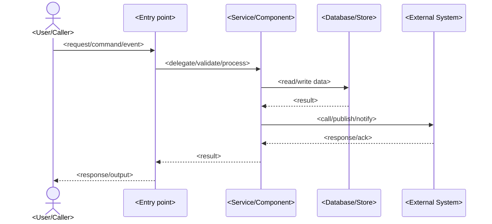

# Dynamic View — <Use Case or Flow Name>

> Generated with `ai-craftkit` skill: `c4doc`  
> Source: `<repository-url>` at commit `<commit-hash>`  
> Prompt: `<exact-user-prompt>`

## Purpose

Describe the runtime behavior for `<use-case-or-flow-name>`.

This view should answer:

- What triggers the flow?
- Which actors, systems, containers, or components participate?
- What happens in what order?
- Which data is read, written, published, or returned?
- Which parts are confirmed versus inferred?

## Scope

| Field | Value |
|---|---|
| System | `<system-name>` |
| Flow | `<use-case-or-flow-name>` |
| Repository | `<repository-name>` |
| View type | `Dynamic` |
| Last updated | `<yyyy-mm-dd>` |
| Confidence | `<Confirmed / Inferred / Needs review>` |

## Trigger

| Field | Value |
|---|---|
| Trigger | `<HTTP request / CLI command / scheduled job / event / file arrival / user action>` |
| Entry point | `<route / command / function / handler / topic / file watcher>` |
| Evidence | `<path>` |
| Confidence | `<Confirmed / Inferred / Needs review>` |

## Participants

| ID | Name | Type | Responsibility in flow | Evidence | Confidence |
|---|---|---|---|---|---|
| `actor-user` | `<User/Caller>` | `<Person / External system / Container / Component>` | `<role>` | `<path>` | `<Confirmed / Inferred / Needs review>` |
| `participant-api` | `<API/CLI/Handler>` | `<Container / Component>` | `<role>` | `<path>` | `<Confirmed / Inferred / Needs review>` |
| `participant-store` | `<Data store>` | `<Container / External system>` | `<role>` | `<path>` | `<Confirmed / Inferred / Needs review>` |

## Sequence Diagram

Use `sequenceDiagram` for dynamic views.

## Step-by-Step Flow

| Step | From | To | Action | Data / Message | Evidence | Confidence |
|---|---|---|---|---|---|---|
| 1 | `<source>` | `<target>` | `<action>` | `<data/message>` | `<path>` | `<Confirmed / Inferred / Needs review>` |
| 2 | `<source>` | `<target>` | `<action>` | `<data/message>` | `<path>` | `<Confirmed / Inferred / Needs review>` |

## Inputs

| Input | Source | Format | Validation | Evidence |
|---|---|---|---|---|
| `<input>` | `<source>` | `<format>` | `<validation>` | `<path>` |

## Outputs

| Output | Destination | Format | Evidence |
|---|---|---|---|
| `<output>` | `<destination>` | `<format>` | `<path>` |

## Error and Edge Cases

| Case | Behavior | Evidence | Confidence |
|---|---|---|---|
| `<error/edge case>` | `<behavior>` | `<path>` | `<Confirmed / Inferred / Needs review>` |

## Related Views

| View | Link |
|---|---|
| System Context | [../system-context.md](../system-context.md) |
| Container View | [../container.md](../container.md) |
| Related Component View | [../components/<container-name>.md](../components/<container-name>.md) |
| Related Deployment View | [../deployment/<environment-or-platform>.md](../deployment/<environment-or-platform>.md) |

## Assumptions

| Assumption | Reason | Review needed |
|---|---|---|
| `<assumption>` | `<evidence or inference>` | `<yes/no>` |

## Open Questions

| Question | Why it matters |
|---|---|
| `<question>` | `<impact>` |

## Review Notes

- Keep this view focused on one use case or runtime flow.
- Create separate dynamic views for unrelated flows.
- Do not try to show the entire system lifecycle in one diagram.
- Confirm inferred steps with maintainers.
