# Mermaiddoc Skill

Command: `/mermaiddoc`

Create readable Mermaid diagrams for repository documentation.

The skill creates Markdown files with Mermaid code blocks that render directly in GitHub.

The skill mainly creates these diagram types:

```text
flowchart LR
sequenceDiagram
```

The skill stores generated diagram documentation in:

```text
docs/diagrams/
```

## Purpose

`/mermaiddoc` helps humans and agents create useful Mermaid diagrams for code documentation.

The goal is to create diagrams that:

- explain one focused concept
- render well in GitHub Markdown
- stay readable in pull requests and repository docs
- use simple Mermaid syntax
- use stable node IDs
- use short labels
- use clear arrows
- avoid visual clutter
- avoid layout tricks that break or look bad on GitHub
- can be maintained as text
- help future humans and agents understand the codebase faster

The goal is not to create decorative diagrams or complete visual models of the whole system.

## Supported Diagram Types

Prefer these diagram types:

```text
flowchart LR
sequenceDiagram
```

Use `flowchart LR` for:

- architecture overviews
- module dependencies
- request flow
- data flow
- build flow
- deployment flow
- agent workflow
- repository workflow
- command execution flow
- high-level process diagrams
- documentation generation flows

Use `sequenceDiagram` for:

- runtime interactions
- API calls
- request and response behavior
- agent and tool interactions
- user and system flows
- service-to-service communication
- event handling sequences
- retry sequences
- error handling paths

Do not use other Mermaid diagram types unless the user explicitly asks.

## Slash Command

Use this skill when the user calls:

```text
/mermaiddoc
```

Supported examples:

```text
/mermaiddoc flow "Show how a request moves through the API"
/mermaiddoc sequence "Show how the CLI command calls the skill"
/mermaiddoc "Create a diagram for the authentication flow"
/mermaiddoc --focus src/auth
/mermaiddoc --type flowchart
/mermaiddoc --type sequence
/mermaiddoc --dry-run
/mermaiddoc --no-run
```

If no type is provided:

1. Use `sequenceDiagram` when the user describes steps over time, calls, messages, requests, responses, retries, or interactions.
2. Use `flowchart LR` when the user describes structure, modules, dependencies, ownership, states, or process flow.
3. If both could fit, prefer `flowchart LR` for documentation overview diagrams.
4. If the intent is unclear, create one focused `flowchart LR` diagram and mention that a sequence diagram may be useful as a follow-up.

## Required Output Files

Create diagram files under:

```text
docs/diagrams/
```

Create the directory if it does not exist.

Default file format:

```text
docs/diagrams/short-kebab-case-topic.md
```

Examples:

```text
docs/diagrams/authentication-flow.md
docs/diagrams/request-lifecycle.md
docs/diagrams/agent-skill-workflow.md
docs/diagrams/repository-documentation-flow.md
```

Each file should be a Markdown file that GitHub can render directly.

Default file structure:

```md
# [Diagram Title]

Purpose: [short purpose]

Source basis:
- [user input, repository files, architecture docs, code scan, or other source]

Diagram type: [flowchart LR | sequenceDiagram]

```mermaid
[diagram]
```

Notes:
- [important clarification]
- [important limitation]
```

Do not create image files by default.

Do not create SVG, PNG, or PDF output unless the user explicitly asks.

## Repository Inspection

Inspect the repository when the diagram should reflect existing code.

Use repository inspection when:

- the user mentions a source folder, module, command, API, service, or workflow
- the diagram should describe current architecture
- the user asks for a diagram from the codebase
- the user provides too little detail but the repository likely contains the answer
- existing `REPO_MAP.md`, `ARCHITECTURE.md`, `OPERATIONS.md`, or ADRs can provide useful context

Start with safe read-only inspection.

Recommended first pass:

```bash
pwd
git rev-parse --show-toplevel
git status --short
git ls-files
find . -maxdepth 2 -type f | sort
find . -maxdepth 2 -type d | sort
```

Inspect existing documentation first when present:

```text
README.md
docs/REPO_MAP.md
docs/ARCHITECTURE.md
docs/OPERATIONS.md
docs/adr/
docs/
```

Then inspect likely source and config files:

```text
src/
app/
lib/
packages/
services/
cmd/
api/
routes/
controllers/
workers/
jobs/
config/
package.json
pyproject.toml
go.mod
Cargo.toml
Dockerfile
docker-compose.yml
.github/workflows/
```

Do not read secrets.

Never print secret values into generated diagrams or notes.

Sensitive files to avoid reading in full:

```text
.env
.env.*
*.pem
*.key
*.crt
id_rsa
id_ed25519
secrets.*
credentials.*
```

It is acceptable to record that an environment file exists, but do not copy values.

## Diagram Design Rules

Create small diagrams.

A good documentation diagram usually has:

- one clear purpose
- 4 to 9 main nodes for flowcharts
- 2 to 6 participants for sequence diagrams
- short labels
- clear arrows
- no decorative styling
- no dense text blocks
- no large nested structures
- no unnecessary edge labels
- no Mermaid features that are likely to render poorly in GitHub

Avoid:

- huge all-system diagrams
- long prose inside nodes
- deeply nested subgraphs
- many crossing arrows
- too many arrow label variants
- custom CSS
- theme initialization blocks
- unusual shapes without a clear reason
- layout tricks
- diagrams that require Mermaid Live Editor settings to understand

Prefer multiple small diagrams over one large diagram.

If the user asks for a broad diagram, create a focused overview and add notes about what to diagram separately.

## GitHub Rendering Rules

Generated Markdown must use Mermaid code blocks:

```md
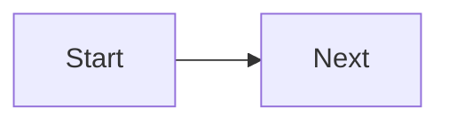
```

or:

```md
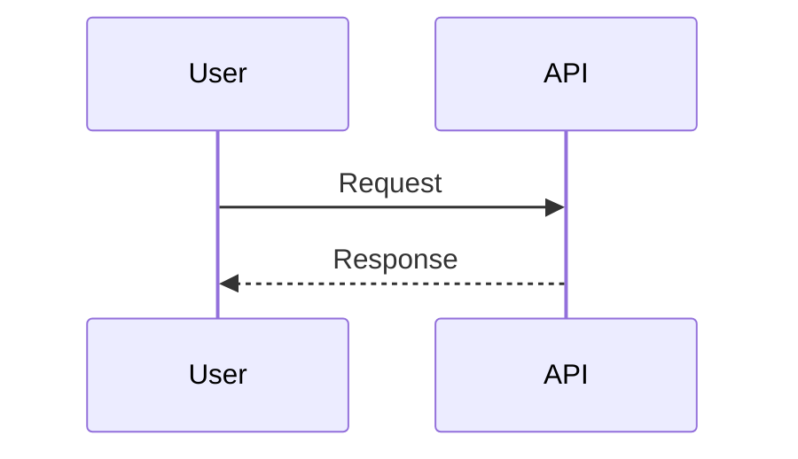
```

Use plain Mermaid syntax that GitHub renders directly.

Avoid relying on:

- external Mermaid config
- custom themes
- external CSS
- unsupported rendering options
- local editor settings
- generated images
- links that are required to understand the diagram

The Markdown file itself should be useful in GitHub.

## Flowchart Rules

Use `flowchart LR` by default.

`LR` keeps many code documentation diagrams readable because they follow the usual left-to-right direction of cause, dependency, or request flow.

Default structure:

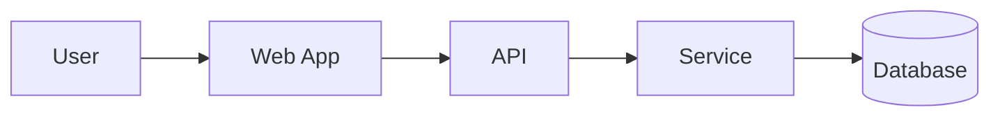

Use stable node IDs.

Good:

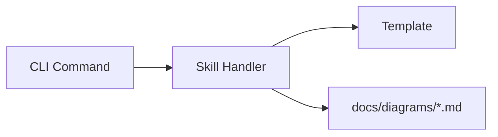

Bad:

```mermaid
flowchart LR
    The user starts the command[The user starts the command] --> The skill looks through a lot of files[The skill looks through a lot of files]
```

Use short node labels.

Good:

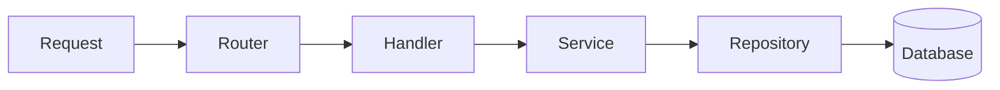

Use edge labels only when they add meaning.

Good:

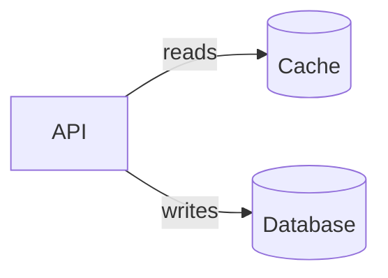

Avoid labeling every edge.

Good:

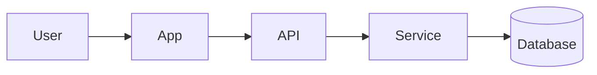

Bad:

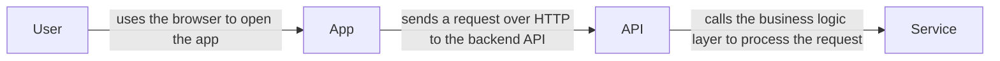

Use subgraphs only when they make ownership or boundaries clearer.

Good:

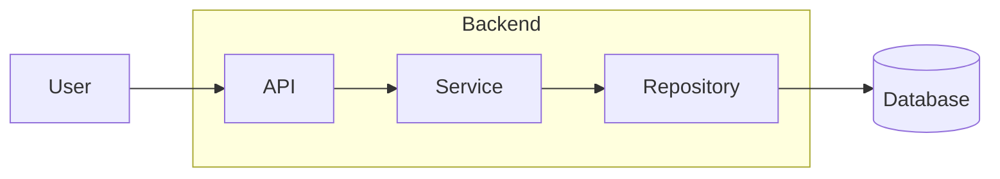

Avoid many nested subgraphs.

Good arrows for flowcharts:

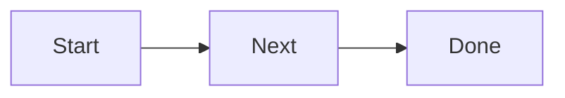

Use labeled arrows for meaningful action:

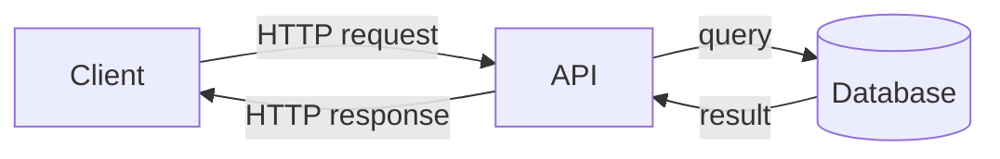

Use dotted arrows only for optional, indirect, or asynchronous relationships:

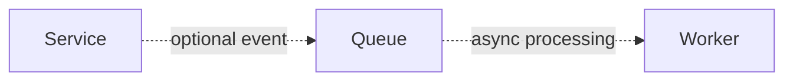

Use thick arrows sparingly for the main path:

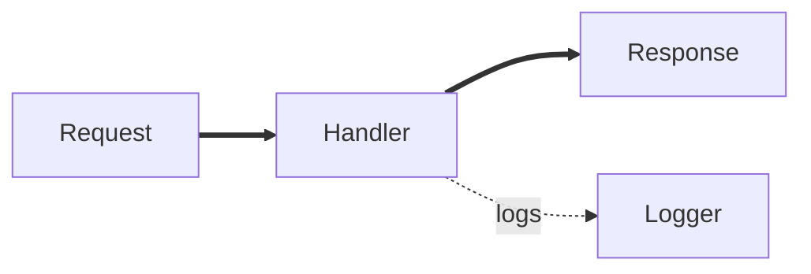

Use database shape for storage:

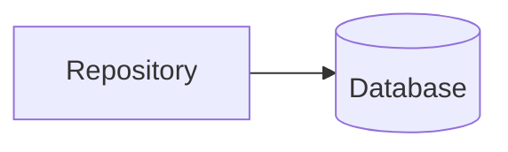

Use bracket nodes for most modules:

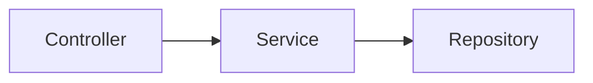

Use rounded nodes for start and end only when useful:

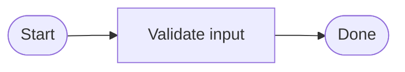

## Recommended Flowchart Patterns

### Simple Request Flow

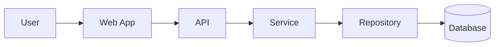

### Module Boundary

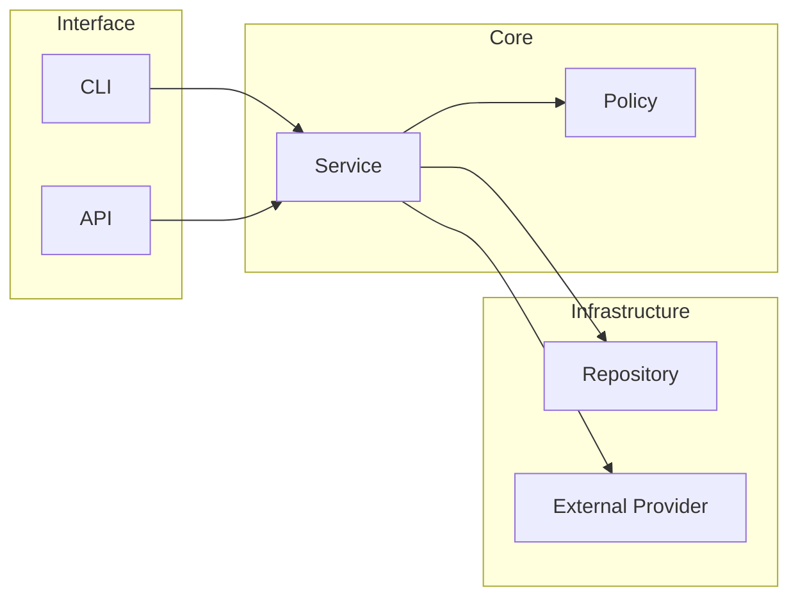

### Agent Skill Workflow

```mermaid
flowchart LR
    User[User Request] --> Skill[Skill]
    Skill --> Inspect[Inspect Repository]
    Skill --> Generate[Generate Markdown]
    Generate --> Docs[docs/diagrams/*.md]
```

### Decision or Check Flow

```mermaid
flowchart LR
    Input[Input] --> Check{Enough evidence?}
    Check -->|yes| Diagram[Create diagram]
    Check -->|no| Gap[Document gap]
    Diagram --> Output[Markdown file]
    Gap --> Output
```

Use decision diamonds only for real branching.

Avoid large decision trees.

## Sequence Diagram Rules

Use `sequenceDiagram` for interactions over time.

Default structure:

```mermaid
sequenceDiagram
    actor User
    participant Web as Web App
    participant API
    participant Service
    participant DB as Database

    User->>Web: Submit request
    Web->>API: POST /resource
    API->>Service: Validate and process
    Service->>DB: Save data
    DB-->>Service: Saved
    Service-->>API: Result
    API-->>Web: 201 Created
    Web-->>User: Show confirmation
```

Use `actor` for humans when useful.

Use `participant` for systems, services, modules, or tools.

Prefer aliases when labels need spaces:

```mermaid
sequenceDiagram
    actor Dev as Developer
    participant CLI as CLI Command
    participant Skill as Mermaiddoc Skill
    participant Docs as docs/diagrams
```

Use solid arrows for calls:

```mermaid
sequenceDiagram
    API->>Service: Process request
```

Use dotted arrows for responses:

```mermaid
sequenceDiagram
    Service-->>API: Result
```

Use self messages for local work:

```mermaid
sequenceDiagram
    Service->>Service: Validate input
```

Use `alt` for important branches:

```mermaid
sequenceDiagram
    API->>Auth: Validate token
    alt Token valid
        Auth-->>API: User context
        API->>Service: Continue request
    else Token invalid
        Auth-->>API: Reject
        API-->>Client: 401 Unauthorized
    end
```

Use `opt` for optional behavior:

```mermaid
sequenceDiagram
    API->>Service: Process request
    opt Cache enabled
        Service->>Cache: Read cached value
        Cache-->>Service: Cached value
    end
```

Use `loop` only for real repeated behavior:

```mermaid
sequenceDiagram
    loop Retry up to 3 times
        Worker->>Provider: Send request
        Provider-->>Worker: Temporary failure
    end
```

Use `Note over` for short clarifications:

```mermaid
sequenceDiagram
    participant API
    participant Queue

    API->>Queue: Publish job
    Note over API,Queue: Job is processed asynchronously
```

Avoid long notes.

Avoid too many activation bars because they can make GitHub-rendered sequence diagrams look noisy.

Use activations only when they clarify nested or long-running work:

```mermaid
sequenceDiagram
    participant API
    participant Service

    API->>+Service: Process request
    Service-->>-API: Result
```

## Recommended Sequence Patterns

### Request and Response

```mermaid
sequenceDiagram
    actor User
    participant Web as Web App
    participant API
    participant Service
    participant DB as Database

    User->>Web: Submit form
    Web->>API: POST /items
    API->>Service: Create item
    Service->>DB: Insert item
    DB-->>Service: Item saved
    Service-->>API: Created item
    API-->>Web: 201 Created
    Web-->>User: Show success
```

### Agent Tool Interaction

```mermaid
sequenceDiagram
    actor User
    participant Agent
    participant Skill as Mermaid Skill
    participant Repo as Repository
    participant Docs as docs/diagrams

    User->>Agent: Request diagram
    Agent->>Skill: Select diagram type
    Skill->>Repo: Inspect relevant files
    Repo-->>Skill: Evidence
    Skill->>Docs: Write Markdown diagram
    Skill-->>Agent: Report created file
    Agent-->>User: Summarize result
```

### Error Path

```mermaid
sequenceDiagram
    participant Client
    participant API
    participant Auth
    participant Service

    Client->>API: Request protected resource
    API->>Auth: Validate token
    alt Valid token
        Auth-->>API: User context
        API->>Service: Load resource
        Service-->>API: Resource
        API-->>Client: 200 OK
    else Invalid token
        Auth-->>API: Reject
        API-->>Client: 401 Unauthorized
    end
```

### Async Job Flow

```mermaid
sequenceDiagram
    participant API
    participant Queue
    participant Worker
    participant DB as Database

    API->>Queue: Enqueue job
    Queue-->>API: Job accepted
    Worker->>Queue: Fetch job
    Worker->>DB: Update state
    DB-->>Worker: Saved
    Worker-->>Queue: Acknowledge job
```

## Diagram Creation Process

When `/mermaiddoc` is called, follow this process:

1. Determine the diagram focus from the user request.
2. Decide whether `flowchart LR` or `sequenceDiagram` fits better.
3. Inspect repository files if the diagram should reflect existing code.
4. Identify the smallest useful scope.
5. Choose a short diagram title.
6. Choose a stable kebab-case file name.
7. Create `docs/diagrams/` if missing.
8. Write one Markdown file with a Mermaid code block.
9. Keep the diagram small and readable.
10. Add notes for assumptions, gaps, or omitted details.
11. Report the created file and the diagram type.

## File Naming Rules

Use lower-case kebab-case filenames.

Good:

```text
docs/diagrams/authentication-flow.md
docs/diagrams/request-lifecycle.md
docs/diagrams/adr-generation-workflow.md
docs/diagrams/api-worker-interaction.md
```

Bad:

```text
docs/diagrams/Diagram1.md
docs/diagrams/big architecture overview.md
docs/diagrams/Auth Flow Final FINAL.md
```

If the file already exists:

1. Read it first.
2. Preserve useful manual notes.
3. Update the diagram only when the user asked for an update or the existing diagram is clearly stale.
4. Avoid overwriting unrelated diagrams.
5. If unsure, create a new focused file with a more specific name.

## Markdown File Quality Rules

Each generated Markdown file should include:

- a clear title
- a short purpose
- a source basis
- one Mermaid diagram
- short notes if needed

Keep notes concise.

Use this structure:

```md
# Authentication Flow

Purpose: Show how an authenticated request moves through the application.

Source basis:
- `src/auth/`
- `src/api/`
- `docs/ARCHITECTURE.md`

Diagram type: sequenceDiagram

```mermaid
sequenceDiagram
    actor User
    participant API
    participant Auth
    participant Service

    User->>API: Request protected resource
    API->>Auth: Validate token
    Auth-->>API: User context
    API->>Service: Load resource
    Service-->>API: Resource
    API-->>User: Response
```

Notes:
- Token storage details are intentionally omitted.
- Error handling is documented separately.
```

## Evidence Labels

When a diagram is based on repository inspection, use evidence labels in notes when useful:

```text
verified
inferred
uncertain
missing
```

Definitions:

- `verified`: directly confirmed from code, config, tests, docs, or explicit human input.
- `inferred`: likely true based on structure, naming, imports, or partial evidence.
- `uncertain`: plausible but not sufficiently supported.
- `missing`: expected information was searched for but not found.

Example notes:

```md
Notes:
- API to service flow is verified from `src/api/users.ts`.
- Cache interaction is inferred from `src/cache/client.ts`.
- Retry behavior could not be verified.
```

## Mermaid Syntax Guardrails

Use indentation consistently.

Use simple ASCII node IDs.

Good node IDs:

```text
User
WebApp
API
Service
Repository
Database
Queue
Worker
```

Bad node IDs:

```text
web-app
API Service
User Request Handler
src/api/users.ts
```

Node labels can contain spaces, but IDs should not.

Good:

```mermaid
flowchart LR
    WebApp[Web App] --> API[API]
```

Avoid special characters in node IDs.

Avoid punctuation-heavy labels.

Avoid quotes unless necessary.

Avoid HTML in labels unless the user explicitly asks.

Avoid very long labels.

Use comments sparingly.

Do not include broken or partial Mermaid syntax.

## GitHub-Friendly Defaults

Use these defaults unless the user asks otherwise:

```text
flowchart direction: LR
max flowchart nodes: 9
max sequence participants: 6
max sequence messages: 12
subgraphs: only when they clarify ownership or boundary
edge labels: only when they add meaning
notes: short and practical
custom styling: avoid
theme config: avoid
```

If more detail is needed, create multiple diagrams.

Example split:

```text
docs/diagrams/authentication-overview.md
docs/diagrams/authentication-sequence.md
docs/diagrams/authentication-error-path.md
```

## Validation Checklist

Before writing a diagram file, check:

- Does the Mermaid code start with `flowchart LR` or `sequenceDiagram`?
- Is the diagram small enough to read in GitHub?
- Are node labels short?
- Are arrows clear?
- Are edge labels necessary?
- Does the diagram explain one focused thing?
- Does the Markdown file contain a valid Mermaid code block?
- Is the output path under `docs/diagrams/`?
- Are assumptions or gaps documented?
- Are secrets excluded?
- Would a future agent understand what this diagram is for?

## Dry Run Mode

If the user uses:

```text
/mermaiddoc --dry-run
```

Do not write files.

Instead report:

```text
Dry run only. No files were written.

Would create/update:
- docs/diagrams/[file].md

Diagram type:
- [flowchart LR | sequenceDiagram]

Diagram preview:
[short Mermaid diagram]
```

## No Run Mode

If the user uses:

```text
/mermaiddoc --no-run
```

Do not execute commands that run builds, tests, installs, servers, Docker, or network calls.

File inspection is allowed.

## Completion Report

After writing files, respond with a concise report.

Example:

```text
Created/updated:
- docs/diagrams/authentication-flow.md

Diagram type:
- sequenceDiagram

Source basis:
- src/auth/
- src/api/

Notes:
- Main request flow is verified.
- Token refresh behavior was not included because it was not found in the inspected files.
```

## Failure Handling

If the repository root cannot be determined:

```text
I could not determine the repository root. Open the repository folder first or run `/mermaiddoc` from inside the repo.
```

If the user request is too broad:

- create a focused overview diagram
- document what was intentionally omitted
- suggest separate diagrams for deeper areas

If the diagram would become too large:

- split it into smaller diagrams
- create one overview first
- put details into separate files

If source evidence is missing:

- create a diagram only from user-provided information
- mark the source basis clearly
- add a note that repository evidence was missing or not inspected

If Mermaid syntax may be risky:

- simplify the diagram
- remove styling
- remove complex syntax
- prefer plain nodes and arrows

## Non-Goals

This skill does not:

- create decorative diagrams
- generate SVG, PNG, or PDF files by default
- model the entire codebase in one diagram
- replace architecture documentation
- replace ADRs
- expose secrets
- run expensive commands by default
- rely on Mermaid editor settings
- use custom CSS or themes by default
- create diagrams that are too dense to read in GitHub

## Core Principle

Create the smallest useful Mermaid diagram that explains the requested focus and renders cleanly in GitHub Markdown.