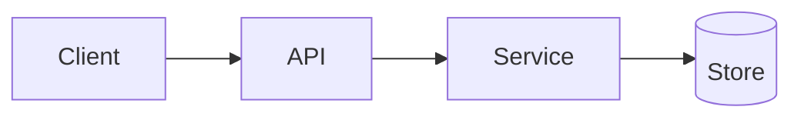
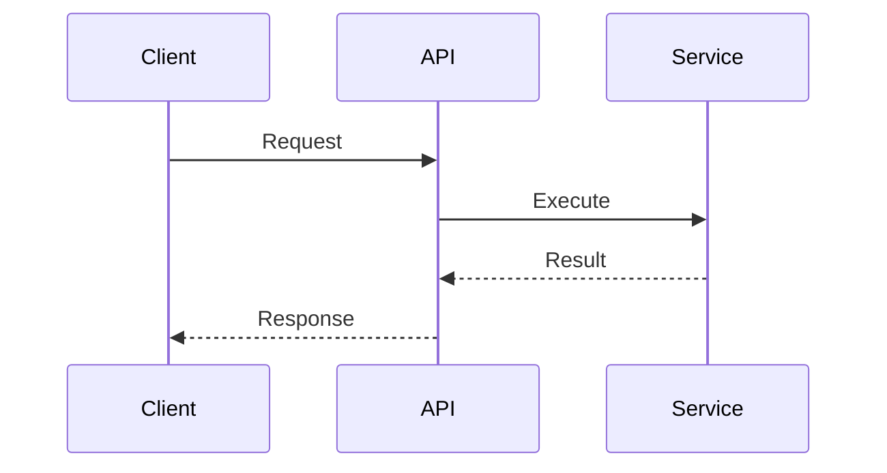

# Mermaiddoc Skill

Command: `/mermaiddoc`

`mermaiddoc` is a **diagram helper**, not a repository-documentation workflow.

Use it when a specific document or question is clearer with one focused Mermaid diagram. It may return a Mermaid block for insertion into an existing document, or write/update a file when the user names an output location.

It does **not** own a default `docs/diagrams/` tree and should not create one unless the user explicitly asks for standalone diagram files.

## Preferred Diagram Types

Prefer:

```text
flowchart LR
sequenceDiagram
```

Use `flowchart LR` for:

- components and dependencies
- request/data/process flow
- module boundaries
- build or deployment flow
- simple decision flow

Use `sequenceDiagram` for:

- interactions over time
- request/response sequences
- service calls
- retries and important failure paths
- user/system interaction

Use another standard Mermaid diagram only when it is materially better for the requested concept and is likely to render in GitHub.

Do not use Mermaid C4 syntax.

## Scope

One diagram should answer one question.

Examples:

- “How does an incoming request reach persistence?”
- “Which modules depend on the domain package?”
- “What happens during token refresh?”
- “How does the worker process a queued job?”

Do not attempt to visualize the entire repository unless the user explicitly requests that scope and the result can remain readable.

## Repository Evidence

When the diagram represents repository behavior:

1. inspect only the files needed for the requested diagram
2. prefer current code/config/tests and existing architecture docs
3. use `docs/archdoc/` and `docs/adr/` as context when present
4. distinguish inferred relationships from verified ones in surrounding prose when it matters
5. do not invent missing components, calls, or rationale to make a diagram look complete

For a purely conceptual diagram supplied by the user, repository inspection is unnecessary.

## Diagram Rules

Keep diagrams deliberately small.

- use stable simple node IDs such as `API`, `Service`, `DB`
- keep visible labels short
- prefer left-to-right flowcharts unless another direction is clearly better
- avoid decorative styling, custom colors, icons, HTML-heavy labels, and layout tricks
- avoid edge crossings where a simpler grouping or smaller diagram would work
- show only relationships needed to explain the requested concept
- split a diagram only when one view has become hard to read

A useful default target is roughly 5–12 nodes/participants. This is a readability heuristic, not a hard limit.

## Flowchart Pattern


```mermaid
flowchart LR
    Client[Client] --> API[API]
    API --> Service[Service]
    Service --> Store[(Store)]
```

Use subgraphs sparingly and only when they clarify a real boundary.

## Sequence Pattern


```mermaid
sequenceDiagram
    participant C as Client
    participant A as API
    participant S as Service

    C->>A: Request
    A->>S: Execute
    S-->>A: Result
    A-->>C: Response
```

Include error/retry branches only when they are important to the requested behavior.

## Output Behavior

Prefer this order:

1. If the user names an existing Markdown document, insert or update the diagram there.
2. If another skill such as `archdoc` needs a diagram, produce a block suitable for that document.
3. If the user names a standalone output file, write it there.
4. Only if the user explicitly requests a diagram collection should you create a directory such as `docs/diagrams/`.

Do not create duplicate standalone diagrams for flows already adequately documented elsewhere.

## Validation

Before finishing:

- check that node/participant IDs are unique
- check arrows and message direction
- check labels for problematic quoting or line breaks
- keep syntax within standard GitHub-supported Mermaid features
- if a Mermaid renderer/parser is already available, use it when convenient
- do not install tooling merely to validate a small diagram unless the user asks

The examples in [`examples/mermaiddoc-examples.md`](examples/mermaiddoc-examples.md) are reference patterns, not mandatory templates.

## Safety

Diagram generation should normally require only read-only inspection. Do not run deployments, mutate external systems, or expose secrets to create a diagram.

## Non-Goals

`mermaiddoc` does not:

- generate a full architecture documentation set
- create an alternative architecture source of truth
- force diagrams into documents that are clearer as prose/tables
- infer undocumented architecture intent
- own repository-wide documentation structure

## Core Principle

**Generate the smallest diagram that makes one specific idea easier to understand.**
