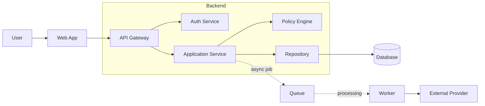
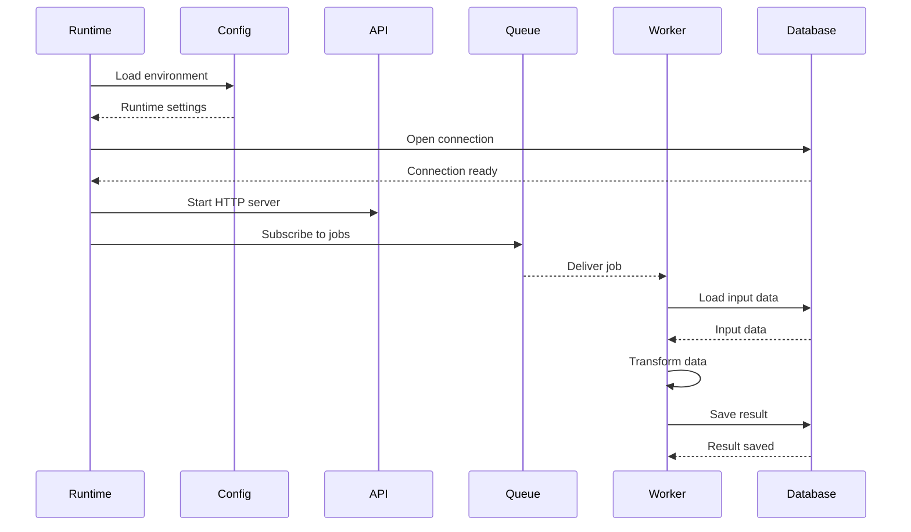
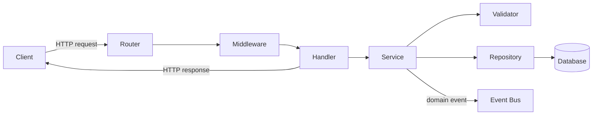
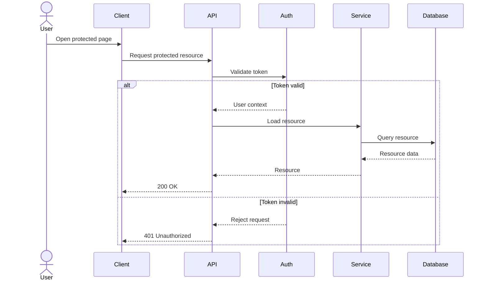
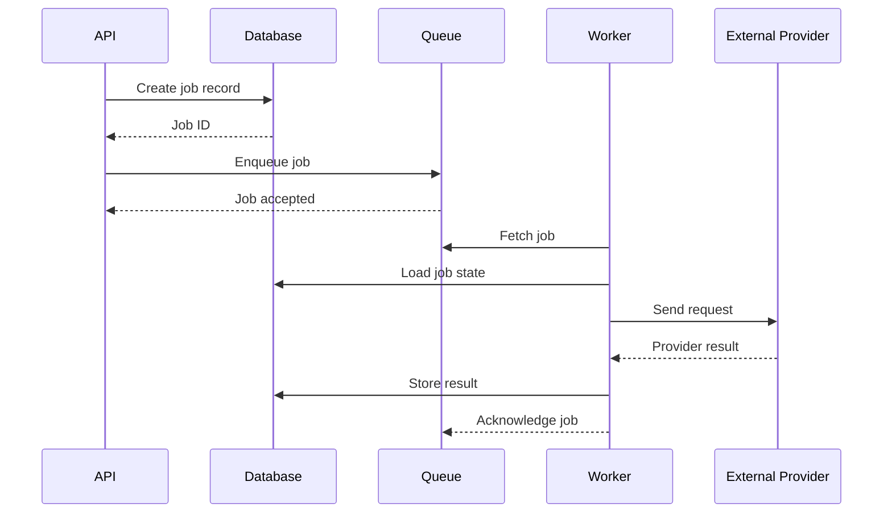
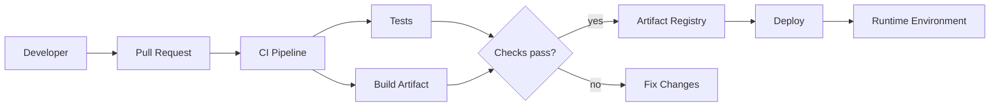
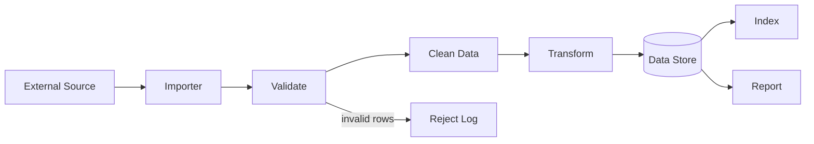
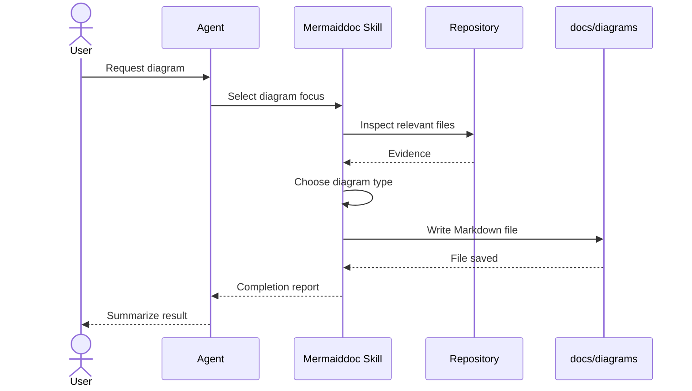
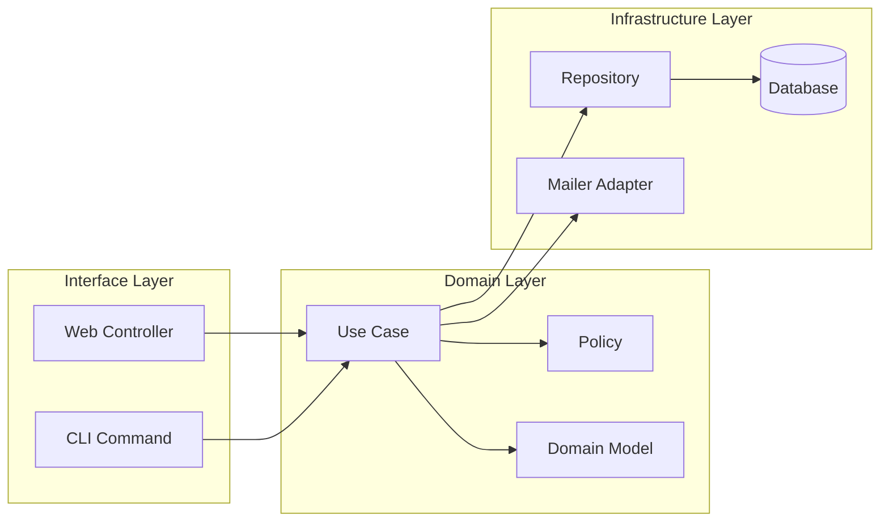
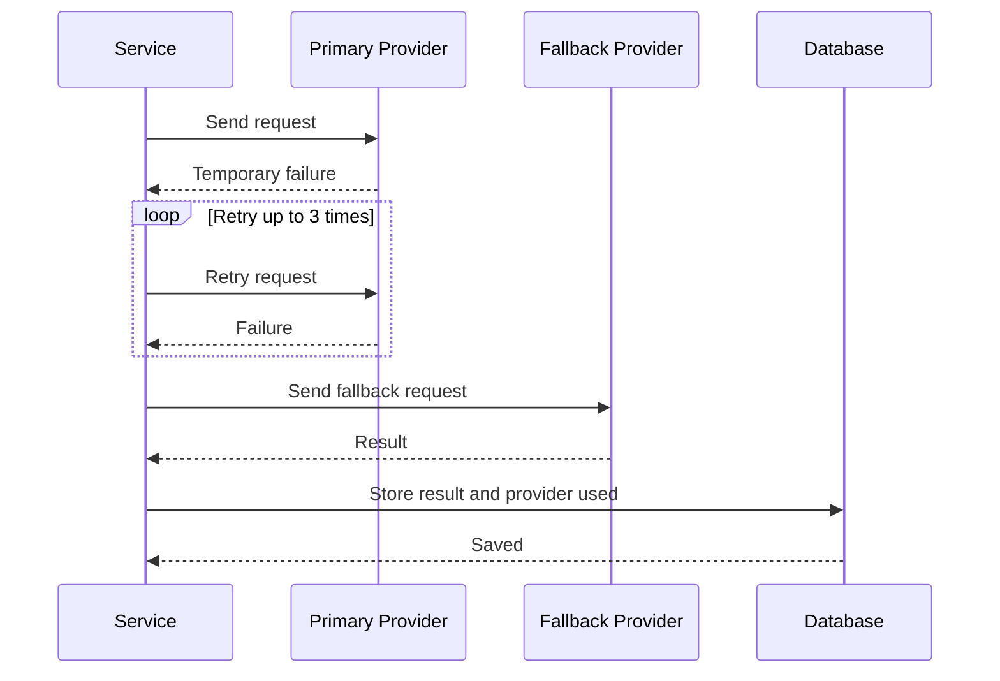

# Mermaiddoc Examples

This file shows example diagrams that follow the `mermaiddoc` skill recommendations.

The examples use only GitHub-renderable Mermaid code blocks and focus on the two preferred diagram types:

- `flowchart LR` for structure and process
- `sequenceDiagram` for interactions over time

The diagrams are intentionally small enough to read in GitHub, but large enough to show typical developer documentation use cases.

## Example 1: Main Components of a Larger Application

Purpose: Show the main components of a larger application without turning the diagram into a full system map.

Source basis:
- Example application architecture
- Typical web application with API, workers, storage, and integrations

Diagram type: flowchart LR

Notes:
- The main synchronous path is shown with solid arrows.
- The asynchronous worker path is shown with dotted arrows.
- Internal implementation details are intentionally omitted.

## Example 2: Startup Until Data Processing

Purpose: Show how a service starts, validates configuration, connects dependencies, and begins processing data.

Source basis:
- Example backend startup flow
- Typical service runtime lifecycle

Diagram type: sequenceDiagram

Notes:
- Startup and processing are shown in one sequence because the focus is the runtime handoff.
- Deployment, migrations, and monitoring are intentionally omitted.

## Example 3: Request Lifecycle Through a Backend

Purpose: Show how an HTTP request moves through common backend layers.

Source basis:
- Typical layered backend architecture

Diagram type: flowchart LR

Notes:
- Edge labels are used only where they add meaning.
- The diagram shows one focused request path and one event side effect.
- Error handling is better documented as a separate sequence diagram.

## Example 4: Authentication Success and Failure Path

Purpose: Show an authentication check with the most important success and failure branches.

Source basis:
- Typical API authentication behavior

Diagram type: sequenceDiagram

Notes:
- The diagram uses one `alt` block for the important branch.
- Token refresh and permission checks are intentionally omitted.

## Example 5: Background Job Processing

Purpose: Show how an API request creates work that is processed asynchronously by a worker.

Source basis:
- Typical queue-based background job architecture

Diagram type: sequenceDiagram

Notes:
- Database state and queue state are shown separately.
- Retry and dead-letter handling would be separate diagrams if needed.

## Example 6: Build and Release Flow

Purpose: Show the main path from source change to deployed service.

Source basis:
- Typical CI/CD pipeline

Diagram type: flowchart LR

Notes:
- The decision diamond is used only for the real pipeline branch.
- Rollback and manual approval are omitted to keep this diagram focused.

## Example 7: Data Import Pipeline

Purpose: Show how external data moves through validation, transformation, storage, and reporting.

Source basis:
- Typical data import workflow

Diagram type: flowchart LR

Notes:
- The main path moves left to right.
- Invalid rows are shown as a labeled branch.
- Scheduling and authentication are intentionally omitted.

## Example 8: Agent Skill Documentation Workflow

Purpose: Show how an agent turns a user request into a Markdown diagram file.

Source basis:
- Example `mermaiddoc` workflow

Diagram type: sequenceDiagram

Notes:
- Repository inspection is shown as a verified evidence step.
- The generated output is a Markdown file, not an image.

## Example 9: Module Boundary in a Larger Codebase

Purpose: Show the boundaries between interface, domain, and infrastructure layers.

Source basis:
- Typical modular application structure

Diagram type: flowchart LR

Notes:
- Subgraphs are used only to clarify ownership and boundaries.
- Dependency direction is shown from interface toward domain and infrastructure.
- Individual helper classes are intentionally omitted.

## Example 10: Retry With Fallback

Purpose: Show a retry path without overloading the main architecture diagram.

Source basis:
- Typical external provider call with retry and fallback behavior

Diagram type: sequenceDiagram

Notes:
- The retry loop is shown because retry behavior is the focus.
- Timeout values and alerting are intentionally omitted.
