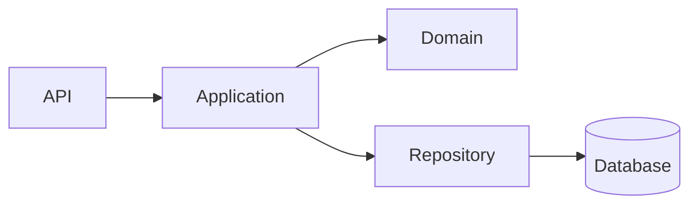
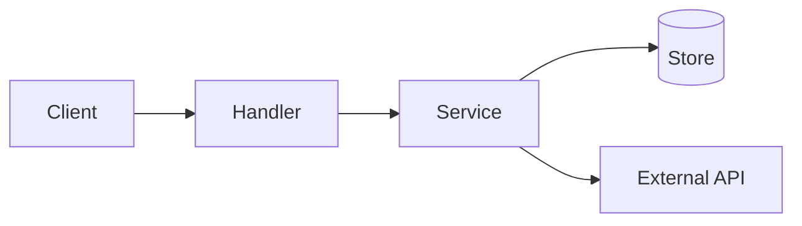
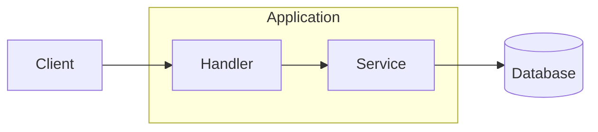
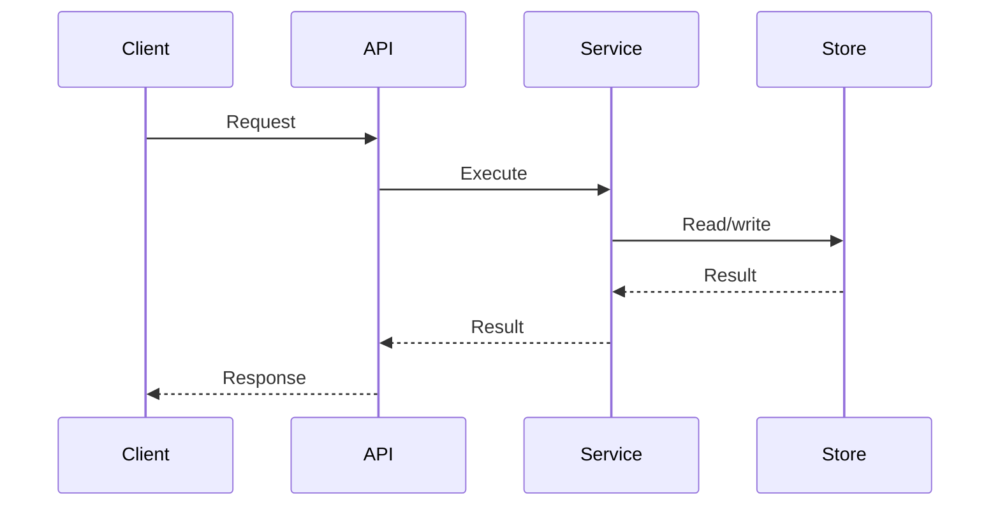
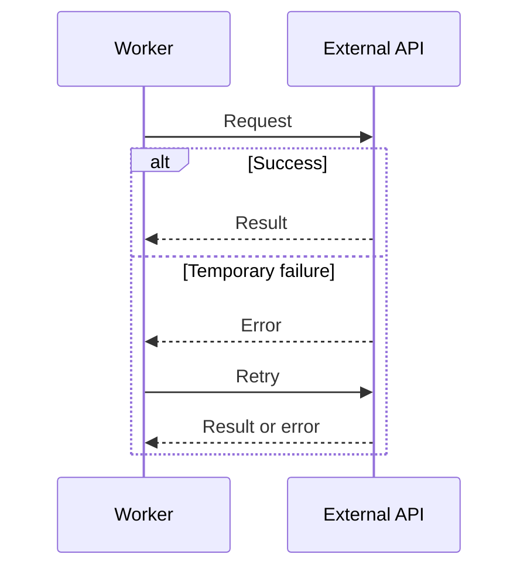
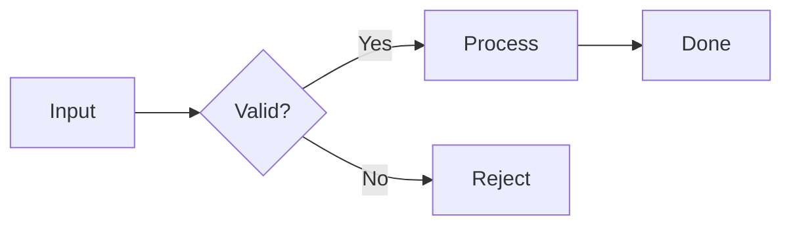

# Mermaid helper examples

These are small reference patterns for `mermaiddoc`. Adapt them to repository evidence; do not copy them mechanically.

## Component dependency

```mermaid
flowchart LR
    API[API] --> App[Application]
    App --> Domain[Domain]
    App --> Repo[Repository]
    Repo --> DB[(Database)]
```

## Request flow

```mermaid
flowchart LR
    Client[Client] --> Handler[Handler]
    Handler --> Service[Service]
    Service --> Store[(Store)]
    Service --> External[External API]
```

## Boundary grouping

```mermaid
flowchart LR
    subgraph App[Application]
        Handler[Handler]
        Service[Service]
    end

    Client[Client] --> Handler
    Handler --> Service
    Service --> DB[(Database)]
```

Use subgraphs only when the boundary itself matters.

## Request/response sequence

```mermaid
sequenceDiagram
    participant C as Client
    participant A as API
    participant S as Service
    participant D as Store

    C->>A: Request
    A->>S: Execute
    S->>D: Read/write
    D-->>S: Result
    S-->>A: Result
    A-->>C: Response
```

## Failure branch

```mermaid
sequenceDiagram
    participant W as Worker
    participant E as External API

    W->>E: Request
    alt Success
        E-->>W: Result
    else Temporary failure
        E-->>W: Error
        W->>E: Retry
        E-->>W: Result or error
    end
```

## Small decision flow

```mermaid
flowchart LR
    Start[Input] --> Valid{Valid?}
    Valid -->|Yes| Process[Process]
    Valid -->|No| Reject[Reject]
    Process --> Done[Done]
```

## Practical rules

- Prefer one idea per diagram.
- Keep node IDs simple and labels short.
- Avoid custom colors and decorative styling.
- Do not show relationships that repository evidence does not support.
- If a diagram grows hard to read, remove detail before adding layout tricks.
